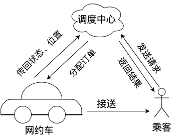

<!--more-->

# Problem

本问题我们考虑诸如滴滴出行或Uber在短时间内如何处理大规模数据的配对。
为了较容易解决该问题，我们做一些简化：假设此时已知n个乘客的出行计划和n个司机的位置，其中乘客的出行计划中我们给出了每个乘客位置的经纬度以及他们目的地的经纬度，司机当前所在位置的经纬度也可以明确标定。假设平台可以实时监测到所有司机的位置

1. 你需要制定一个方案，如果平台只会让用户与最近的若干辆出租车配对，那么如何控制绝大部分乘客的候车时间在一个合理的范围以内。
2. 如果你在问题（1）中没法满足所有乘客的配对，我们允许司机在顺路的情况下，让乘客与乘客进行拼车，此时平台可能允许已经接单的司机再次进入平台接单。在最多允许两名乘客拼车的假设下，能否使乘客总体获得更好的体验？
3. 在这一问中，你进入了一个更符合实际的动态场景，即乘车需求和空闲司机实时出现，假设平台数据每半秒刷新一次，附件是其1小时内采集到的所有数据。在是否允许拼车两种假设下，分别为平台制订动态人车配对策略。
4. 你需要思考一个开放问题并制定一个可行方案，从社会总体福利或者用户个体体验亦或是其他角度来达到某种意义下较好的结果，将你的方案写成研究报告提交。

# 模型假设

1. 本问题中，由于大部分定位点都在道路密集的纽约市中心，基本不受道路方向的约束，故近似的假设两点之间的路径没有障碍物，可以直接到达。
2. 假设所有网约车的驾驶司机都服从平台的派单要求，乘客由司机接到后立刻上车，平台派单响应时间仅为算法处理时间。
3. 附件“pass.txt”和“taxi.txt”的数据为1小时内每隔0.5s测得，我们假设每个0.5秒测得的数据概率均匀分布。

4.1.3 时间的离散化和网约车的状态
基于问题分析，本问题是一个“在线”问题，在时间维度的影响下，需要将时间离散化，以合适的时间间隔 ∆t=0.5s 进行状态更新。
对于网约车状态，需要考虑如下两种状态： 专车和拼车

此外，对于专车，仅当网约车收到接送目标时状态就转换为满载，之后开往接客地点和送客到达目的地的路途中始终保持满载的状态。
对于拼车，暂不考虑收到接送目标1后开往接客地点的路线上接送新产生乘客，仅考虑接客后状态转为有客后再确定接送目标2。

满意度函数评价标准

我们假设第i个乘客的满意度为m_i ,满意度总和为M

$$
m_i=\left\{\begin{aligned}
10-0.4 t_{\text {wait }}, & t_{\text {wait }} \in[0,4] \\
20.4-2.1 t_{\text {wait }}, & t_{\text {wait }} \in[4,12] \\
0, & t_{\text {wait }} \in[12,+\infty]
\end{aligned}\right.
$$

我们建立如下专车在线接送模型：
假设某一时刻进入系统的乘客为$p_i$，其出发点、目的地为$start\left(p_i\right),end\left(p_i\right)$ ，计划路线耗时t_{p_i}。此时状态为“空车”的网约车状态为{sti(c}_{k_j})=empty, “有客” 状态为{sti(c}_{k_j})=few，“满载” 状态为{sti(c}_{k_j})=full 。在可达域G中的网约车 c_{k_j}\in G ,其到乘客的距离dckj，pi，转化成时间 t_{wait}(c_{k_j},\ pi)=d(ckj)/piv

（1）t=0 时刻：我们得到所有“空车”\ {sti(c}_{k_j})=empty状态的网约车位置。
（2）每过 ∆t 的时间，判断是否到了投放乘客进入系统的时间间隔 \tau ，如果满足，则更新一位新的乘客位置和需求，再更新一次所有车的状态，并进行专车接送的策略判断：

（i）以编号p_i  的乘客为圆心，对于每一个在可达域（网约车在最大有效等候时间t_0=12min内能够到达的区域）包含内 p_i 的网约车\ c_{k_j} ，计算 \ c_{k_j} 到达乘客的位置的等候时间t_{wait}ckj，pi  ，计算几辆车送客的收益效率
\sigma_j=mitpj+ twaitckj，pi
选择收益效率最高的k_j=argmax{\sigma_j}与p_j配对。
（3）被选中的网约车状态转换为“满载”\ {sti(c}_{k_j})=full，直到\ t_{p_i}+\ t_{wait}ckj，pi 后，将乘客送达目的地才恢复“空车”，并将该乘客移出系统，标记为“已达”。若某乘客在最大有效等候时间t_0中没有等到网约车来接，则在t_0后移出系统，标记为“未达”。一直重复执行（2），直到所有乘客移出系统
根据上述算法流程，我们建立模型：

$$
\max M=\sum_1^n m_i \\\\

\left\{\begin{aligned}
& \int i=k_j\left(\text { 第 } \mathrm{k}_{\mathrm{j}} \text { 号网约车配对 } \mathrm{p}_{\mathrm{i}} \text { 位乘客 }\right) \\
& m_i=\left\{\begin{aligned}
10-0.4 t_{w a i t}\left(c_{k_j}, p_i\right), & t_{w a i t}\left(c_{k_j}, p_i\right) \in[0,4] \\
12.6-1.05 t_{w a i t}\left(c_{k_j}, p_i\right), & t_{w a i t}\left(c_{k_j}, p_i\right) \in[4,12] \\
0, & t_{w a i t}\left(c_{k_j}, p_i\right) \in[12,+\infty]
\end{aligned}\right. \\
& t_{\text {wait }}\left(c_{k_j}, p_i\right)=\frac{d\left(c_{k_j}, p_i\right)}{v} \\
&
\end{aligned}\right.
$$

即本文求解只需确定c_{k_1}~c_{k_j}的顺序即可

基于贪心策略的在线专车模型求解

由于数据量过大，我们随机抽取1000条数据（结果见附表一）进行策略的检验。算法分析如下：

1. 正确性
   本问题的子问题是一个np-hard问题，故多项式时间内无法确定最优解。所以我们转而求解其较优解。而本文的贪心算法本身便设计成求得局部最优。
2. 确定性
   由模型建立确定的算法流程可以清晰的描述成一个由基本操作构成的序列。
3. 可行性
   每一个基本操作都可以在常数项时间内执行，从整体而言，从乘客进入系统到乘客移出系统，必然在有限时间内完成。
4. 有穷性
   乘客的数量有限，从第一位乘客进入系统，直到最后一个乘客移出系统，必然在有限时间内完成，此后算法结束。

本文系统描述图例如下：

较好的用户体验\left(m_i>8.4\right)占比：95.5224%
将1000名乘客满意度绘制成图像：

| 载客次数 | 网约车数量 |
| -------- | ---------- |
| 0        | 359        |
| 1        | 344        |
| 2        | 182        |
| 3        | 72         |
| 4        | 31         |
| 5        | 10         |
| 6        | 2          |

第二问：基于贪心策略的在线拼车模型建立与求解

在线拼车接送模型的建立

根据上一问的专车模型和模型准备，我们建立如下在线拼车接送模型：
假设某一时刻进入系统的乘客为\ p_i，其出发点、目的地为start\left(p_i\right),end\left(p_i\right) ，计划路线耗时t_{p_i}。此时状态为“空车”的网约车状态为{sti(c}_{k_j})=empty, “有客” 状态为{sti(c}_{k_j})=few，“满载” 状态为{sti(c}_{k_j})=full 。在可达域G中的网约车 c_{k_j}\in G ,其到乘客的距离dckj，pi，转化成时间 t_{wait}ckj，pi=dckj，piv 。

（1）t=0 时刻：我们得到所有“空车”\ {sti(c}_{k_j})=empty状态的网约车位置。
（2）每过 ∆t 的时间，判断是否到了投放乘客进入系统的时间间隔 \tau ，如果满足，则更新一位新的乘客位置和需求，再更新一次所有车的状态，并进行专车接送的策略判断：
（i）以编号 p_i 的乘客为圆心，对于每一个在可达域（网约车在最大有效等候时间t_0=12min内能够到达的区域）包含内 p_i 的网约车\ c_{k_j} ，计算 \ c_{k_j} 到达乘客的位置的等候时间 t_{wait}ckj，pi ，计算几辆车送客的收益效率
\sigma_j=mitpj+ twaitckj，pi
选择收益效率最高的k_j=argmax{\sigma_j}与p_j配对。
（3）被选中的网约车状态转换为“有客”\ {sti(c}_{k_j})=few，开往乘客的等候地点start\left(p_i\right)。历经\ t_{wait}ckj，pi 后接上乘客，在将乘客送往目的地的途中，如果某一时刻t在其可达域 Gckj，pi，t中出现新的乘客2，经过路径判断：
（i）t_{wait}ckj，pi+1<12
（ii）目的地1’与2’间所额外花的时间小于0.1倍的原来时间:
t_{bet}\left(end\left(p_j\right),end\left(p_{i+1}\right)\right)<{0.1t}_{p_j}
确定是否需要接送乘客2。若要接送，则立刻改变路线，去往start\left(p_{j+1}\right) ，此时网约车状态转变为“满载”sti\left(c_{k_j}\right)=full，直到将p_i,p_{i+1}都送达目的地后，才恢复“空车”\ sti\left(c_{k_j}\right)=empty，并将两位乘客移出系统，标记为“已达”。若某乘客在最大有效等候时间t_0中没有等到网约车来接，则在t_0后移出系统，标记为“未达”。一直重复执行（2），直到所有乘客移出系统。

所以大致路线如下：

1. 如果不需要拼车：
   初始点\rightarrow start\left(p_i\right)\rightarrow end\left(p_i\right)
2. 如果需要拼车：

初始点\rightarrow start\left(p_i\right)\rightarrow start\left(p_{i+1}\right)\rightarrow end\left(p_i\right)\rightarrow end\left(p_{i+1}\right)
或者：

初始点\rightarrow start\left(p_i\right)\rightarrow start\left(p_{i+1}\right)\rightarrow end\left(p_{i+1}\right)\rightarrow end\left(p_i\right)

根据上述算法流程，我们建立模型：

$$
\max M=\sum_1^n m_i \\\\

\left\{\begin{aligned}
& i=k_j\left(\text { 第 } \mathrm{k}_{\mathrm{j}} \text { 号网约车配对 } \mathrm{p}_{\mathrm{i}} \text { 位乘客 }\right) \\
& m_i=\left\{\begin{aligned}
10-0.4 t_{w a i t}\left(c_{k_j}, p_i\right), & t_{w a i t}\left(c_{k_j}, p_i\right) \in[0,4] \\
12.6-1.05 t_{w a i t}\left(c_{k_j}, p_i\right), & t_{w a i t}\left(c_{k_j}, p_i\right) \in[4,12] \\
0\ , & t_{w a i t}\left(c_{k_j}, p_i\right) \in[12,+\infty]
\end{aligned}\right. \\
& t_{\text {wait }}\left(c_{k_j}, p_i\right)=\frac{d\left(c_{k_j}, p_i\right)}{v} \\
&
\end{aligned}\right.
$$

基于贪心策略的在线拼车模型的求解
算法分析基本同第一问。
本文系统描述图例如下：

较好的用户体验\left(m_i>8.4\right)占比：97.0149%
将1000名乘客满意度绘制成图像：

| 载客次数 | 网约车数量 |
| -------- | ---------- |
| 0        | 359        |
| 1        | 344        |
| 2        | 182        |
| 3        | 72         |
| 4        | 31         |
| 5        | 10         |
| 6        | 2          |

第三问：基于模拟退火策略的在线缓存模型建立与求解

模型准备
在第三问中，由于乘车需求和空闲司机都处于未知状态，我们在一、二问的基础上建立缓存机制。刷新频率依旧为∆t，假设每隔时间\tau^\prime=10∆t=5s，系统进入网约车和乘客的数量为r_c\left(t\right)、rpt，两者服从均匀分布：
      rc~U0,6,rc=1,2,…,5rp~U0,4,rp=1,2,3
任意时刻之前一个每隔时间\tau^\prime内已配对的网约车和乘客的数量为 n_c\left(t\right),n_p\left(t\right) 空闲的网约车和待分配的人数量为R_c\left(t\right),R_p\left(t\right)，则有：
Rct=rct-nctRpt=rpt-npt

$$
\begin{aligned}
& t_{w a i t}\left(c_{k_j}, p_i\right)=\frac{d\left(c_{k_j}, p_i\right)}{v} \\
& \left\{\begin{array}{l}
R_c(t)=\sum r_c(t)-\sum n_c(t) \\
R_p(t)=\sum r_p(t)-\sum n_p(t)
\end{array}\right. \\
& \left\{\begin{array}{l}
R_c \geq 1.25 R_p \\
t \bmod \tau^{\prime}=0
\end{array}\right. \\
&
\end{aligned}
$$

当满足空闲网约车数量大于等于乘客数量的1.25倍时，或者距离上一次分配经历了10个时间间隔时，缓存结束，进行配对：
Rc≥1.25Rpt mod τ'=0

基于模拟退火策略的在线缓存模型的建立
6.2.1 专车的在线缓存模型的建立
基本假设同第一问，现加入缓存机制，引入模拟退火算法重新修改策略：
（1）t=0 时刻：系统中没有网约车和乘客，R_c\left(t\right)=R_p\left(t\right)=0。
（2）运行缓存策略，判断是否到了退出缓存的条件，如果可以，则进行专车接送的策略判断：
（i）以编号p_i  的乘客为圆心，对于每一个在可达域（网约车在最大有效等候时间t_0=12min内能够到达的区域）包含内 p_i 的网约车\ c_{k_j} ，计算 \ c_{k_j} 到达乘客的位置的等候时间 t_{wait}ckj，pi ，计算几辆车送客的收益效率
\sigma_j=mitpj+ twaitckj，pi
此时，选择收益效率较高几辆的网约车，收益效率越高，表示该网约车被选中的概率越高。（这里没有直接采用贪心策略（直接取收益效率最高的），而是利用用启发式算法规避局部最优解）
（3）被选中的网约车状态转换为“满载”\ {sti(c}_{k_j})=full，直到\ t_{p_i}+\ t_{wait}ckj，pi 后，将乘客送达目的地才恢复“空车”，并将该乘客移出系统，标记为“已达”。若某乘客在最大有效等候时间t_0中没有等到网约车来接，则在t_0后移出系统，标记为“未达”。一直重复执行（2），直到所有乘客移出系统
根据上述算法流程（示意图如下）

$$
\max M=\sum_1^n m_i \\\\

\left\{\begin{aligned}
& i=k_j\ \left( {k}_{{j}} \text { Car pairs } {p}_{{i}} \text { Passager}\right) \\
& m_i=\left\{\begin{aligned}
10-0.4 t_{w a i t}\left(c_{k_j}, p_i\right), & t_{w a i t}\left(c_{k_j}, p_i\right) \in[0,4] \\
12.6-1.05 t_{w a i t}\left(c_{k_j}, p_i\right), & t_{w a i t}\left(c_{k_j}, p_i\right) \in[4,12] \\
0, & t_{w a i t}\left(c_{k_j}, p_i\right) \in[12,+\infty]
\end{aligned}\right. \\
& t_{\text {wait }}\left(c_{k_j}, p_i\right)=\frac{d\left(c_{k_j}, p_i\right)}{v} \\
& \left\{\begin{array}{l}
R_c(t)=\sum r_c(t)-\sum n_c(t) \\
R_p(t)=\sum r_p(t)-\sum n_p(t)
\end{array}\right. \\
& \left\{\begin{array}{l}
R_c \geq 1.25 R_p \\
t \bmod \tau^{\prime}=0
\end{array}\right. \\
\end{aligned}\right.
$$

拼车的在线缓存模型的建立

根据第二问的专车模型和本问的模型准备，我们建立如下在线拼车接送模型：
（1）t=0 时刻：系统中没有网约车和乘客，R_c\left(t\right)=R_p\left(t\right)=0。
（2）运行缓存策略，判断是否到了退出缓存的条件，如果可以，则进行专车接送的策略判断：
（i）以编号 p_i 的乘客为圆心，对于每一个在可达域（网约车在最大有效等候时间t_0=12min内能够到达的区域）包含内 p_i 的网约车\ c_{k_j} ，计算 \ c_{k_j} 到达乘客的位置的等候时间 t_{wait}ckj，pi ，计算几辆车送客的收益效率 \sigma_j=mitpj+ twaitckj，pi 。
（ii）选择收益效率较高几辆的网约车，收益效率越高，表示该网约车被选中的概率越高。（这里没有直接采用贪心策略（直接取收益效率最高的），而是利用用启发式算法规避局部最优解）
（3）被选中的网约车状态转换为“有客”\ {sti(c}_{k_j})=few，开往乘客的等候地点start\left(p_i\right)。历经\ t_{wait}ckj，pi 后接上乘客，在将乘客送往目的地的途中，如果某一时刻在其可达域 Gckj，pi，t中出现新的乘客2，经过路径判断：
（i）t_{wait}ckj，pi+1<12
（ii）目的地1’与2’间所额外花的时间小于0.1倍的原来时间
t_{bet}\left(end\left(p_j\right),end\left(p_{i+1}\right)\right)<{0.1t}_{p_j}
确定是否需要接送乘客2，若要接送，则立刻改变路线，去往start\left(p_{j+1}\right) ，此时网约车状态转变为“满载”sti\left(c_{k_j}\right)=full，直到将p_i,p_{i+1}都送达目的地后，才恢复“空车”\ sti\left(c_{k_j}\right)=empty，并将两位乘客移出系统，标记为“已达”。若某乘客在最大有效等候时间t_0中没有等到网约车来接，则在t_0后移出系统，标记为“未达”。一直重复执行（2），直到所有乘客移出系统。

所以大致路线如下：

1. 如果不需要拼车：
   初始点\rightarrow start\left(p_i\right)\rightarrow end\left(p_i\right)
2. 如果需要拼车：

初始点\rightarrow start\left(p_i\right)\rightarrow start\left(p_{i+1}\right)\rightarrow end\left(p_i\right)\rightarrow end\left(p_{i+1}\right)
或者：

初始点\rightarrow start\left(p_i\right)\rightarrow start\left(p_{i+1}\right)\rightarrow end\left(p_{i+1}\right)\rightarrow end\left(p_i\right)

根据上述算法流程（示意图如下）

$$
\max M=\sum_1^n m_i \\\\

\left\{\begin{aligned}
& i=k_j\ \left( {k}_{{j}} \text { Car pairs } {p}_{{i}} \text { Passager}\right) \\
& m_i=\left\{\begin{aligned}
10-0.4 t_{w a i t}\left(c_{k_j}, p_i\right), & t_{w a i t}\left(c_{k_j}, p_i\right) \in[0,4] \\
12.6-1.05 t_{w a i t}\left(c_{k_j}, p_i\right), & t_{w a i t}\left(c_{k_j}, p_i\right) \in[4,12] \\
0\ , & t_{w a i t}\left(c_{k_j}, p_i\right) \in \left[12,+\infty \right]
\end{aligned}\right. \\
& t_{\text {wait }}\left(c_{k_j}, p_i\right)=\frac{d\left(c_{k_j}, p_i\right)}{v} \\
& t_{\text {wait }}\left(c_{k_j}, p_{i+1}\right)<12 \\
& \mathrm{t}_{\text {bet }}\left(\operatorname{end}\left(p_j\right), \operatorname{end}\left(p_{i+1}\right)\right)<0.1 t_{p_j}\\

\end{aligned}\right.
$$

基于模拟退火策略的在线缓存模型的求解
模拟退火算法程序框图如下

| 名称         | 数值 |
| ------------ | ---- |
| 初始温度     |      |
| 最终温度     |      |
| 迭代次数     |      |
| 温度衰减系数 |      |

专车的在线缓存模型的求解
算法分析:
本文系统描述图例如下：

本问题算法可分为2部分：
第一部分为缓冲策略，第二部分为加入模拟退火算法后的第一问策略。
显然，模拟退火算法并不会影响本问题的正确性、确定性、有穷性，所以，该问题的算法分析可以转化为对缓冲策略的算法分析。

1. 正确性
   本问题规定缓冲，属于假设，不必证明。
2. 确定性
   由模型建立确定的算法流程可以清晰的描述成一个由模型准备中若干个基本操作构成的序列。
3. 可行性
   每一个基本操作都可以在常数项时间内执行，从整体而言，从任意一个乘客和多个网约车进入系统，到该乘客移出系统，必然在有限时间内完成。
4. 有穷性
   乘客的数量有限，从第一位乘客进入系统，直到最后一个乘客移出系统，以及所有网约车进入系统，必然在有限时间内完成，此后算法结束。

算法结果如下表：

| 退火算法： | 总满意度：  | 较好的用户体验                    占比： | 接客总耗时： |
| ---------- | ----------- | ---------------------------------------- | ------------ |
| 初始解     | 8820.351876 | 91.7413%                                 | 1356         |
| 最终解     | 8951.024118 | 93.7363%                                 | 1334         |

根据上述结果，退火算法将满意度提升1.5%，并没有非常显著的提高，这是因为地图上大部分的乘客定位都聚集在市中心半径为8km的圆内，而网约车的可达域半径5.6km。这使得大部分乘客的需求都得以满足，仅用贪心策略即可以达到一个较优的解，而且这个解相对“饱和”，即没有太多的优化空间。

这样也侧面印证出前两问的“贪心”策略有较好的优势。
此外，得到分配网约车和乘客的具体方案，见附表四。
将1000名乘客满意度绘制成图像：

拼车的在线缓存模型的求解
算法结果如下表：

| 退火算法： | 总满意度：  | 较好的用户体验                    占比： |
| ---------- | ----------- | ---------------------------------------- |
| 初始解     | 8857.011080 | 92.4279%                                 |
| 最终解     | 8967.675957 | 94.8259%                                 |

| Simulated Annealing Algorithm: | Total Satisfaction Score: | Percentage of Users with Good Experience: |
| ------------------------------ | ------------------------- | ----------------------------------------- |
| Initial Solution               | 8857.011080               | 92.4279%                                  |
| Final Solution                 | 8967.675957               | 94.8259%                                  |

8  模型检验
由于模型建立时仅随机抽取1000条数据，具有较大的偶然性，故我们使用更大规模数据进行模型检验
8.1.1 第一问模型的检验

| 第一问\数据规模      | 1000     | 5000      | 10000     |
| -------------------- | -------- | --------- | --------- |
| 满意度               | 8926.692 | 45393.605 | 91043.950 |
| 拥有较好体验用户占比 | 0.955    | 0.974     | 0.990     |
| 第二问\数据规模      | 1000     | 5000      | 10000     |
| 满意度               | 9042.547 | 45690.976 | 91534.926 |
| 拥有较好体验用户占比 | 0.970    | 0.987     | 0.989     |
| 3.1问\数据规模       |          |           |           |
| 满意度               | 8951.024 | 45153.462 | 90594.901 |
| 拥有较好体验用户占比 | 0.937    | 0.963     | 0.970     |
| 3.2问\数据规模       |          |           |           |
| 满意度               | 8967.676 | 45428.535 | 91112.081 |
| 拥有较好体验用户占比 | 0.948    | 0.978     | 0.982     |

## 灵敏度分析

对1%数据的位置坐标进行随机扰动：

9.1.1 模型的优点

1. 本模型通过建立缓存机制，将零散的进入信息缓冲成更多信息的位置分布，并且利用模拟退火算法进行全局较优的寻找，使得本问策略有更大的概率发现较优解。
2. 使用贪心算法的模型能更快的处理问题
3. 采用模拟退火的优化模型能够大大避免陷入局部最优的概率，更大程度的提高了整体用户的满意度
4. 使用更大规模数据进行模型检验，发现随着数据规模的增加，模型效果也随之变好，说明本模型策略在更大规模数据下有更大优势

9.1.2 模型的缺点

1. 使用贪心算法的模型往往容易陷入局部最优，得到一个非全局较优的时长。故第三问我们采用缓存以及模拟退火算法进行全局较优的寻找。
2. 随机采样具有较大偶然性，但随着大规模数据的检验，这个缺点已经得到解决。
3. 实际生产中，对在线算法有较强的持续运行时间要求，本文未对模型进行压力测试。
