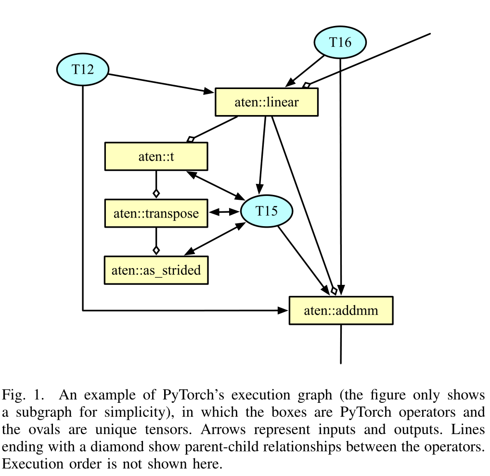
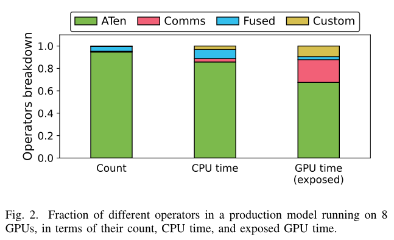
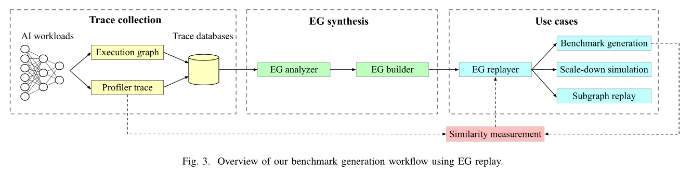
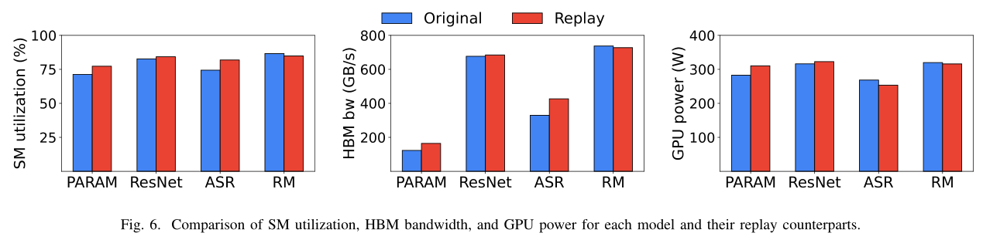
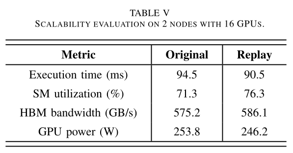

We present Mystique, a benchmark generation framework for AI workloads, which leverages the new PyTorch execution graph capability to record the runtime information of a model at operator granularity, and faithfully replay it to reproduce the original performance.
We evaluate our methodology across several production PyTorch workloads running in a warehouse-scale fleet, and show that the generated benchmarks closely match the original, both in terms of execution time and systemlevel metrics.
In general, all these frameworks are founded on building blocks, such as the tensor manipulation library and communication library, and are executed by the operators in these libraries, unlike the traditional CPU-centric applications. This is highly promising for benchmark generation, as these operators are reproducible.

<!--more-->

> [https://arxiv.org/abs/2301.04122](https://arxiv.org/abs/2301.04122)

# Abstract

- Generating accurate benchmarks plays an essential role in the design and evaluation of rapidly evoloving software and hardware solutions in this area. Two fundamental challenges to make this process scalable are (i) workload representativeness and (ii) the ability to quickly incorporate changes to the fleet into the benchmarks.
- Mystique, an accurate and scalable framework for production AI benchmark generation. It leverages the PyTorch execution graph (EG), By sourcing EG traces from the fleet, we can build AI benchmarks that are portable and representative
- Mystique is scalable, with its lightweight data collection, in terms of runtime overhead and user instrumentation efforts
- show that benchmarks generated with Mystique closely resemble original AI models, both in execution time and system-level metrics.

# Introduction

In this paper, we propose an efficient and scalable framework to create AI benchmarks directly from production workflows in a “replay as benchmark” manner.

Our main contributions are:

- We build a scalable and automated end-to-end infrastructure that profiles and replays the execution graph traces from real production AI workloads.
- We showcase the **portability** of the generated benchmarks across platforms and evaluate several use cases the framework can be applied to.

# Related Work

### A. AI benchmarks

- Benchmarks are powerful tools, as they enable evaluating a target system’s performance for a given workload without the need for supporting all dependencies the original application requires
- In essence, we have a scalability issue both in terms of the model space and in terms of time required for benchmark generation.
- Our insight in dealing with this scalability issue is to rely on automation to generate representative AI benchmarks instead of the current manual curation approach.

### B. Simulation, emulation, and performance modeling

- Simulation, emulation, and performance modeling offer another way to approximate a workload’s performance when software or hardware is unavailable.
- Fortunately, AI models are mostly implemented using highlevel APIs provided by common frameworks, such as PyTorch and TensorFlow. This means that instead of creating benchmarks at instruction level, we can achieve performance reconstruction at a higher level, in our case, via leveraging the traced execution graph of a model.

# Background

### A. Execution Graph (EG)

### B. Advantages of EG

- EG stands out among other similar recording approaches because:

  \1) its API is easy to use and requires minimal source level changes

  \2) its hardware agnostic design makes it portable across different hardware platforms,
  \3) it incurs very small performance overheads, which facilitates a largescale automated data collection setup in the background, in a production environment,
  \4) it has a compactly defined data schema which minimizes the storage support cost in production, and
  \5) as each EG node is a self-contained entity, the EG format provides great composability which enable more use cases, such as new hardware platform evaluation and scaled-down performance emulation .
- 

  - As the default compute backend of PyTorch, A Ten operators take up the lion share in terms of all three metrics. Fused operators are the second in count but have the shortest GPU time. Custom and communication operators are quantitatively modest, but have long GPU time; the former are usually complex in functionality and therefore expensive to execute, and the latter can also come at a significant cost in large-scale distributed deployments.

# Mystique Design

- First, we collect both the execution graph and the profiler trace of the fleet’s AI workloads under live traffic. Then the EG analyzer and builder preprocess the traces and select the most commonly-occurring ones. Currently, we pass these EG traces to the replayer in their original form and in the future we plan to add more sophistication to accommodate additional uses, such as operator obfuscation for enhanced IP protection.

  Finally, the EG replayer gets the input traces and creates the desired benchmarks or configures them for different use cases.

### B. Operators selection

- To identify these redundant operators, since the parent operator is always executed before its children, we can traverse the operators in the order of execution, keep each operator we encounter and skip all its child operators, based on the parent-child relationships captured in the execution graph.

### F . Putting it all together

- Our EG replay approach first collects the execution graph and profiler trace of a model to capture both the operators with their metadata, and their launched GPU kernels.
- We then walk through the graph according to the execution order, distinguish individual tensors, and identify the operators to replay.
- Next, we reconstruct the callable function for each operator, prepare the necessary tensors, and initialize the distributed environment, if necessary.
- Finally, we replay the operators on different streams with the same execution order, input arguments (but not values for tensors), and data dependencies as in the original workload, to faithfully reproduce their original performance characteristics.
- In case of a distributed deployment, for validation purposes, the same number of processes will be spawned as the original, each using a separate execution graph, and repeating all the steps above.

# Implementation

# Evaluation

C. Operators coverage

D. End-to-end execution time

F . Distributed training

- SM utilization, HBM bandwidth, and power are lower

# Use Cases

# Discussion

# Conclusion
