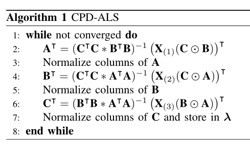
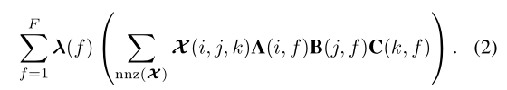
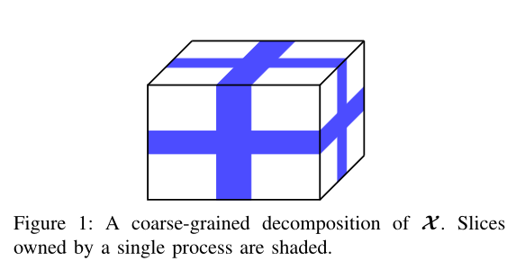
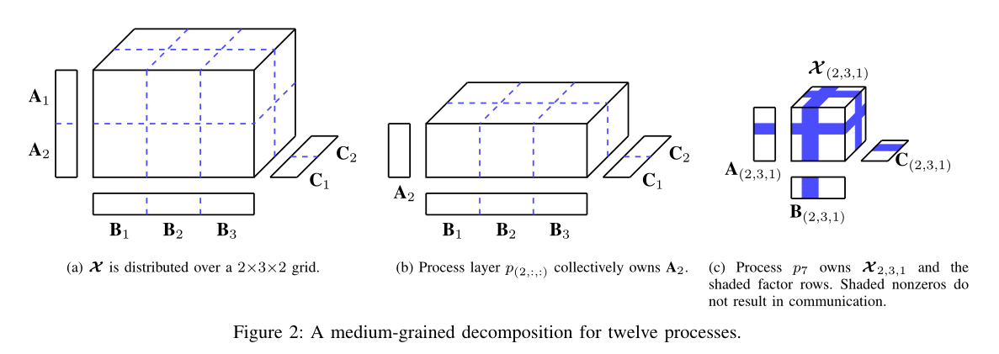
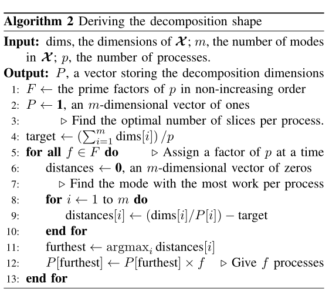
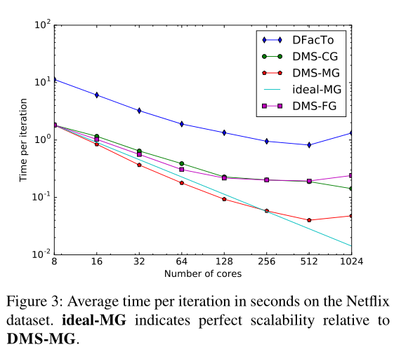

Present a **medium-grained decomposition** that avoids complete factor replication and communication, while **eliminating the need for expensive pre-processing** steps

<!--more-->

> [https://www.semanticscholar.org/paper/A-Medium-Grained-Algorithm-for-Distributed-Sparse-Smith-Karypis/30ef77d6370b3af3a6a84476f5c2441e3dda75e6](https://www.semanticscholar.org/paper/A-Medium-Grained-Algorithm-for-Distributed-Sparse-Smith-Karypis/30ef77d6370b3af3a6a84476f5c2441e3dda75e6)

## Abstract

- Challenge:

  - The computational time and memory required to compute CPD limits the size and dimensionality of the tensors that can be solved on a **typical workstation**, making distributed solution approaches the only viable option.
  - Most methods for **distributed-memory systems** have focused on distributing the tensor in a coarse-grained, one-dimensional fashion that prohibitively requires the dense matrix factors to **be fully replicated on each node**.
  - Recent work overcomes this limitation by using a fine-grained decomposition of the tensor nonzeros, at the cost of **computationally expensive hypergraph partitioning**.
- To that effect, we present a **medium-grained decomposition** that avoids complete factor replication and communication, while **eliminating the need for expensive pre-processing** steps.
- Performance:

  - #41-76x faster than a state-of-the-art MPI code, and is #1.5-5.0x faster than the fine-grained decomposition with 1024 cores.

# Intro

- Contributions:
  - A CPD-ALS algorithm for distributed-memory systems that uses an **m-**dimensional decomposition of the **tensor** and **one-**dimensional decompositions of the **factors** to achieve computational and memory scalability.
  - A theoretical analysis of the medium-grained decomposition, which shows that it **reduces the communication** overhead from $O(IF)$ to $O(IF/ \sqrt[m]{p})$, where IF is the size of the output and p is the number of cores.
    - 
    - 
    - The cost of Equation (2) is $4F \cdot nnz(X) \text{FLOPs}$, which is more expensive than an entire MTTKRP operation. In Section IV-B6 we present a method of reusing MTTKRP operation results to reduce the cost to 2FI.

# Related work

- Independent one-dimensional (1D) decompositions are used for each tensor mode. Processes own a set of contiguous slices for each mode and are responsible for the corresponding factor rows.

  - 
  - Memory consumption is **not scalable** and since updated factors must be communicated, communication is also not scalable.
- HYPERTENSOR

  - The experiments presented in [9] show that a balanced partitioning of the hypergraph leads to **a load-balanced computation with low communication volume**.
- The CSF data structure allows SPLATT to perform **operation-efficient**, **multithreaded** MTTKRP operations using a single tensor representation

# MEDIUM-GRAINED CPD-ALS

- In order to **address** the high memory and communication requirements of the coarse-grained decomposition while at the same time **eliminate** the need to perform the **expensive** **pre-processing** step associated with hypergraph partitioning, we developed an approach that uses a medium-grained decomposition.

## A. Data Distribution Scheme

## B. Distributed CPD-ALS

- \1) Distributed MTTKRP Operations:
- \2) Cholesky Factorization
- \3) Column Normalization
- \4) Forming the New Gram Matrix
- \5) Updating Non-Local Rows
- \6) Residual Computation

## C. Extensions to Higher Modes

## D. Complexity Analysis

- $O(IF) \rightarrow O(IF/ \sqrt[m]{n})$

# COMPUTING THE DATA DECOMPOSITION

- here are two forms of overhead that an
  ideal data decomposition will minimize: load imbalance and
  communication volume.

## A. Finding a Balanced Tensor Decomposition

## B. Partitioning the Factor Matrices

## C. Choosing the Shape of the Decomposition

# EXPERIMENTAL METHODOLOGY & RESULTS

---

# CONCLUSIONS AND FUTURE WORK

We introduced a medium-grained decomposition for **sparse tensor factorization**. The decomposition addresses the limitations of coarse-grained methods by **avoiding complete replication and communication** of the factors. In addition, the medium-grained decomposition does **not** require computationally **expensive pre-processing** such as hypergraph partitioning to have a low communication volume.
