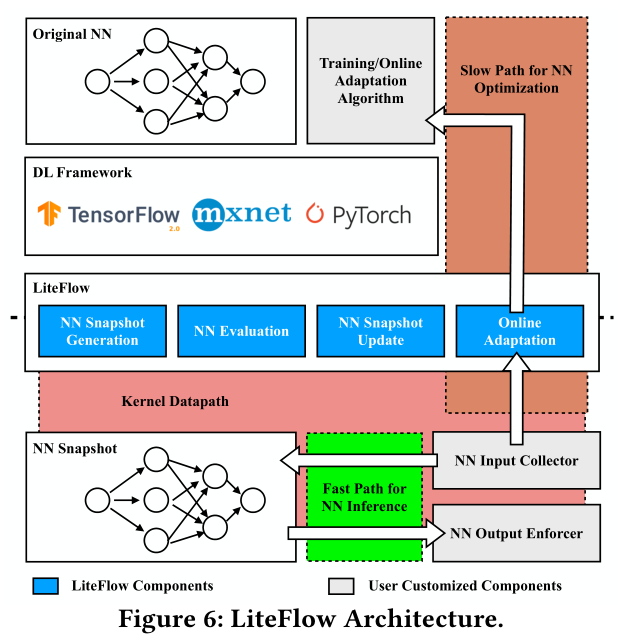
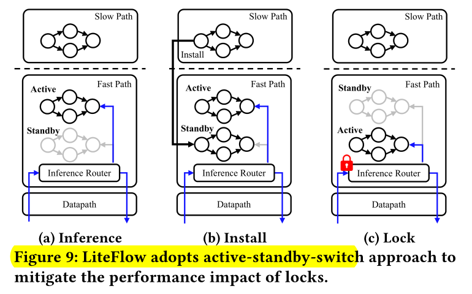
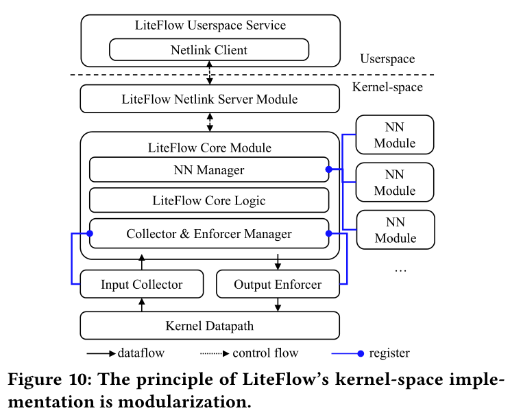
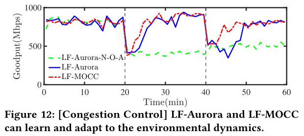
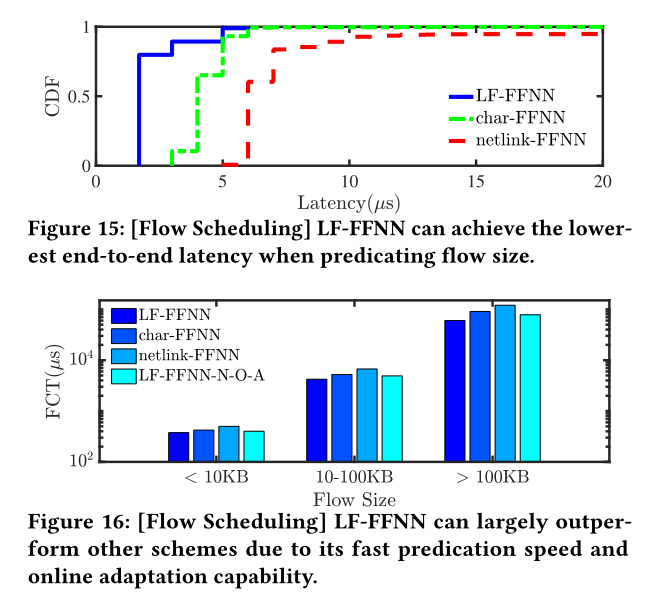

<!--more-->

> [https://hongzhangblaze.github.io/assets/pdf/liteflow.pdf](https://hongzhangblaze.github.io/assets/pdf/liteflow.pdf)

# Abstract

Adaptive neural networks (NN) have been used to optimize OS kernel datapath functions because they can achieve superior performance under changing environments.

## Challenge

One approach is to deploy these adaptive NNs in the userspace. However, such **userspace deployments** suffer from either **high cross-space communication overhead** or **low responsiveness**, significantly compromising the function performance.

On the other hand, **pure kernel-space deployments** also incur a large performance **degradation** because the computation logic of model tuning algorithm is typically complex, **interfering** with the performance of normal datapath execution.

## Contribution

This paper presents LiteFlow, a hybrid solution to build high performance adaptive NNs for kernel datapath.

- (1) a **kernel-space** fast path for efficient model **inference**, and
- (2) a **userspace** slow path for effective model **tuning**.

## Performance

LiteFlow achieves **44.4%** better goodput for **congestion control**, and improves the completion time for **long flows** by **33.7%** and **56.7%** for **flow scheduling** and load balancing, respectively.

# 1. Intro

Congestion control (CC)

## Goal

*Can we design high-performance adaptive NNs for kernel datapath to optimize function performance?*

## Insight

Model inference requires **fast execution**, which is better suited in the **kernel space**; whereas model tuning requires **high-precision** and intensive calculation, which is better suited in the **userspace**.

3 challenges:

- (1) The decoupling method requires two NNs of different design targets: one is compatible with kernel-space development environment and can be efficiently executed in kernel-space, the other is compatible with userspace machine learning frameworks, e.g., TensorFlow, etc. . Thus, it requires non-trivial development and debugging efforts.
- (2) As only the userspace-deployed NN is further tuned, the kernel-space-deployed NN cannot timely react to the changing network environment, affecting the function performance.
- (3) Tuning the userspace-deployed NN needs data from kernel-space, leading to performance degradation caused by frequent cross-space communication.

## Contribution

LiteFlow to

- (1) Automatically optimize the NN via **high-precision integer quantization** and leverages code transformation technology to generate a kernel-space-compatible **snapshot** ;
- (2) **Conservatively update** the snapshot with the userspace-tuned NN to make sure that it is accurate under the changing environments;
- (3) Perform **online adaption** with batched data based on the observation that network characteristics do not change at sub-second scale [55] to achieve high accuracy and low overhead simultaneously.

On a more general note, we have seen an **emerging trend** to *move the networking functionalities into the **userspace** [30, 44] or offload them to the **hardware**,*

# 2 Background & Motivation

## 2.1 Adaptive Neural Networks for Kernel

Datapath Functions

## 2.2 Performance Penalty

The results indicate that a **fine-grained** communication interval is necessary to make the CCP-Aurora responsive enough to achieve good network performance.

**Conclusion**: When pursuing high-performance datapath functions, the **userspace** deployment of NNs has an **inherent problem** of suffering from either high overhead or low responsiveness. No matter how we set the communication interval, we encounter an inevitable performance penalty.

## 2.3 What about Adaptive Neural Networks

*Direct in Kernel-space Datapath?*

- One approach is to directly implement the adaptive NNs, both the NN optimization and inference, in kernel space.
- Another approach is to abandon the NN optimization and convert the NNs to one-time lightweight NNs for inference only.

Conclusion: Directly deploying adaptive NNs in **kernel space** leads
to suboptimal performance because of either large implementation
complexity/overhead or **lack** of **adaptation** towards the changing
**environment**.

# 3. LiteFlow

LiteFlow builds a

$$
\text{kernel-space path} \sim \text{fast path} \rightarrow  \text{model inference}\\
\text{path to userspace}\sim \text{slow path}\rightarrow \text{model tuning}
$$

- (1) NNs for kernel datapath functions require very frequent inference to be responsive. Thus, putting them in the kernel space can **reduce the overhead**.
- (2) Model tuning, i.e., online adaptation, is suitable in userspace because it can benefit from **easy-to-use APIs**, **advanced features** (such as floating point/multi-thread support) brought by mature software and libraries in the userspace.

## Challenges for LiteFlow:

**C1.** The **decoupling method** requires two NNs of different design targets: one is compatible with the kernel-space environment and can be efficiently executed there, while the other one is compatible with userspace machine learning frameworks. Thus, users have to develop two NNs, and suffer from restrictions in kernel-space as discussed in §2.3, which introduces **non-trivial development and debugging efforts**.

**C2.** Since only the userspace-deployed NN is further tuned, the snapshot in the kernel space cannot timely react to the changing network environment, degrading the function performance.

**C3.** Tuning the userspace-deployed NN requires continuously delivering data from kernel space to userspace. Such frequent data exchange causes massive cross-space communication, yielding a large overhead.

To address these challenges, we design LiteFlow to:

- automatically optimize the NN via high-precision integer quantization and leverages code transformation technology to generate a kernel-space-compatible snapshot.
- conservatively update the snapshot with the userspace-tuned NN to make it accurate under the changing environment. Specifically, LiteFlow considers both correctness: LiteFlow waits for the online adaption to converge, and necessity: LiteFlow minimizes the number of snapshot updates to avoid the interference of function performance caused by kernel-space locks.
- batchwisely perform online adaption based on the network characteristics to simultaneously achieve high accuracy and low overhead.

## 3.1 NN Snapshot Generation

High-precision Integer Quantization

Automatic Layer-wise Code Translation

However, some layers are difficult to be converted into kernel-space compatible and optimized ones
For these layers, LiteFlow uses lookup table to approximate these functions with high precision and low computation complexity.

## 3.2 Online Adaptation

## 3.3 NN Synchronization Evaluation

LiteFlow delivers training data to the userspace in a batch mode to reduce the cross-space communication overhead.
**It is necessary to update the NN snapshot only when the minimal fidelity loss exceeds a user-defined threshold,**

## 3.4 NN Snapshot Update

Specifically, when updating the NN snapshot, LiteFlow has to leverage a kernel lock (usually a spin lock) to temporally prevent the NN snapshot from being used by other functions’ control flows.

functions relying on the NN will wait for the lock, eventually causing performance issues,

To solve the problem, LiteFlow adopts an active-standby-switch approach. Basically, LiteFlow maintains one NN snapshot as active, another snapshot as standby. Only the active snapshot is used for inference. Moreover, LiteFlow designs an inference router to switch the role of the two snapshots by forwarding the inference request to different snapshots.

### Flow Consistency

Flow inconsistency refers to a problem that some packets of one flow are served by an old NN snapshot while others are served by a new snapshot.
we design a flow cache in the inference router to ensure that packets of one flow will use the same NN for inference.2

When a NN inference request comes, LiteFlow calculates its flow ID and uses the flow ID as the key to look up the flow cache. The flow cache is a kernel-space hash table with flow ID as the key and pointer to a NN as the value. If there is a cache hit, then we directly use the pointer to find the NN for inference. If there is a cache miss, then we go back to the inference router to use the active NN for inference. Meanwhile, we move the pointer to the active NN to the cache for future use.

# 4 Implementation

## 4.1 Userspace Implementation

### NN Evaluation Interface

- (1) returning the stability value
- (2) calculating the output of the userspace deployed NN when given a set of input data.

### NN Online Adaptation Interface

## 4.2 Kernel-space Implementation

Figure 10 shows how LiteFlow is divided into different modules and we will introduce each module in the following sections.

### LiteFlow Core Module:

LiteFlow Netlink Server Module

- The first function is LiteFlow’s core logic, including NN evaluation and updating logics
- it implements a NN manager
- implement the collector & enforcer manager to integrate NNs with different datapath functions
- provides a unified inference interface lf_query_model for other kernel-space modules to use the NN

### LiteFlow Netlink Server Module:

Two types of messages are transferred through this netlink channel: (1) the newly-collected data for online adaptation, and (2) the output of the NN snapshot when given a set of input data for necessity evaluation.

### NN Module

### Input Collector & Output Enforcer

In this paper, we have implemented three such modules

- LiteFlow Congestion Control Module
- LiteFlow Flow Scheduling Module
- LiteFlow Path Selection Module

# 5 LiteFlow Applications

## 5.1 LiteFlow for Congestion Control

- Aurora: Aurora uses a reinforcement learning algorithm and builds a NN with two hidden fully-connected layers with 32 and 16 neutrons respectively
- MOCC uses multi-objective reinforcement learning and builds a NN with two hidden fully-connected layers with 64 and 32 neutrons respectively

Congestion Control Performance

The experiment results show that by enabling online adaptation, even with batched data, LiteFlow allows the NNs to efficiently learn and adapt to the environmental dynamics.

These experimental results show that by eliminating the overhead caused by crossspace communication, LiteFlow with NNs can achieve comparable performance to pure kernel-space implementations.

High Throughput & Low Latency
LF-Dummy-NN can achieve as high throughput as pure kernel-space BBR, where the performance degradation is within 5%.

## 5.2 LiteFlow for Flow Scheduling

**FFNN**: FFNN is a feed-forward neural network used to predict flow size in FLUX [55]. FFNN has 2 hidden layers with a ReLU activation function. Each hidden layer has 5 neutrons.

We mainly compare LF-FFNN with pure user-space inference solutions.

We mainly make two observations. First, LF-FFNN can largely outperform the other two userspace-deployed solutions in all cases.

Particular, LF-FFNN outperforms char-FFNN by 10.9% for short flows (377휇s vs 423휇s) and 33.7% for long flows

The results further demonstrate that by enabling online adaptation, LiteFlow is well suited for optimizing datapath functions in a large-scale deployment full of dynamics.

## 5.3 LiteFlow for Load Balancing

We make the following three observations. First, LF-MLP can largely outperform other schemes. It outperforms userspacedeployed MLP, i.e., char-MLP, by 34.3% on short flows and 56.7%  on long flows. Second, to our surprise, char-MLP even performs worse than the naive load balancing scheme, ECMP. We believe the reason is that char-MLP suffers from increasingly large overhead caused by cross-space communication which leads to severe datapath performance degradation. Third, LF-MLP can perform better than LF-MLP-N-O-A, which again confirms that it is crucial for NNs to learn and adapt to the environment to deliver superb performance in the networking context.
