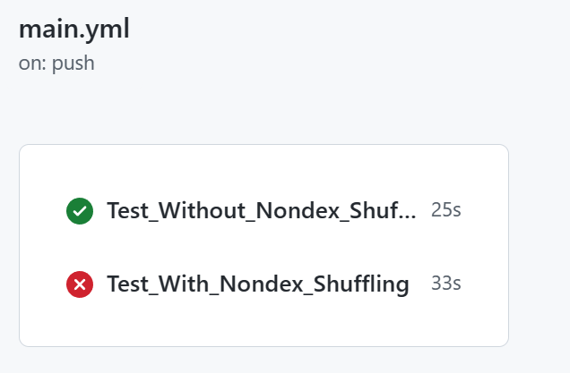

<!--more-->


# Step 0: Preparation 
Using my e-mail to generate 10 random tests:
``grep ,ID,, pr-data.csv | grep -v "\\[" | shuf --random-source=<(while :; do echo yiran.ding2@gmail.com; done) | head``

Results Test[] show as below:


```
https://github.com/webx/citrus,adfceaab120661e78ee7608f3335eaf863693a38,service/configuration,com.alibaba.citrus.service.configuration.PropertyPlaceholderTests.defaultValue,ID,,,test does not fail with -Dtest=PropertyPlaceholderTests#defaultValue but fails with -Dtest=PropertyPlaceholderTests   
https://github.com/twitter-archive/distributedlog,6c7b5745b697617327235a8b773a4263e50875ee,distributedlog-core,com.twitter.distributedlog.impl.metadata.TestZKLogMetadataForWriter.testCreateLogMetadataWithCustomMetadata,ID,,,
https://github.com/GoogleCloudPlatform/DataflowTemplates,5094c7b39de511c9ed441d9fde28553a88f68e4b,.,com.google.cloud.teleport.templates.BulkDecompressorTest.testDecompressUnknownCompressionFile,ID,,,
https://github.com/GoogleCloudPlatform/DataflowTemplates,5094c7b39de511c9ed441d9fde28553a88f68e4b,.,com.google.cloud.teleport.splunk.HttpEventPublisherTest.stringPayloadTest,ID,,,      
https://github.com/apache/nifi,2bd752d868a8f3e36113b078bb576cf054e945e8,nifi-registry/nifi-registry-core/nifi-registry-framework,org.apache.nifi.registry.security.ldap.tenants.LdapUserGroupProviderTest.testSearchGroupsWithNoNameAndUserIdentityUidAttribute,ID,,,
https://github.com/spring-attic/spring-security-oauth,0344de8cc75055742f638b1e476a646a6f5891d9,spring-security-oauth2,org.springframework.security.oauth2.provider.token.store.redis.RedisTokenStoreTests.testRemovedTokenCannotBeFoundByUsername,ID,,,
https://github.com/wro4j/wro4j,185ab607f1d649ca38b4a772831ee754cd4649fb,wro4j-extensions,ro.isdc.wro.extensions.processor.TestRubySassCssProcessor.shouldBeThreadSafe,ID,,,
https://github.com/apache/druid,50963edcae70150f13520b619f167512d951a71b,core,org.apache.druid.math.expr.ParserTest.testSimpleMultiplicativeOp1,ID,,,
https://github.com/dromara/hutool,ec14f8384ad384fb6e054df722fe089d64af0c41,hutool-core,cn.hutool.core.annotation.AnnotationUtilTest.getCombinationAnnotationsWithClassTest,ID,,,
https://github.com/apache/hbase,801fc05e9c082ab12c7c1207087d3667ab162d1a,hbase-server,org.apache.hadoop.hbase.master.TestCatalogJanitor.testParentCleanedEvenIfDaughterGoneFirst,ID,,, 
```

And the content is that:
Project URL | SHA Detected | Module Path | Fully-Qualified Test Name | Category | Status | ...

---

# Step 1: Confirm that the test is flaky

An example is at https://github.com/benzhao654/openapi-generator-flaky/actions/runs/4038354814/workflow. 

Details are show as below:
```yaml
name: Test:TypescriptAngularPetstoreIntegrationTest.generatesCorrectDirectoryStructure
run-name: Known Flaky test
on: [push]
jobs:
  Test_Without_Nondex_Shuffling:
    runs-on: ubuntu-latest
    steps:
      - uses: actions/checkout@v3
      - name: Set up JDK 8
        uses: actions/setup-java@v3
        with:
          java-version: '8'
          distribution: 'temurin'
      - name: Test
        run: mvn -pl modules/openapi-generator test -Dtest=org.openapitools.codegen.typescript.typescriptangular.TypescriptAngularPetstoreIntegrationTest#generatesCorrectDirectoryStructure
        
  Test_With_Nondex_Shuffling:
    runs-on: ubuntu-latest
    steps:
      - uses: actions/checkout@v3
      - name: Set up JDK 8
        uses: actions/setup-java@v3
        with:
          java-version: '8'
          distribution: 'temurin'
      - name: Test
        run: mvn -pl modules/openapi-generator edu.illinois:nondex-maven-plugin:1.1.2:nondex -Dtest=org.openapitools.codegen.typescript.typescriptangular.TypescriptAngularPetstoreIntegrationTest#generatesCorrectDirectoryStructure
        
```
Compare to the record from `pr.csv`:
```
Project URL:
    https://github.com/OpenAPITools/openapi-generator
SHA Detected:
    fe934dc1b40227369f226611219886760458f6d2
Module Path:
    modules/openapi-generator
Fully-Qualified Test Name:
    org.openapitools.codegen.typescript.typescriptangular.TypescriptAngularPetstoreIntegrationTest.generatesCorrectDirectoryStructure
Category:
    ID
```

So we can get the template of Github Action file:

```yaml
name: Test:[Last 2 Fully-Qualified Test Name]
run-name: Known Flaky test
on: [push]
jobs:
  Test_Without_Nondex_Shuffling:
    runs-on: ubuntu-latest
    steps:
      - uses: actions/checkout@v3
      - name: Set up JDK 8
        uses: actions/setup-java@v3
        with:
          java-version: '8'
          distribution: 'temurin'
      - name: Test
        run: mvn -pl [Module Path] test -Dtest=[Fully-Qualified Test Name with '.' -> '#']
        
  Test_With_Nondex_Shuffling:
    runs-on: ubuntu-latest
    steps:
      - uses: actions/checkout@v3
      - name: Set up JDK 8
        uses: actions/setup-java@v3
        with:
          java-version: '8'
          distribution: 'temurin'
      - name: Test
        run: mvn -pl [Module Path] edu.illinois:nondex-maven-plugin:1.1.2:nondex -Dtest=[Fully-Qualified Test Name with '.' -> '#']

```

## **Test[0]**
So I try this temple on Test[0] from step 0,
but error happened on `Test_Without_Nondex_Shuffling`
```yaml
Failed to execute goal on project citrus-service-configuration: Could not resolve dependencies for project com.alibaba.citrus:citrus-service-configuration:jar:3.2.4: The following artifacts could not be resolved: com.alibaba.citrus:citrus-service-base:jar:3.2.4, com.alibaba.citrus:citrus-test-util:jar:3.2.4: Could not find artifact com.alibaba.citrus:citrus-service-base:jar:3.2.4 in central (https://repo.maven.apache.org/maven2)
```

"That's not a big problem", I thought.
But after 5 times trying, I gave up this test. Maybe Test[1] is better? 

## **Test[1]**
A different error happened, it "seems" more easy to solve.
```
Could not transfer metadata com.twitter:distributedlog-protocol:0.4.0-incubating-SNAPSHOT/maven-metadata.xml from/to maven-default-http-blocker (http://0.0.0.0/): transfer failed for http://0.0.0.0/com/twitter/distributedlog-protocol/0.4.0-incubating-SNAPSHOT/maven-metadata.xml
Warning:  com.twitter:distributedlog-protocol:0.4.0-incubating-SNAPSHOT/maven-metadata.xmlfailed to transfer from http://0.0.0.0/ during a previous attempt. This failure was cached in the local repository and resolution will not be reattempted until the update interval of maven-default-http-blocker has elapsed or updates are forced. Original error: Could not transfer metadata com.twitter:distributedlog-protocol:0.4.0-incubating-SNAPSHOT/maven-metadata.xml from/to maven-default-http-blocker (http://0.0.0.0/): transfer failed for http://0.0.0.0/com/twitter/distributedlog-protocol/0.4.0-incubating-SNAPSHOT/maven-metadata.xml

... ...

Error:  Failed to execute goal on project distributedlog-core: Could not resolve dependencies for project com.twitter:distributedlog-core:jar:0.4.0-incubating-SNAPSHOT: Failed to collect dependencies at com.twitter:distributedlog-protocol:jar:0.4.0-incubating-SNAPSHOT: Failed to read artifact descriptor for com.twitter:distributedlog-protocol:jar:0.4.0-incubating-SNAPSHOT: Could not transfer artifact com.twitter:distributedlog-protocol:pom:0.4.0-incubating-SNAPSHOT from/to maven-default-http-blocker (http://0.0.0.0/): Blocked mirror for repositories: [apache.snapshots (http://repository.apache.org/snapshots, default, snapshots)] -> [Help 1]

```
I search on stackoverflow with "twitter:distributedlog-protocol:pom:0.4.0-incubating-SNAPSHOT from/to maven-default-http-blocker (http://0.0.0.0/): Blocked mirror for repositories:" 
and find out some useful suggestions:
[Getting "Blocked mirror for repositories" maven error even after adding mirrors](https://stackoverflow.com/questions/67833372/getting-blocked-mirror-for-repositories-maven-error-even-after-adding-mirrors)

But these methods are all build in the local environment. It need to find `~/.m2/local-settings.xml` and change the `<mirror>`. After 1-2 hours searching, I feel exhausted. So I took a break and stretched myself.

After that, a post catch my attention: "**If you work in a project and cannot make sure the Maven settings are always like that, e.g. because you share code with other people or want to use CI/CD with automated testing, you may do the following**:"
Oh! I find a "solution" ! And it seems that caused by 
> Maven now disables all insecure http://* mirrors by default. Here is explanation from maven mainteners: http://maven.apache.org/docs/3.8.1/release-notes.html#cve-2021-26291

After I follow the steps by this post, another problem happened:
```yaml
Error:  Failed to execute goal on project distributedlog-core: Could not resolve dependencies for project com.twitter:distributedlog-core:jar:0.4.0-incubating-SNAPSHOT: Could not find artifact com.twitter:distributedlog-protocol:jar:0.4.0-incubating-SNAPSHOT in bookkeeper-twitter-mvn-repo (https://raw.github.com/twitter/bookkeeper/mvn-repo/4.3.5-TWTTR-OSS) -> [Help 1]
```
I gave up after [22](https://github.com/Yiyi-philosophy/distributedlog/actions/) attempt ... 😢😢 ... Maybe I don't deserve this task ...


## **Test[2]**
After all, I talk a few minutes with chatgpt, she comfort me a lot. 😘😘 And I start Test[2]:
Error, I'm numb ...
```
Failed to execute goal org.apache.maven.plugins:maven-checkstyle-plugin:3.2.1:check (default) on project templates: Execution default of goal org.apache.maven.plugins:maven-checkstyle-plugin:3.2.1:check failed: An API incompatibility was encountered while executing org.apache.maven.plugins:maven-checkstyle-plugin:3.2.1:check: java.lang.UnsupportedClassVersionError: com/puppycrawl/tools/checkstyle/api/AuditListener has been compiled by a more recent version of the Java Runtime (class file version 55.0), this version of the Java Runtime only recognizes class file versions up to 52.0
```
It **is** the **easiest** problem I met these days !
Just the `Java` version problem, look at me handling it in a minute. I change the `Java` version from 8 to 11. And run it:
[Known Flaky test · Yiyi-philosophy/DataflowTemplates@914ef26 (github.com)](https://github.com/Yiyi-philosophy/DataflowTemplates/actions/runs/4476167945)



Ohhhhh! It passed! I'm finish these Sh** task.

### **But... **
Something abnormal happened:
`Test_With_Nondex_Shuffling` fail with error
```yaml
Error:  Failed to execute goal edu.illinois:nondex-maven-plugin:1.1.2:nondex (default-cli) on project templates: Execution default-cli of goal edu.illinois:nondex-maven-plugin:1.1.2:nondex failed: NonDex only supports Java 8 -> [Help 1]
```
> Looking back with the error from the Eg:
> ```yaml
> Failed to execute goal edu.illinois:nondex-maven-plugin:1.1.2:nondex (default-cli) on project openapi-generator: Unable to execute mojo: There are test failures.
> ```
This is "False positive". Actually, NonDex only supports Java 8. So I should find another solution. 
This post make sense:
> [https://stackoverflow.com/questions/71500951/maven-checkstyle-plugin-failed-to-parse-java-record](https://stackoverflow.com/questions/71500951/maven-checkstyle-plugin-failed-to-parse-java-record)

And finally ... finally I find this Flaky test, and confirm it:
[Known Flaky test · Yiyi-philosophy/DataflowTemplates@914ef26 (github.com)](https://github.com/Yiyi-philosophy/DataflowTemplates/actions/runs/4476317644)

```yaml
Error:  Failed to execute goal edu.illinois:nondex-maven-plugin:1.1.2:nondex (default-cli) on project openapi-generator: Unable to execute mojo: There are test failures.
```
Same as e.g.


