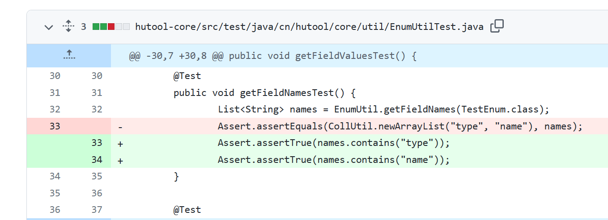
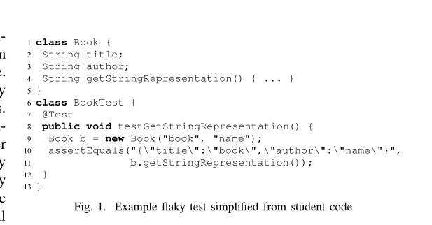
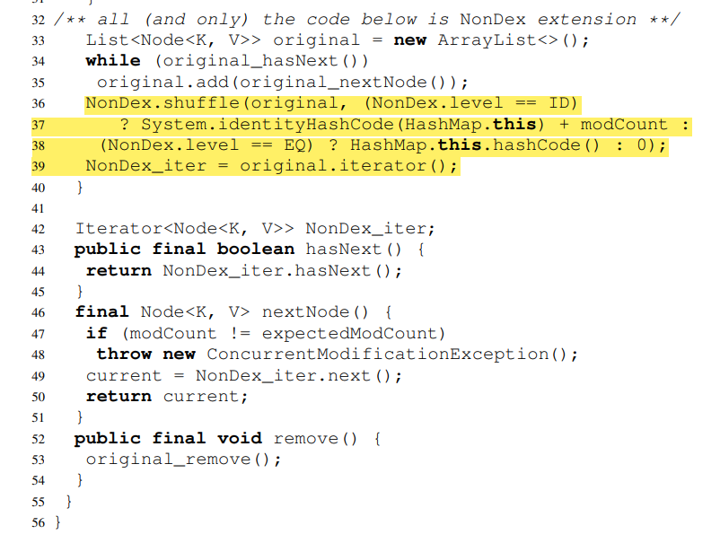
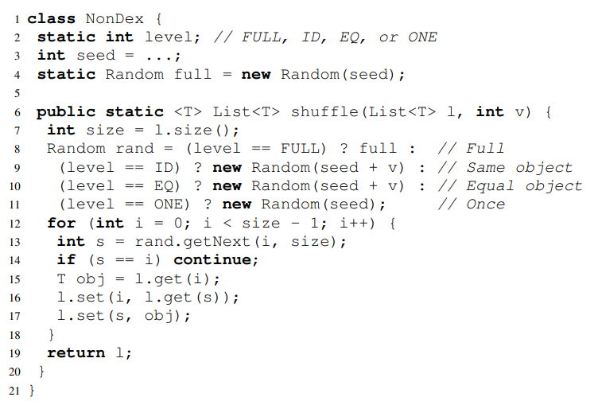
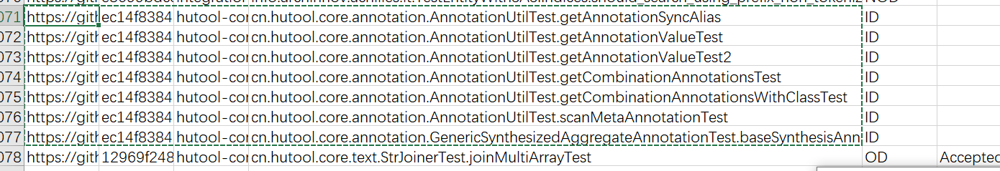
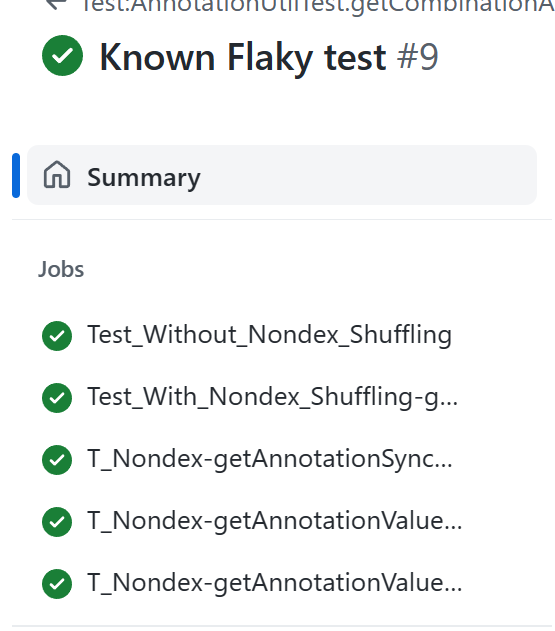

<!--more-->

> I'm major in C/C++ ...

---

# Step 0: Preparation

Using my e-mail to generate 10 random tests:
``grep ,ID,, pr-data.csv | grep -v "\\[" | shuf --random-source=<(while :; do echo yiran.ding2@gmail.com; done) | head``

Results Test[] show as below:

```
https://github.com/webx/citrus,adfceaab120661e78ee7608f3335eaf863693a38,service/configuration,com.alibaba.citrus.service.configuration.PropertyPlaceholderTests.defaultValue,ID,,,test does not fail with -Dtest=PropertyPlaceholderTests#defaultValue but fails with -Dtest=PropertyPlaceholderTests   
https://github.com/twitter-archive/distributedlog,6c7b5745b697617327235a8b773a4263e50875ee,distributedlog-core,com.twitter.distributedlog.impl.metadata.TestZKLogMetadataForWriter.testCreateLogMetadataWithCustomMetadata,ID,,,
https://github.com/GoogleCloudPlatform/DataflowTemplates,5094c7b39de511c9ed441d9fde28553a88f68e4b,.,com.google.cloud.teleport.templates.BulkDecompressorTest.testDecompressUnknownCompressionFile,ID,,,
https://github.com/GoogleCloudPlatform/DataflowTemplates,5094c7b39de511c9ed441d9fde28553a88f68e4b,.,com.google.cloud.teleport.splunk.HttpEventPublisherTest.stringPayloadTest,ID,,,  
https://github.com/apache/nifi,2bd752d868a8f3e36113b078bb576cf054e945e8,nifi-registry/nifi-registry-core/nifi-registry-framework,org.apache.nifi.registry.security.ldap.tenants.LdapUserGroupProviderTest.testSearchGroupsWithNoNameAndUserIdentityUidAttribute,ID,,,
https://github.com/spring-attic/spring-security-oauth,0344de8cc75055742f638b1e476a646a6f5891d9,spring-security-oauth2,org.springframework.security.oauth2.provider.token.store.redis.RedisTokenStoreTests.testRemovedTokenCannotBeFoundByUsername,ID,,,
https://github.com/wro4j/wro4j,185ab607f1d649ca38b4a772831ee754cd4649fb,wro4j-extensions,ro.isdc.wro.extensions.processor.TestRubySassCssProcessor.shouldBeThreadSafe,ID,,,
https://github.com/apache/druid,50963edcae70150f13520b619f167512d951a71b,core,org.apache.druid.math.expr.ParserTest.testSimpleMultiplicativeOp1,ID,,,
https://github.com/dromara/hutool,ec14f8384ad384fb6e054df722fe089d64af0c41,hutool-core,cn.hutool.core.annotation.AnnotationUtilTest.getCombinationAnnotationsWithClassTest,ID,,,
https://github.com/apache/hbase,801fc05e9c082ab12c7c1207087d3667ab162d1a,hbase-server,org.apache.hadoop.hbase.master.TestCatalogJanitor.testParentCleanedEvenIfDaughterGoneFirst,ID,,, 
```

And the content is that:
Project URL | SHA Detected | Module Path | Fully-Qualified Test Name | Category | Status | ...

## Here are the test result of these 10 test:

| Test[]      | Without_Nondex | With_Nondex | Link                                                                                              | Reason                                                             |
| ----------- | -------------- | ----------- | ------------------------------------------------------------------------------------------------- | ------------------------------------------------------------------ |
| 0           | ❌             | ❌          | [Actions](https://github.com/Yiyi-philosophy/citrus/actions)                                         | Dependency Problem                                                 |
| 1           | ❌             | ❌          | [Known Flaky test](https://github.com/Yiyi-philosophy/distributedlog/actions/runs/4476015853)        | 0.4.0-incubating-SNAPSHOT                                          |
| **2** | ✔️           | ❌          | [Known Flaky test](https://github.com/Yiyi-philosophy/DataflowTemplates/actions/runs/4480023695)     | Unable to execute mojo:<br />**No tests were executed!**     |
| **3** | ✔️           | ❌          | [Known Flaky test 2](https://github.com/Yiyi-philosophy/DataflowTemplates/actions/runs/4480023649)   | Unable to execute mojo:<br />**No tests were executed!**     |
| 4           | ❌             | ❌          | [Known Flaky test](https://github.com/Yiyi-philosophy/nifi/actions/runs/4480084248)                  | Dependency Problem                                                 |
| 5           | ❌             | ❌          | [Known Flaky test](https://github.com/Yiyi-philosophy/spring-security-oauth/actions/runs/4480129103) | spring-security-oauth2:<br />There are test failures.              |
| 6           | ❌             | ❌          | [Known Flaky test](https://github.com/Yiyi-philosophy/wro4j/actions/runs/4480187692)                 | 1.10.2-SNAPSHOT:<br />Could not resolve **version conflict** |
| 7           | ❌             | ❌          | [Known Flaky test](https://github.com/Yiyi-philosophy/druid/actions/runs/4480222235)                 | Could not find the selected project<br />in the reactor: core @    |
| **8** | ✔️           | ❌          | [Known Flaky test](https://github.com/Yiyi-philosophy/hutool/actions/runs/4486070605)                | Unable to execute mojo:<br />**There are test failures**     |
| 9           | ❌             | ❌          | [Known Flaky test](https://github.com/Yiyi-philosophy/hbase/actions/runs/4480298586)                 | Dependency Problem                                                 |

---

# Step 1: Confirm that the test is flaky

An example is at https://github.com/benzhao654/openapi-generator-flaky/actions/runs/4038354814/workflow.

Details are show as below:

```yaml
name: Test:TypescriptAngularPetstoreIntegrationTest.generatesCorrectDirectoryStructure
run-name: Known Flaky test
on: [push]
jobs:
  Test_Without_Nondex_Shuffling:
    runs-on: ubuntu-latest
    steps:
      - uses: actions/checkout@v3
      - name: Set up JDK 8
        uses: actions/setup-java@v3
        with:
          java-version: '8'
          distribution: 'temurin'
      - name: Test
        run: mvn -pl modules/openapi-generator test -Dtest=org.openapitools.codegen.typescript.typescriptangular.TypescriptAngularPetstoreIntegrationTest#generatesCorrectDirectoryStructure
  
  Test_With_Nondex_Shuffling:
    runs-on: ubuntu-latest
    steps:
      - uses: actions/checkout@v3
      - name: Set up JDK 8
        uses: actions/setup-java@v3
        with:
          java-version: '8'
          distribution: 'temurin'
      - name: Test
        run: mvn -pl modules/openapi-generator edu.illinois:nondex-maven-plugin:1.1.2:nondex -Dtest=org.openapitools.codegen.typescript.typescriptangular.TypescriptAngularPetstoreIntegrationTest#generatesCorrectDirectoryStructure
  
```

Compare to the record from `pr.csv`:

```
Project URL:
    https://github.com/OpenAPITools/openapi-generator
SHA Detected:
    fe934dc1b40227369f226611219886760458f6d2
Module Path:
    modules/openapi-generator
Fully-Qualified Test Name:
    org.openapitools.codegen.typescript.typescriptangular.TypescriptAngularPetstoreIntegrationTest.generatesCorrectDirectoryStructure
Category:
    ID
```

So we can get the **template** of Github Action file:

```yaml
name: Test:[Last 2 Fully-Qualified Test Name]
run-name: Known Flaky test
on: [push]
jobs:
  Test_Without_Nondex_Shuffling:
    runs-on: ubuntu-latest
    steps:
      - uses: actions/checkout@v3
      - name: Set up JDK 8
        uses: actions/setup-java@v3
        with:
          java-version: '8'
          distribution: 'temurin'
      - name: Test
        run: mvn -pl [Module Path] test -Dtest=[Fully-Qualified Test Name with '.' -> '#']
  
  Test_With_Nondex_Shuffling:
    runs-on: ubuntu-latest
    steps:
      - uses: actions/checkout@v3
      - name: Set up JDK 8
        uses: actions/setup-java@v3
        with:
          java-version: '8'
          distribution: 'temurin'
      - name: Test
        run: mvn -pl [Module Path] edu.illinois:nondex-maven-plugin:1.1.2:nondex -Dtest=[Fully-Qualified Test Name with '.' -> '#']

```

## **Test[0]**

So I try this temple on Test[0] from step 0,
but error happened on `Test_Without_Nondex_Shuffling`

```yaml
Failed to execute goal on project citrus-service-configuration: Could not resolve dependencies for project com.alibaba.citrus:citrus-service-configuration:jar:3.2.4: The following artifacts could not be resolved: com.alibaba.citrus:citrus-service-base:jar:3.2.4, com.alibaba.citrus:citrus-test-util:jar:3.2.4: Could not find artifact com.alibaba.citrus:citrus-service-base:jar:3.2.4 in central (https://repo.maven.apache.org/maven2)
```

"This is not a big problem", I thought.
But after 5 tries, I gave up on this test. Maybe Test[1] is better?

## **Test[1]**

A different error occurred and it "seemed" easier to fix.

```
Could not transfer metadata com.twitter:distributedlog-protocol:0.4.0-incubating-SNAPSHOT/maven-metadata.xml from/to maven-default-http-blocker (http://0.0.0.0/): transfer failed for http://0.0.0.0/com/twitter/distributedlog-protocol/0.4.0-incubating-SNAPSHOT/maven-metadata.xml
Warning:  com.twitter:distributedlog-protocol:0.4.0-incubating-SNAPSHOT/maven-metadata.xmlfailed to transfer from http://0.0.0.0/ during a previous attempt. This failure was cached in the local repository and resolution will not be reattempted until the update interval of maven-default-http-blocker has elapsed or updates are forced. Original error: Could not transfer metadata com.twitter:distributedlog-protocol:0.4.0-incubating-SNAPSHOT/maven-metadata.xml from/to maven-default-http-blocker (http://0.0.0.0/): transfer failed for http://0.0.0.0/com/twitter/distributedlog-protocol/0.4.0-incubating-SNAPSHOT/maven-metadata.xml

... ...

Error:  Failed to execute goal on project distributedlog-core: Could not resolve dependencies for project com.twitter:distributedlog-core:jar:0.4.0-incubating-SNAPSHOT: Failed to collect dependencies at com.twitter:distributedlog-protocol:jar:0.4.0-incubating-SNAPSHOT: Failed to read artifact descriptor for com.twitter:distributedlog-protocol:jar:0.4.0-incubating-SNAPSHOT: Could not transfer artifact com.twitter:distributedlog-protocol:pom:0.4.0-incubating-SNAPSHOT from/to maven-default-http-blocker (http://0.0.0.0/): Blocked mirror for repositories: [apache.snapshots (http://repository.apache.org/snapshots, default, snapshots)] -> [Help 1]

```

I search on stackoverflow with "twitter:distributedlog-protocol:pom:0.4.0-incubating-SNAPSHOT from/to maven-default-http-blocker (http://0.0.0.0/): Blocked mirror for repositories:"
and find out some useful suggestions:
[Getting &#34;Blocked mirror for repositories&#34; maven error even after adding mirrors](https://stackoverflow.com/questions/67833372/getting-blocked-mirror-for-repositories-maven-error-even-after-adding-mirrors)

However, these methods are built in the local environment. You need to find `~/.m2/local-settings.xml` and modify `<mirror>`. After searching for 1-2 hours, I was feeling tired. So I took a break and stretched myself a bit.

After that, a post caught my attention: "**If you are working on a project and can't make sure Maven settings are always the same, for example because you share code with others or want to use CI/CD with automated tests, you can take the following steps**:"
Oh! I found a "solution"! It seems to be causing this

> Maven now disables all insecure http://* mirrors by default. Here is explanation from maven mainteners: http://maven.apache.org/docs/3.8.1/release-notes.html#cve-2021-26291

After I follow the steps by this post, I had another problem:

```yaml
Error:  Failed to execute goal on project distributedlog-core: Could not resolve dependencies for project com.twitter:distributedlog-core:jar:0.4.0-incubating-SNAPSHOT: Could not find artifact com.twitter:distributedlog-protocol:jar:0.4.0-incubating-SNAPSHOT in bookkeeper-twitter-mvn-repo (https://raw.github.com/twitter/bookkeeper/mvn-repo/4.3.5-TWTTR-OSS) -> [Help 1]
```

I gave up after [22](https://github.com/Yiyi-philosophy/distributedlog/actions/) attempt ... 😢😢 ... Maybe I don't deserve this task ...

## **Test[2]**

After all, I talked to chatgpt for a few minutes and she comforted me a lot. 😘😘 Then I started testing [2]:

Error, I'm numb ...

```
Failed to execute goal org.apache.maven.plugins:maven-checkstyle-plugin:3.2.1:check (default) on project templates: Execution default of goal org.apache.maven.plugins:maven-checkstyle-plugin:3.2.1:check failed: An API incompatibility was encountered while executing org.apache.maven.plugins:maven-checkstyle-plugin:3.2.1:check: java.lang.UnsupportedClassVersionError: com/puppycrawl/tools/checkstyle/api/AuditListener has been compiled by a more recent version of the Java Runtime (class file version 55.0), this version of the Java Runtime only recognizes class file versions up to 52.0
```

It is the **simplest** problem I've encountered recently!
It's just a `Java` version issue, see how I deal with it in a moment. I changed the version of "Java" from 8 to 11. Then ran it as follows:
[Known Flaky test · Yiyi-philosophy/DataflowTemplates@914ef26 (github.com)](https://github.com/Yiyi-philosophy/DataflowTemplates/actions/runs/4476167945)


Ohhhhhhh! It passed! I finished these Sh** tasks.

### **But... **

Something untoward happened: `Test_With_Nondex_Shuffling` fail with error

```yaml
Error:  Failed to execute goal edu.illinois:nondex-maven-plugin:1.1.2:nondex (default-cli) on project templates: Execution default-cli of goal edu.illinois:nondex-maven-plugin:1.1.2:nondex failed: NonDex only supports Java 8 -> [Help 1]
```

> Looking back with the error from the Eg:
>
> ```yaml
> Failed to execute goal edu.illinois:nondex-maven-plugin:1.1.2:nondex (default-cli) on project openapi-generator: Unable to execute mojo: There are test failures.
> ```

This is "False positive". Actually, NonDex only supports Java 8. So I should find another solution.This post make sense:

> [https://stackoverflow.com/questions/71500951/maven-checkstyle-plugin-failed-to-parse-java-record](https://stackoverflow.com/questions/71500951/maven-checkstyle-plugin-failed-to-parse-java-record)

I ran it.
[Known Flaky test · Yiyi-philosophy/DataflowTemplates@914ef26 (github.com)](https://github.com/Yiyi-philosophy/DataflowTemplates/actions/runs/4476317644)

```yaml
Error:  Failed to execute goal edu.illinois:nondex-maven-plugin:1.1.2:nondex (default-cli) on project openapi-generator: Unable to execute mojo: No tests were executed!
```

Same as e.g, ... Pretty much.  `No tests were executed!` This is really a hard job. Wait, I need to change my search strategy. Why not use **BFS** instead of **DFS**?

## BFS test

So I test the rest 7 project and recieved the [table of 10 test results](#here-are-the-test-result-of-these-10-test:), showed as previous. The results show that only Test[8] hutool [Known Flaky test](https://github.com/Yiyi-philosophy/hutool/actions/runs/4486070605) strictly confirmed by Flaky Test.

# Step 2: Fix the flaky test

After that, I cloned the code locally and tried to fix it. Here are the results of `nondex` 10 times:

| Test Name                                                                           | 933178 | 974622 | 1016066 | 1057510 | 1098954 | 1140398 | 1181842 | 1223286 | 1264730 | 1306174 |
| ----------------------------------------------------------------------------------- | ------ | ------ | ------- | ------- | ------- | ------- | ------- | ------- | ------- | ------- |
| cn.hutool.core.annotation.AnnotationUtilTest#getCombinationAnnotationsWithClassTest | ✖     | ✔     | ✔      | ✖      | ✖      | ✖      | ✖      | ✔      | ✔      | ✖      |

With a patient, I thought `pull request in github` might give me some ideas. So I searched `flaky` in [pull requests](https://github.com/dromara/hutool/pull/1270) for closed requests, and I found a useful result:

[Fix flaky test in EnumUtilTest by ShawnLi-25 · Pull Request #1270 · dromara/hutool (github.com)](https://github.com/dromara/hutool/pull/1270)



This fix request suggests that the failure is due to non-deterministic return values. So I think the problem may occur mainly in `String` and `List`. Here is the course code for this test:
Form `cn.hutool.core.annotation.AnnotationUtilTest#getCombinationAnnotationsWithClassTest`

Error show like below:

```java
Failed tests:   getCombinationAnnotationsWithClassTest(cn.hutool.core.annotation.AnnotationUtilTest): expected:<1> but was:<0>

Failed tests:   getCombinationAnnotationsWithClassTest(cn.hutool.core.annotation.AnnotationUtilTest): expected:<[??]> but was:<[repeat-annotation]>
```

Here is the code:

```java
// hutool-core/src/test/java/cn/hutool/core/annotation/AnnotationUtilTest.java
@Test
	public void getCombinationAnnotationsWithClassTest(){
		final AnnotationForTest[] annotations = AnnotationUtil.getCombinationAnnotations(ClassWithAnnotation.class, AnnotationForTest.class);//<--- Only place may cause Non-Deterministic Error
		Assert.assertNotNull(annotations);
		Assert.assertEquals(1, annotations.length);//<--- Failure in this
		Assert.assertEquals("测试", annotations[0].value());
	}
```

```java
// hutool-core/src/main/java/cn/hutool/core/annotation/AnnotationUtil.java
public static <T> T[] getCombinationAnnotations(AnnotatedElement annotationEle, Class<T> annotationType) {//<--- From here 
		return getAnnotations(annotationEle, true, annotationType);
	}
```

There didn't seem to be any clues, so I went back to the paper

# Paper

[Detecting Assumptions on Deterministic Implementations of Non-deterministic Specifications](https://mir.cs.illinois.edu/marinov/publications/ShiETAL16NonDex.pdf)



Here is how `nondex` test shuffle the order:




So, this could be caused by `HashMap()` or some other sequential function. But it doesn't work, it seems that the unit test `getCombinationAnnotationsWithClassTest` doesn't use hashmap. In fact, the fault shows more details: `expected: <[??] > but is: <[repeat-annotation]>`. **`repeat-annotation`** is important. Here is the code:

```java
///hutool-core/src/test/java/cn/hutool/core/annotation/RepeatAnnotationForTest.java
@AnnotationForTest("repeat-annotation")
@Retention(RetentionPolicy.RUNTIME)
// Target注解决定MyAnnotation注解可以加在哪些成分上，如加在类身上，或者属性身上，或者方法身上等成分
@Target({ ElementType.METHOD, ElementType.TYPE })
public @interface RepeatAnnotationForTest {
}

// hutool-core/src/test/java/cn/hutool/core/annotation/AnnotationUtilTest.
@AnnotationForTest(value = "测试", names = {"测试1", "测试2"})
@RepeatAnnotationForTest
static class ClassWithAnnotation{
  public void test(){

  }
}
```

If I comment this statement `@RepeatAnnotationForTest`, this test will be **Build Successfully**. So I ran it on github workflow: [Known Flaky test · Yiyi-philosophy/hutool@b427612 (github.com)](https://github.com/Yiyi-philosophy/hutool/actions/runs/4538227739) and both `Test_Without_Nondex_Shuffling` and `Test_With_Nondex_Shuffling` are passed.

# Other Testing

By the way, I search this project `hutool` in `pr.csv`, and found other errors in this project:


So I test them all in github workflow, and result is excellent:

[Known Flaky test · Yiyi-philosophy/hutool@84d2b47 (github.com)](https://github.com/Yiyi-philosophy/hutool/actions/runs/4542326570)



# Conclusion and Discussion

In this project, I search a lot of information about these errors and nearly solve it. And learn a lot of `Java` and `Github-Workflow`. Besides, I also learn the importance of choosing between strategies of **BFS** and **DFS**.
Although the resulting code seems to pass the Flaky test, it still comes at the cost of losing the `@RepeatAnnotationForTest` functionality, which is sometimes impossible.