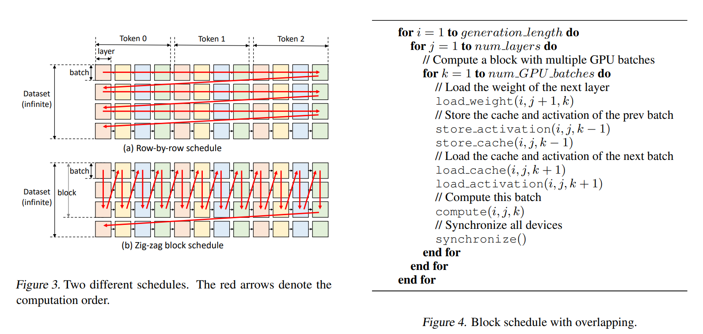
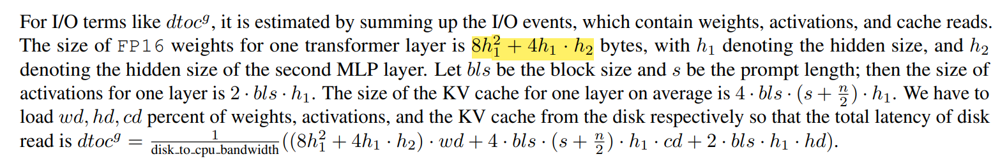

Motivated by the emerging demand for **latency-insensitive** tasks with batched processing, this paper initiates the study of **high-throughput** LLM **inference** using limited resources, such as a **single commodity GPU**. We present FlexGen, a high-throughput generation engine for running LLMs with limited GPU memory. 

<!--more-->
> https://github.com/FMInference/FlexGen

# Abstract

FlexGen can be **flexibly** configured under various hardware resource constraints by aggregating memory and computation from the GPU, CPU, and disk. 
Through a **linear programming optimizer**, it searches for efficient patterns to store and access tensors. FlexGen further compresses these weights and the attention cache to **4 bits** with negligible accuracy loss. 
These techniques enable FlexGen to have a **larger space of batch size** choices and thus significantly increase maximum throughput. 

| System | OPT-6.7B | OPT-30B | OPT-175B |
| ------ | -------- | ------- | -------- |
| Hugging Face Accelerate  | 25.12 (2 on GPU)  | 0.62 (8 on CPU) | 0.01 (2 on disk) |
| DeepSpeed ZeRO-Inference | 9.28 (16 on CPU)  | 0.60 (4 on CPU) | 0.01 (1 on disk) |
| Petals                 | 8.25 (2 on GPU) | 2.84 (2 on GPU) | 0.08 (2 on GPU) |
| FlexGen                  | 25.26 (2 on GPU) | 7.32 (144 on CPU) | 0.69 (256 on disk) |
| FlexGen with Compression | **29.12** (72 on GPU) | **8.38** (512 on CPU) | **1.12** (144 on CPU) |

# Intro
	
- Introduced a throughtput-oriented generative inference.
- Methods:
    - Model compression
    - collaborative inference
    - offloading
-  Flexgen:
    -  run 175B on single GPU
-  **Challenge**
    - efficient offloading strategies: weights, activation, KV cache
    - efficient compression strategies
- Contribution
    - linear programming-based search algorithm to optimize the throughput within the search space which contains possible offloading strategies
    - compress both the **weights** and **KV cache** for LLMs like OPT-175B to 4 bits without retraining or calibration
    - Performance
        - FlexGen: same latency = 5000s -> #**40×** higher DeepSpeed Zero-Inference
      	- higher latency = 12000s, FlexGen achieves #**69×** higher maximum throughput compared to baselines
    	- allowing 4-bit compression, FlexGen can reach 100× higher maximum throughput with latency = 4000s 

# 

---

# Evaluation

> https://zhuanlan.zhihu.com/p/615021309

Flexgen系统传播效果好主要是取了一个新颖的视角，还是单/多GPU跑LLM模型，放大了throughout需求，提出一个极端的CPU offload系统，实验中提到，With a higher latency of 12000 s(3.3个小时）,batchsize 256,, 69×higherthroughput than DeepSpeed Zero-Inference（b=1），推理延迟已经拉长到3.3个小时了（这也限制它的使用场景，仅适合离线批量计算场景），从并行设计上没有什么特别突出地方，但是敢想（延迟压到3.3个小时）、敢换角度思考（利用高throughout、高延迟特性挖掘跨样本的并行）以及对细节的持续思考（比如进一步量化压缩改进CPU-GPU访存带宽、设计自动方法寻找最优的优化参数）来改进系统。

## Offloading Strategy

作者基于一些假设前提，设定了一个形式话抽象，简单的说，就是作者基于zig-zag的并行策略，该策略高优先通过流水等延迟隐藏方法不断向GPU输送batch样本，且GPU端仅仅进行一个Transformer layer的计算，一旦计算完成就对KVcache、激活、weight权重参数进行checkpoint，也是流水化overlapping的将数据转移到CPU DRAM和磁盘；当batch纬度并行达到一定的阶段后，再进入下一个layer的计算，且也是高优先batch纬度并行，同样利用overlapping技术隐藏CPU Dram和磁盘的访存延迟；依次进入下一个layer；直到所有layer完成。到这里肯可能prompt计算完了，然后Generating的token同样按照这样的并行技巧，优先batch并行，然后进行layer并行。

## Cost model

基于上面的并行思路，假定我们实现了一个“磁盘-CPU-GPU”的pipeline流水并行系统，来overlapping整个链路中的“计算、数据读、数据写”的延迟，这个完美的系统，但是，多少数据放到磁盘上，多少数据放到cpu端，多少数据放到GPU端，都会影响整体pipeline的效率，故作者给出了一个计算disk磁盘到cpu端拖取数据的耗时的量化结论：

4h1^2是attention的参数大小，2h1*h2是2个h1*h2 FFN矩阵参数大小，分别乘以2字节（fp16）；activation对一个tokens只有一个hidden大小，就是2*bls*h1（所以从这里可以看出其实没有估算prompt这块的计算，可能耗时占比不大所以忽略吧）；KV cache主要2个字节、KV共2个缓存项、seq平均长度、隐藏大小、批大小。加起来就是下面的公式：

${dtoc^g}=\frac{1}{\text{disk_to_cpu_bandwidth}} \left(\left(8 h_1^2+4 h_1 \cdot h_2\right) \cdot w d + \\\\ 4 \cdot b l s \cdot\left(s+\frac{n}{2}\right) \cdot h_1 \cdot c d+2 \cdot b l s \cdot h_1 \cdot h d\right)$

pipeline每个环节都用类似的评估方法形式化除量化公式，然后基于这个量化公式，进行线性规划的优化，寻找一些性能更佳的参数。做理论研究，似乎还可以基于实际情况（不用上面的理论建模），用类似强化学习方法，探索更优的系统参数。因为上面形式化方法偏理想，因为对于一个pipeline，当某一个计算单元需要相关参数的时候，参数在磁盘、cpu和dram上实际占比是不确定的，尤其再考虑不用简化的并行模型（比如，batch数据并行和layer并行是混合的场景，系统模型更加复杂，无法构建这样的形式化模型，也较难收集稳定的性能数据）。

## Others

GPU上同时“几个batch以及几个Layers”混跑。GPU上默认先尽最大可能进行batch内/间的数据并行，文章说为了简化工程实现(论文附录分析了还有更优的设计，分析思路有兴趣读者可以继续深入），直到batch计算产生的激活和KVcache把下游memory hierarchy存储空间，比如DRAM，打满（批注： 理论上也可以不用极端的打满，到一个上界应该就不影响系统最终吞吐就可以了，这个上界跟batch size、DRAM访存带宽、GPU计算密度、GPU存储空间有一定的关系，对于特定的GPU和服务器架构，理论上可以实验获取这个超参)

所以，基于上面的假设简化，flexgen的并行重点参照ZiG-zag设计，用通俗话说，极端的用batch填满GPU计算密度，达到一定阶段（就是前面讲的阈值，文章里讲更极端，就是等DRAM或者CPU这些内存被填满）后，再进行下一个layer的计算调度（因为可以不考虑latency，所以这种极端设计也是合理的），参看右侧的伪代码，工程上上面一些步骤要异步实现，将weight、activate、KV cache的存储和更新隐藏（overlapping）到GPU的计算里去(原文： the weight load of the next layer, cache/activation load of the next batch, cache/activation store of the previous batch and the computation of the current batch.)
