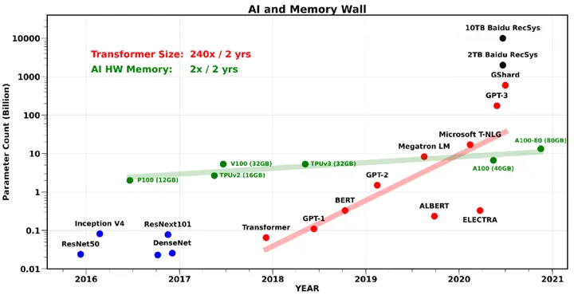
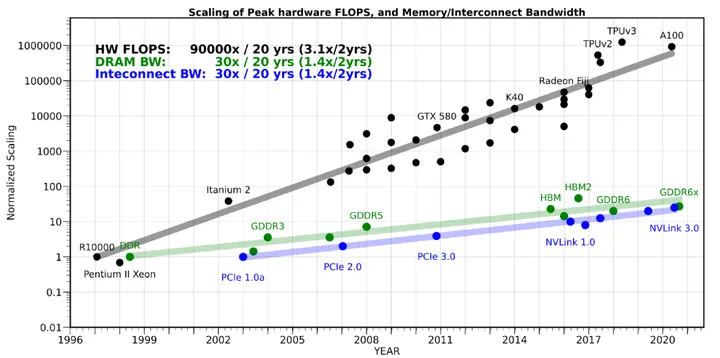
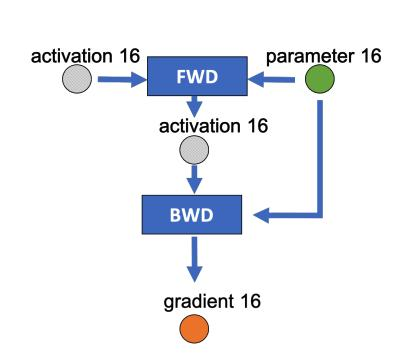
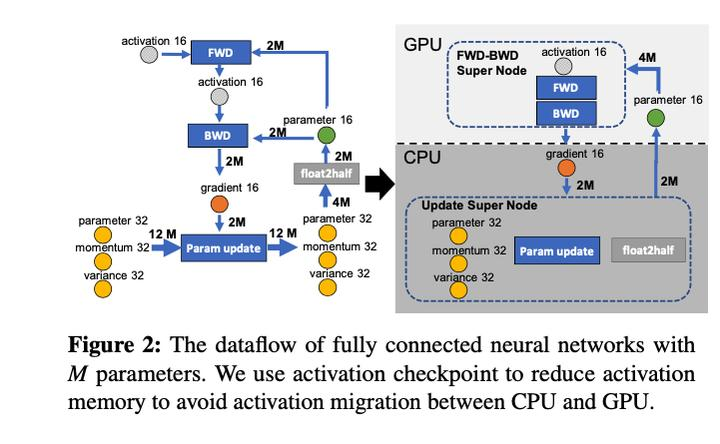
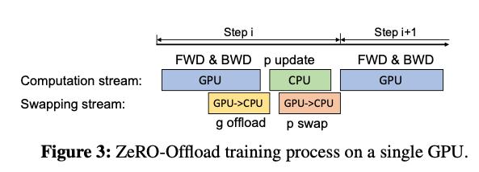
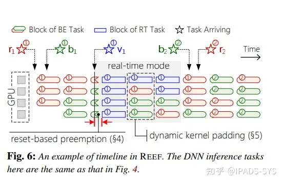
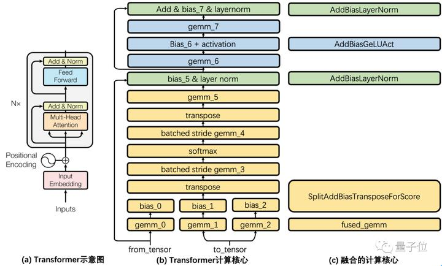

<!--more-->

# Sourse

## Useful blog

- 🔲[AI算力的阿喀琉斯之踵：内存墙 - OneFlow的文章 - 知乎](https://zhuanlan.zhihu.com/p/363041668)
> 
> 

- ✅[A Summary Thread on Attention in Transformers](https://mem.ai/p/yYEcOhYFjmjq32CtzEPX)

- ✅[How to Estimate the Number of Parameters in Transformer models](https://towardsdatascience.com/how-to-estimate-the-number-of-parameters-in-transformer-models-ca0f57d8dff0)

- 🔲[OpenAI 工程师 lilianweng 关于LLM推理计算优化的方法概述](https://lilianweng.github.io/posts/2023-01-10-inference-optimization/)

## [王燕飞](https://www.zhihu.com/people/nono-nono-66/posts)

- ✅[大模型LLMs算法和计算系统重点论文 - AI系统工程师视角Reading List （1） - 王燕飞的文章](https://zhuanlan.zhihu.com/p/608268806)

- ✅[大模型LLMs算法和计算系统重点论文 - AI系统工程师视角Reading List （2） - 王燕飞的文章](https://zhuanlan.zhihu.com/p/616200081)

### Flexgen

- ✅[单卡高吞吐的大语言模型推理 - 嘻嘻嘻的文章 - 知乎](https://zhuanlan.zhihu.com/p/608279479)

- ✅[Flexgen LLM推理 CPU Offload计算架构到底干了什么事情？ - 王燕飞的文章 - 知乎](https://zhuanlan.zhihu.com/p/615021309)

- ✅[Flexgen LLM推理计算环节的量化分析 - 王燕飞的文章 - 知乎](https://zhuanlan.zhihu.com/p/615327112)

- ✅[Flexgen LLM推理相关工作 - 怎么思考寻找优化方法 - 王燕飞的文章 - 知乎](https://zhuanlan.zhihu.com/p/615328081)

- 🔲[DeepSpeed之ZeRO系列：将显存优化进行到底 - basicv8vc的文章 - 知乎](https://zhuanlan.zhihu.com/p/513571706)

## Muli

### Methods

- ✅[**如何读论文**：](https://www.bilibili.com/video/BV1H44y1t75x/)

- 🔲[如何判断（你自己的）研究工作的价值- [论文精读]](https://www.bilibili.com/video/BV1oL411c7Us/)

- 🔲[你（被）吐槽过论文不够 novel 吗？- [论文精读]](https://www.bilibili.com/video/BV1ea41127Bq/)

### Background Knowledge

- ✅[Transformer论文逐段精读- [论文精读]](https://www.bilibili.com/video/BV1pu411o7BE/)

- 🔲[BERT 论文逐段精读【论文精读】](https://www.bilibili.com/video/BV1PL411M7eQ/)

- ✅[GPT，GPT-2，GPT-3 论文精读- [论文精读]](https://www.bilibili.com/video/BV1AF411b7xQ/)

- 🔲[Megatron LM 论文精读- [论文精读]](https://www.bilibili.com/video/BV1nB4y1R7Yz/)

- 🔲[Zero 论文精读[论文精读]](https://www.bilibili.com/video/BV1tY411g7ZT/)

- 🔲[InstructGPT 论文精读[论文精读·48]](https://www.bilibili.com/video/BV1hd4y187CR/)

- 🔲[HELM 全面语言模型评测[论文精读·50]](https://www.bilibili.com/video/BV1z24y1B7uX/)

- 🔲[Anthropic LLM 论文精读[论文精读·51]](https://www.bilibili.com/video/BV1XY411B7nM/)

----

# **Article**

- ✅[How to Read a Paper](https://web.stanford.edu/class/ee384m/Handouts/HowtoReadPaper.pdf)

> 因为LLM应用效果显著（OpenAI chatGPT/GPT-4、meta OPT/LLaMA），所以LLM的计算系统研究工作从专注训练系统设计到推理系统方向拓展，目标降低LLM推理成本、推理门槛，Flexgen提到了几个重要工作，谷歌代表性工作 **PaLM inferenc**e 、微软代表性工作   **Deepspeed-Inference**，另外OSDI22年 **Orca**工作。PaLM inference和Deepspeed-Inference是端到端系统并行系统设计；Orca侧重对变成seq的计算效率提升，设计token level的并行计算系统，侧重系统设计（不单纯是多GPU同构系统上的高性能计算的并行设计，更强调系统化的设计，包含推理计算、调度服务）来提升推理计算的资源利用率。其他还有，FasterTransformer、LightSeq、TurboTransformers 、  Huggingface的Accelerate工作。这类工作比较侧重从计算机系统设计角度研究对LLM推理计算的优化，大部分优化具有无损特性，相对通用性更高（但是部分工作里也存在正交的有损优化，进一步加速系统性能提升）。

## **PaLM inference**
- 🔲[Blog](https://ai.googleblog.com/2022/04/pathways-language-model-palm-scaling-to.html)

- 🔲[PaLM: Scaling Language Modeling with Pathways](https://arxiv.org/pdf/2204.02311.pdf)

> 模型层面主要有如下改动：使用SwiGLU激活函数，有研究证明在同等计算量下SwiGLU的效果更好把FFN和Attention并行 

> 以前：$y=x+MLP(LayerNorm(x+Attention(LayerNorm(x)))$
>
> 现在：$y = x + MLP(LayerNorm(x)) + Attention(LayerNorm(x))$
>
>  **Multi-Query Attention：**以往做attention前我们都会把Q和K隐层映射到[head_num, head_size]，而PaLM让所有头共享参数矩阵，只映射到[1, head_size],对训练速度和效果没什么影响，但却提升了decode的速度使用RoPE[2]位置编码：
> 
> RoPE是苏神的工作，主要利用三角函数的恒等变换来优化相对位置编码输入和输出共享embedding矩阵去掉所有的Bias项使用256K个token的SentencePiece

> 作者在intro中也总结了大模型提升的套路：
> 
> - 扩大模型深度和宽度
> - 增加训练的token数目
> - 更干净和更多源的数据
> - 利用稀疏计算增加模型容量

## **Deepspeed-Inference**
- 🔲[https://www.deepspeed.ai/inference/](https://www.deepspeed.ai/inference/)
DeepSpeed Inference: Enabling Efficient Inference
of Transformer Models at Unprecedented Scale
- 🔲[https://arxiv.org/pdf/2207.00032.pdf](https://arxiv.org/pdf/2207.00032.pdf)

### ZeRO
- 🔲[DeepSpeed之ZeRO系列：将显存优化进行到底 - basicv8vc的文章 - 知乎](https://zhuanlan.zhihu.com/p/513571706)
> Offload策略
> ZeRO-Offload并不希望为了最小化显存占用而让系统的计算效率下降.但是将部分GPU的计算和存储下放到CPU和内存，必然涉及CPU和GPU之间的通信增加，**不能让通信成为瓶颈**，此外GPU的计算效率相比于CPU也是数量级上的优势，**也不能让CPU参与过多计算**，避免成为系统瓶颈，只有前两条满足的前提下，再考虑最小化显存的占用。
> 
> 为了找到最优的offload策略，作者将模型训练过程看作数据流图（data-flow graph）。圆形节点表示模型状态，比如参数、梯度和优化器状态矩形节点表示计算操作，比如前向计算、后向计算和参数更新边表示数据流向下图是某一层的一次迭代过程（iteration/step），使用了混合精读训练，前向计算（FWD）需要用到上一次的激活值（activation）和本层的参数（parameter），反向传播（BWD）也需要用到激活值和参数计算梯度，
> 
> ZeRO-Offload的切分思路是：图中有四个计算类节点：FWD、BWD、Param update和float2half，前两个计算复杂度大致是 $O(MB)$，$B$ 是batch size，后两个计算复杂度是 $O(M)$。为了不降低计算效率，将前两个节点放在GPU，后两个节点不但计算量小还需要和Adam状态打交道，所以放在CPU上，Adam状态自然也放在内存中，为了简化数据图，将前两个节点融合成一个节点FWD-BWD Super Node，将后两个节点融合成一个节点Update Super Node。如下图右边所示，沿着gradient 16和parameter 16两条边切分。
> 
> 现在的计算流程是，在GPU上面进行前向和后向计算，将梯度传给CPU，进行参数更新，再将更新后的参数传给GPU。为了提高效率，可以将计算和通信并行起来，GPU在反向传播阶段，可以待梯度值填满bucket后，一遍计算新的梯度一遍将bucket传输给CPU，当反向传播结束，CPU基本上已经有最新的梯度值了，同样的，CPU在参数更新时也同步将已经计算好的参数传给GPU，如下图所示。
> 

## **Orca**
- 🔲[https://www.usenix.org/conference/osdi22/presentation/yu](https://www.usenix.org/conference/osdi22/presentation/yu)

- 🔲[https://www.usenix.org/system/files/osdi22-yu.pdf](https://www.usenix.org/system/files/osdi22-yu.pdf)
- 🔲[OSDI 2022 论文评述-0x6：Machine Learning 2 - IPADS-SYS的文章 - 知乎](https://zhuanlan.zhihu.com/p/541704684)
> 本项工作提出了面现实时场景的DNN推理调度系统REEF，REEF主要提出了两个核心技术：首先，基于DNN推理任务GPU kernel的幂等性，提出了reset-based preemption技术，通过直接kill正在执行的kernel，实现了微秒级的DNN推理任务GPU抢占；其次，基于DNN推理任务GPU kernel的时延可预测性，提出了dynamic kernel padding技术，允许RT和BE任务并行执行，同时可以保证RT任务的时延不受影响。
> 

## **FasterTransformer**
- 🔲[英伟达Fastertransformer源码解读](https://zhuanlan.zhihu.com/p/79528308)
- 🔲[https://github.com/NVIDIA/FasterTransformer](https://github.com/NVIDIA/FasterTransformer)
- 🔲[NVIDIA BERT推理解决方案Faster Transformer开源啦](https://mp.weixin.qq.com/s/77mh--Z2dUbz6sTncNZIYA)
>为了减少kernel调用次数，将除了矩阵乘法的kernel都尽可能合并针对大batch单独进行了kernel优化支持选择最优的矩阵乘法在使用FP16时使用half2类型，达到half两倍的访存带宽和计算吞吐优化gelu、softmax、layernorm的实现以及选用rsqrt等

## **LightSeq**
- 🔲[https://arxiv.org/abs/2010.13887](https://arxiv.org/abs/2010.13887)
- 🔲[简单读读LightSeq - 我不是zzk的文章 - 知乎](https://zhuanlan.zhihu.com/p/398753306)
> 类似LightSeq的高性能加速库也有很多，下面的三个主要特性是我们比别的加速库表现好的原因：
> - 我们将Tensorflow/Pytorch实现中的一些细粒度Kernel，进一步融合实现成一个粗粒度的Kernel，从而避免大量核函数启动和GPU memory IO带来的时间成本
> 我们设计了一种hierarchical（层级） auto regressive search来替代auto regressive search，进一步加速
> 我们提出了一种动态显存复用策略，在NLP处理中，我们经常会遇到变长数据，给内存分配带来了困难。LightSeq预先定义了每个kernel最大可使用显存，并给不存在依赖关系的kernel进行共享，能够减少8倍内存分配。

## **TurboTransformers**
- 🔲[https://arxiv.org/abs/2010.05680](https://arxiv.org/abs/2010.05680)
- 🔲[微信也在用的Transformer加速推理工具，现在腾讯开源了 - 量子位的文章 - 知乎](https://zhuanlan.zhihu.com/p/136194893)
> 算子层优化
> Transformer都包含了什么计算呢？
> 如下图所示，图(a)展示了论文Transformer结构示意图，这里称灰色方框内的结构为一个Transformer Cell，BERT encoder堆叠了Nx个这样的Transformer Cell。图(b)将一个Cell的细节加以展开，每一个矩形都是一个独立的计算核心。
> 
> Transformer Cell计算包含了8个GEMM(通用矩阵乘法，General Matrix Multiplication)运算。通过调优Intel MKL和cuBLAS的GEMM调用方式来获得最佳GEMM性能。并且在硬件允许条件下，在GPU上使用tensor core方式进行GEMM运算。
> 类似NVIDIA FasterTransformers方案，将所有GEMM运算之间的计算融合成一个调用核心。融合会带来两个好处，一是减少了内存访问开销，二是减少多线程启动开销。对于这些核心，在CPU上采用openmp进行并行，在GPU上使用CUDA进行优化实现。对于比较复杂的LayerNorm和Softmax算子，它们包含了不适合GPU上并行的规约操作，TurboTransformers为它们设计了创新并行算法，极大降低了这些算子的延迟。理论上Transformers推理延迟应该近似于矩阵乘法延迟。

## **Huggingface**
- 🔲[https://arxiv.org/abs/1910.03771](https://arxiv.org/abs/1910.03771)
- 🔲 [https://huggingface.co/docs/accelerate/index](https://huggingface.co/docs/accelerate/index)
- 

---

> 一类工作是量化（quantization）和稀疏化（sparsification）工作

## ✅[Flexgen](https://arxiv.org/pdf/2303.06865.pdf)

| System | OPT-6.7B | OPT-30B | OPT-175B |
| ------ | -------- | ------- | -------- |
| Hugging Face Accelerate  | 25.12 (2 on GPU)  | 0.62 (8 on CPU) | 0.01 (2 on disk) |
| DeepSpeed ZeRO-Inference | 9.28 (16 on CPU)  | 0.60 (4 on CPU) | 0.01 (1 on disk) |
| Petals                 | 8.25 (2 on GPU) | 2.84 (2 on GPU) | 0.08 (2 on GPU) |
| FlexGen                  | 25.26 (2 on GPU) | 7.32 (144 on CPU) | 0.69 (256 on disk) |
| FlexGen with Compression | **29.12** (72 on GPU) | **8.38** (512 on CPU) | **1.12** (144 on CPU) |

## 🔲[OpenAI 工程师 lilianweng 关于LLM推理计算优化的方法概述](https://lilianweng.github.io/posts/2023-01-10-inference-optimization/)

> Several methods can be used to make inference cheaper in memory or/and faster in time.
>
> 1. Apply various parallelism to scale up the model across a large number of GPUs. Smart parallelism of model components and data makes it possible to run a model of trillions of parameters. （批注： 例如，Deepspeed inference对dense和MoE 稀疏模型的并行策略，提高并行度，降低计算延迟）
> 2. Memory offloading to offload temporarily unused data to the CPU and read them back when needed later. This helps with memory usage but causes higher latency. （批注： 例如，flexgen和Deepspeed inference都有对CPU offload的设计，其中flexgen更是将这种设计推向新高度，核心追求throughout性能，适合离线场景）
> 3. Smart batching strategy; E.g. EffectiveTransformer packs consecutive sequences together to remove padding within one batch.
> 4. Network compression techniques, such as pruning, quantization, distillation. A model of smaller size, in terms of parameter count or bitwidth, should demand less memory and run faster. （批注： 一般牺牲精度或者需要微调，在小模型时代端侧推理常用的方法，现在在大模型时代，这种类似优化技巧在云端也更加重视）
> 5. Improvement specific to a target model architecture. Many architectural changes, especially those for attention layers, help with transformer decoding speed. （批注： Large Transformer Model Inference Optimization 重点总结了模型结构方面的优化设计，例如，围绕Transformer模型结构进行计算优化，降低理论计算量，不是计算机系统方面的优化设计了）
