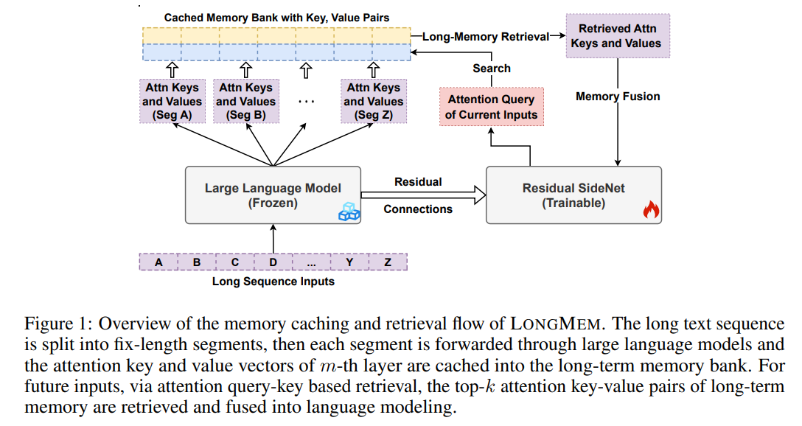
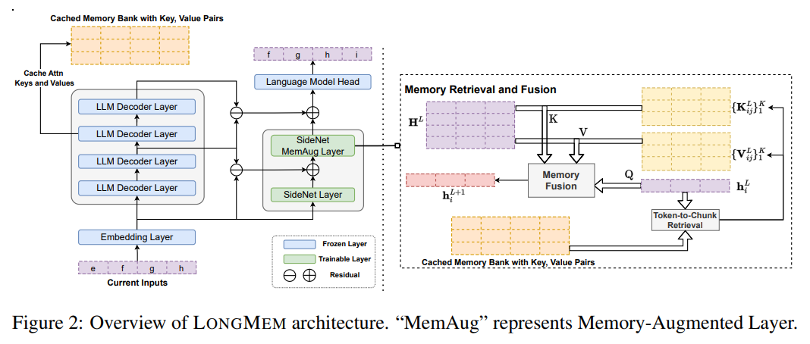
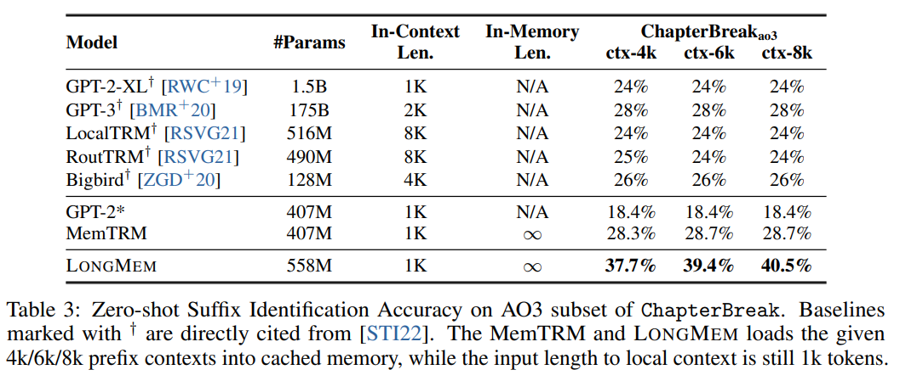
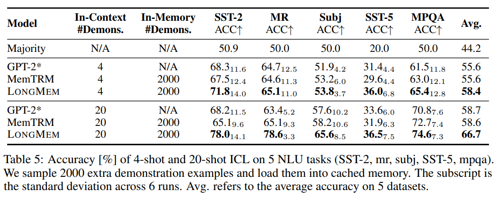

Design a novel decoupled network architecture with the original backbone **LLM** frozen as a **memory encoder** and an **adaptive residual side-network** as a **memory retriever** and reader. Such a decoupled memory design can easily cache and update *long-term past contexts* for memory retrieval without suffering from memory staleness.

<!--more-->

Enhanced with memory-augmented adaptation training, LONGMEM can thus **memorize long past context** and use long-term memory for language modeling. The proposed memory retrieval module can handle unlimited-length context in its memory bank to benefit various downstream tasks.	

# 1 Background:

Existing large language models (LLMs) can only afford **fix-sized** inputs due to the input length limit, preventing them from utilizing rich long-context information from past inputs.

# 2 Related work:

Large language models (LLMs) have revolutionized natural language processing with great successes in advancing the state-of-the-art on various understanding and generation tasks.

# 3 Challenges:

- Length Limit
  - The input length limit of existing LLMs prevents them from generalizing to real-world scenarios where the capability of processing **long-form information** beyond a fix-sized session is critical, e.g., long horizontal planning
- Computation Limit $O(n^4)$
  - This approach typically incurs computation-intensive training from scratch and the **in-context** **dense attention** is still heavily constrained by the **quadratic** computation complexity of Transformer self-attention
  - Instead focuses on developing **in-context sparse attention** to avoid the quadratic cost of self-attention, which still largely requires training from scratch.
- Memory Staleness
  - As the model parameters are updated, cached older representations in memory may have distributional shifts from those from the latest model, thereby limiting the effectiveness of the memory augmentation

# 4 Motivation:

- Propose a framework, Language Models Augmented with Long-Term Memory (LONGMEM), which enables LLMs to memorize long history.
- Avoid the **quadratic cost** of self-attention and reduce other computation costs.
- Overcome **memory staleness**, and memorize long past context and use long-term memory for language modeling.

# 5 Proposed Methods:

Propose a framework for Language Models Augmented with Long-Term Memory(LONGMEM), which enables language models to cache long-form previous context or knowledge into the non-differentiable memory bank, and further take advantage of them via a decoupled memory module to address the memory staleness problem.

- Cache long-form previous context -> **Memory Bank**
- To address the memory staleness -> **Decoupled memory module**
  - **SideNet**
    - memory-augmented
    - joint-attention mechanism
    - cross-network residual connections

Benefit for decoupled memory module

- Solve the memory staleness
- Computationally efficient ?

## Language Models Augmented

Forward pass using the backbone LLM without any gradient calculation

$$
\mathbf{H}_{\mathrm{LLM}}^{l^{\prime}}=f_{\theta_{\mathrm{LMM}}^{\prime}}\left(\mathbf{H}_{\mathrm{LLM}}^{l^{\prime}-1}\right), \forall l^{\prime} \in\left[1, L^{\prime}\right]
$$

Cached Memory Bank maintains attention key-value pairs of latest M previous inputs

$$
\widetilde{\mathbf{K}}, \widetilde{\mathbf{V}} \in \mathbb{R}^{H \times|x| \times d}
$$

SideNet computes the output using the memory-augmented input

$$
\mathbf{H}_{\text {Side }}^{m_s}=f_{\theta_{\text {Mem }}}\left(\mathbf{H}_{\text {Side }}^{m_s-1},\left\{\left\{\widetilde{\mathbf{k}}_{i j}, \widetilde{\mathbf{v}}_{i j}\right\}_{j=1}^K\right\}_{i=1}^{|x|}\right)
$$

## Residual SideNet

The cross-network residual connection of the hidden state difference from the backbone LLM:

$$
\mathbf{H}_{\text {Side }}^l=f_{\Theta_{\text {Side }}^l}\left(\mathbf{H}_{\text {Side }}^{l-1}\right)+\left(\mathbf{H}_{\mathrm{LLM}}^{2 l}-\mathbf{H}_{\mathrm{LLM}}^{2 l-2}\right), \forall l \in[1, L]
$$

## Memory Retrieval and Fusion

Token-to-Chunk Memory Retrieval. ?
A text-chunk refers to an n-gram structure of chunk-size $csz$ number of contiguous tokens. The memory bank stores cached key-value pairs at the level of token chunks. We divide the memory bank into $M/csz$ attention key-value paired chunks and use the mean-pooled vector on the chunk-size dimension to get the key vector for retrieval. Then we retrieve the top-$(K/csz)$ attention key-value chunks w.r.t the dot product between the attention query of the current input token and the mean-pooled attention key of a candidate chunk.

$$
\begin{aligned}
& \mathbf{A}=\operatorname{softmax}\left(\frac{\mathbf{Q K}^T}{\sqrt{d}}\right) \mathbf{V}, \mathbf{M}=\operatorname{Concat}\left\{\operatorname{softmax}\left(\frac{\mathbf{Q}_i \widetilde{\mathbf{K}}_i^T}{\sqrt{d}}\right) \widetilde{\mathbf{V}}_i\right\}_{i=1}^{|x|}, \\
& \mathbf{H}^l=\operatorname{sigmoid}(g) \cdot \mathbf{A}+(1-\operatorname{sigmoid}(g)) \cdot \mathbf{M},
\end{aligned}
$$

# 6 Evaluation:

# 7 Results:

# 8 Limitations:

# 9 New Idea:

- Organize memory:
  - After learning some knowledge, people always reconstruct their memory consciously or unconsciously.
- To memorize knowledge deeper, people always connect new knowledge with old knowledge. Graph
