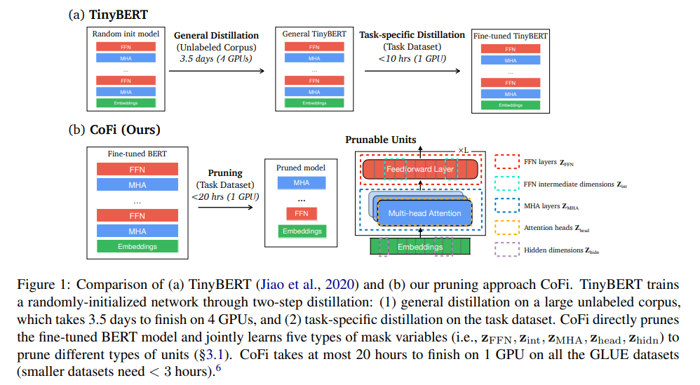

<!-- 0 Main idea: --> 
Propose a task-specific structured pruning method CoFi1
(Coarse- and Fine-grained Pruning), which delivers highly parallelizable subnetworks and
matches the distillation methods in both accuracy and latency, without resorting to any unlabeled data.

<!--more-->

# 1 Background:

# 2 Related work:

# 3 Challenges:

# 4 Motivation:

# 5 Proposed Methods:

# 6 Evaluation:

# 7 Results:

# 8 Limitations:

# 9 New Idea:
