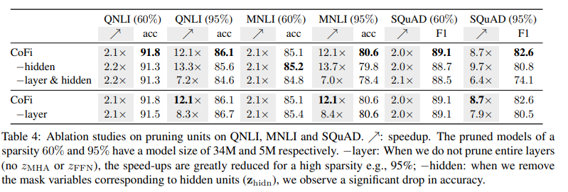

<!-- 0 Main idea: -->

Propose a task-specific structured pruning method CoFi1
(Coarse- and Fine-grained Pruning), which delivers highly parallelizable subnetworks and matches the distillation methods in both accuracy and latency, without resorting to any unlabeled data.

<!--more-->

# 1 Background:

The growing size of neural language models has led to increased attention in model compression. The two predominant approaches are **pruning**, which gradually removes weights from a pre-trained model, and **distillation**, which trains a smaller compact model to match a larger one

Multi-head attention

$$
\operatorname{MHA}(X)=\sum_{i=1}^{N_h} \mathbf{z}_{\text {head }}^{(i)} \operatorname{Att}\left(W_Q^{(i)}, W_K^{(i)}, W_V^{(i)}, W_O^{(i)}, X\right)
$$

Feed-forward layer

$$
\operatorname{FFN}(X)=\operatorname{gelu}\left(X W_U\right) \cdot \operatorname{diag}\left(\mathbf{z}_{\text {int }}\right) \cdot W_D
$$

# 2 Related work:

Pre-trained language models have high costs in terms of storage, memory, and computation time and it has motivated a large body of work on model compression to make them smaller and faster to use in real-world applications

# 3 Challenges:

Pruning methods can significantly reduce the model size but hardly **achieve large speedups** as distillation. However, distillation methods require large amounts of **unlabeled data** and are **expensive** to **train**.

# 4 Motivation:

Propose a task-specific structured pruning method CoFi1
(Coarse- and Fine-grained Pruning), which delivers highly **parallelizable** subnetworks and matches the distillation methods in both **accuracy** and **latency**, without resorting to any **unlabeled data**

# 5 Proposed Methods:

Pruning Methods

- Layer pruning 50% 2x
- Head pruning 1.4x
- FFN pruning
- Block and unstructured pruning

## Method

## Coarse- and Fine-Grained Pruning

1. present a simple solution: we allow pruning MHA and FFN layers explicitly along with fine-grained units
   - Explicitly prune an entire layer, instead of pruning all the heads in one MHA layer

$$
\begin{aligned}
\operatorname{MHA}(X)= & z_{\mathrm{MHA}} \cdot \sum_{i=1}^{N_h}\left(\mathbf{z}_{\text {head }}^{(i)}\right. \\
& \left.\operatorname{Att}\left(W_Q^{(i)}, W_K^{(i)}, W_V^{(i)}, W_O^{(i)}, X\right)\right), \\
\operatorname{FFN}(X)= & z_{\mathrm{FFN}} \cdot \operatorname{gelu}\left(X W_U\right) \cdot \operatorname{diag}\left(\mathbf{z}_{\text {int }}\right) \cdot W_D \cdot
\end{aligned}
$$

- Pruning the output dimensions of $MHA(X)$ and $FFN(X)$, referred to as ‘hidden dimensions’ in this paper.

  - Find that only a **small** number of **dimensions** are pruned (e.g., 768 → 760), but it still helps improve **performance significantly**
- Multiple mask variables **jointly** **control** the pruning decision of **one** single **parameter**.
- Replace the vanilla $l_0$ objective with a **Lagrangian** multiplier to better control the desired sparsity of pruned models.

## Distillation to Pruned Model

A cross-entropy loss between the pruned student’s and the teacher's
output probability:

$$
\mathcal{L}_{\text {pred }}=D_{\mathrm{KL}}\left(\mathbf{p}_s \| \mathbf{p}_t\right)
$$

2. Propose a **layerwise** **distillation** approach for pruning to best utilize the signals from the teacher model.

- **Dynamically** search a layer **mapping** between the full teacher model and the pruned student model.

$$
\mathcal{L}_{\text {layer }}=\sum_{i \in \mathcal{T}} \operatorname{MSE}\left(W_{\text {layer }} \mathbf{H}_s^{m(i)}, \mathbf{H}_t^i\right),
$$

- The layer mapping function $m(·)$ is dynamically determined during the training process to match a teacher layer to its closest layer in the student model

$$
m(i)=\underset{j: \mathbf{z}_{\mathrm{FFN}}^{(j)}>0}{\arg \min } \operatorname{MSE}\left(W_{\text {layer }} \mathbf{H}_s^j, \mathbf{H}_t^i\right) .
$$

- To address the issue of layer mismatch, which mostly happens for **small-sized** datasets, e.g., RTE, MRPC, we add a **constraint** to only allow **matching** a **teacher** layer to a **lower student** layer than the previously matched student layer.

# 6 Evaluation:

Env:
**single NVIDIA V100 GPU (32G mem)**

For TinyBERT and DynaBERT, the released models are trained with task-specific augmented.

# 7 Results:

CoFi delivers more accurate models than distillation and pruning baselines at every **speedup** level and model size.

While general distillation could take up to **hundreds** of GPU hours for training, CoFi trains for a maximum of **20 hours** on a taskspecific dataset with a single GPU.

## Pruning units

Removing the option to prune hidden dimensions ($z_{hidn}$) leads to a slightly faster model with a performance drop across the board and we find that it removes more layers than CoFi and **does not** lead to **optimal performance** under a specific sparsity constraint.

Removing the layer masks ($z_{MHA}, z_{FFN}$) brings a **significant** **drop** in **speedup** on highly compressed models (95%, 5M). 

This result shows that even with the **same** amount of parameters, different **configurations** for a model could lead to drastically different speedups.However, it **does not** affect the lower sparsity regime (60%, 34M).

## Distillation objectives

Removing distillation entirely leads to a performance drop up to **1.9-6.8** points across various datasets, showing the **necessity** to combine pruning and distillation for maintaining performance

Interestingly, the **proposed dynamic layer** matching objective consistently converges to a specific alignment between the layers of the teacher model and student model.

# 8 Limitations:

# 9 New Idea:
