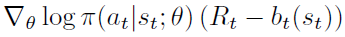

<!--more-->

# Evolutionary history of Distributed Deep Reinforcement Learning: algorithms and architectures
> From  [https://zhuanlan.zhihu.com/p/328284456](https://zhuanlan.zhihu.com/p/328284456)

- Agent & Action & Env
	- 
- Behavior Policy & Target Policy

	- **Behavioral strategy** is the strategy used by the **agent** to interact with the **environment** to generate samples; **Target strategy** is the strategy that is constantly **learned** and optimized according to the samples **generated** by the behavioral strategy, that is, the strategy that is finally used after the completion of training
	- The training process of RL is mainly divided into two parts. One is the **sample collection proces**s, which means that behavioral strategies interact with the environment to generate training samples. The other is the **training process**, which uses the collected training samples to update the strategy.
- On-policy & Off-policy
	- On-policy: Behavior Policy == Target Policy
	- Off-policy: Behavior Policy  !=  Target Policy

- Algorithm
	- **A2C**: Advantage Actor-Critic
		- 
		- 

	- **A3C**: Asynchronous advantage actor-critic
		- 
		- Actor is responsible for interacting with the environment and producing training samples, while Learner is responsible for model training
		- Asynchronous: When the Learner receives gradients from one Actor, instead of waiting for gradients from other actors, it **updates the model directly** and sends the latest model to that Actor
		- Problem:
			- When model become complex, CPU cost a lot.
			- Communication costs
			- Part of the gradient is not in the right direction.

	- **GA3C** 
		- 
		- Actors in GA3C do not have model parameters; there is only **one model** in the architecture, which is stored in the Learner. When the Actor wants to Sample, it puts the **State** into the **Prediction Queue**, and the **Learner Predictor** takes all the state from the queue, samples it, and returns the result to the actor. 
		- After receiving the corresponding action, the Actor performs step in the environment and gets the corresponding reward signal. Once the Actor collects a set of samples, it puts them into the Training Queue, and the Learner's Trainer uses them to update the model.
		- There is still an off-policy phenomenon in this architecture, that is, the behavior policy and the goal policy are not completely consistent.

	- ...
---

# Distributed Deep Reinforcement Learning: An Overview
> [https://arxiv.org/abs/2011.11012](https://arxiv.org/abs/2011.11012)

- Therefore, distributed modifications of DRL were introduced;   agents that could be run on many machines simultaneously.   In this article, we provide a survey of the role of the distributed approaches in DRL.   We overview the state of the field, by studying the key research works that have a significant impact on how we can use distributed methods in DRL.   We choose to overview these papers, from the perspective of distributed learning, and not the aspect of innovations in reinforcement learning algorithms.   Also, we evaluate these methods on different tasks and compare their performance with each other and with single actor and learner agents.

