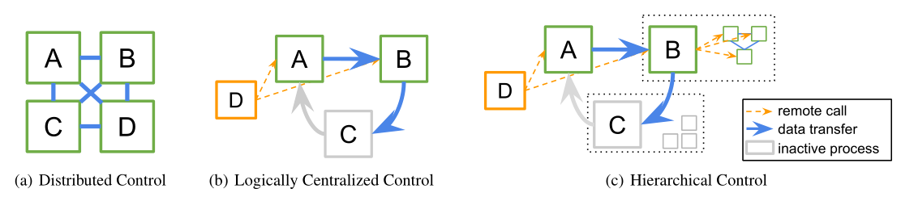
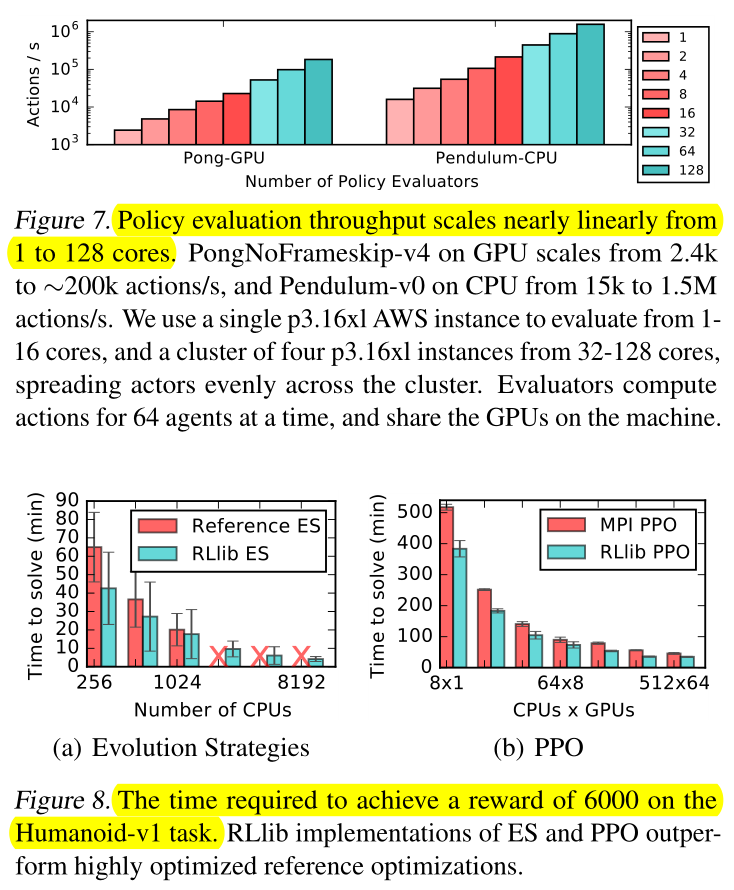

Distributing RL components in a composable way by adapting algorithms for top-down hierarchical control, thereby encapsulating **parallelism** and resource requirements within short-running compute tasks. These primitives enable a broad range of algorithms to be implemented with **high performance**, scalability, and **substantial code reuse**.
<!--more-->

> RLlib: Abstractions for Distributed Reinforcement Learning
> 

- Challenge

	- Because of the absence of a single dominant computational pattern  or fundamental rules of composition, the design and implementation of RL algorithms is hard for researchers.

- Insight

	- **Irregularity** of RL training workloads Modern RL algorithms are highly irregular in the computation patterns they create

		1. The duration and **resource requirements** of tasks differ by orders of magnitude depending on the algorithm
		2. **Communication** patterns vary
		3. **Nested** **computations** are generated by model-based hybrid algorithms

		4. Maintain and update substantial **amounts** of **state**

- Contribution

	- Distributing RL components in a composable way by adapting algorithms for top-down hierarchical control, thereby encapsulating **parallelism** and resource requirements within short-running compute tasks.
	- These primitives enable a broad range of algorithms to be implemented with **high performance**, scalability, and **substantial code reuse**.

- Detail

	- Structuring distributed RL components around the principles of **logically centralized program control** and **parallelism encapsulation**.
		- Logically centralized program control: a single driver program can delegate algorithm sub-tasks to other processes to execute in parallel. 
		- 
			- The equivalent algorithm is often **easier** to implement in practice
			- The separation of algorithm components into sub-routines enables **code reuse** across different execution patterns.
			- Distributed algorithms written in this model can be seamlessly **nested within each other**, satisfying the parallelism encapsulation principle.
	- Policy Optimization: RLlib separates the implementation of algorithms into the declaration of the **algorithm-specific policy graph** and the choice of an **algorithm-independent policy optimizer**.
		- The **policy optimizer** abstraction separating execution strategy from policy and loss definitions, specialized optimizers can be swapped in to take advantage of **available hardware or algorithm features**
		- The **policy graph class** encapsulates interaction with the deep learning framework, allowing algorithm authors to **avoid mixing** distributed systems code with numerical computations
	- Distributed performance
		- **Resource awareness**
			- Ray allows remote calls to specify resource requirements and utilizes a resource-aware scheduler to preserve component performance.
		- **Fault tolerance and straggler mitigation**
			- RLlib leverages Ray’s built-in fault tolerance mechanisms, reducing costs with preemptible cloud compute instances.
	- 

