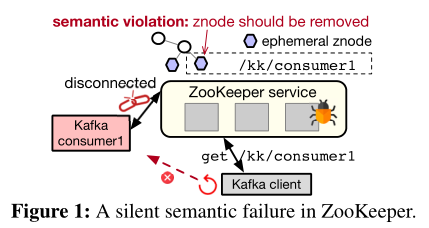
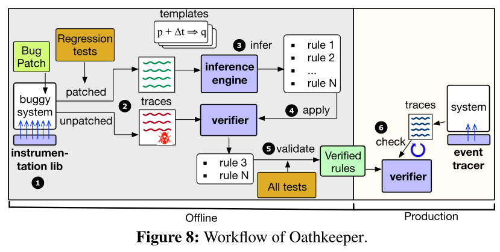

<!--more-->

## Abstract

## 1 Introduction

- A vexing problem occurs when a system is operational
	but silently breaks its semantics without apparent anomalies.
- how prevalent are semantic violations in practice, what semantics are violated, why are these failures not caught in testing, and how are these silent violations detected.
- Find out
	- silent semantic violations: 39% sampled failures 
	- more than two thirds of the failures violate semantics that have existed since the system’s first stable release
	- 74%) violations can be determined locally in some component.
	- The violated semantics are well covered by existing test cases
	- Enabling assertions in release builds can  convert semantic violations into crash failures
	- Many system semantics are vulnerable to violations during maintenance operations or node events.
- Oathkeeper
	- A major reason for the gap is that these regression tests are usually patch-driven: they only check if the specific bug is fixed in a particular setup using a bugtriggering workload.
	- Oathkeeper runs the tests on both the buggy version and patched version of the system, and takes a template-driven approach to automatically infer semantic rules from the two traces. Oathkeeper then deploys these semantic rules to production to catch future violations that are caused by different bugs under different conditions.
	- Oathkeeper on average only incurs 1.27% throughput overhead to the target systems.

## 2 Background

### 2.1 Definition 

- Silent semantic violations differ from other failure modes in observability.
- distributed systems have a large number of interfaces (Table 1), many of which have loosely-defined (or hidden) semantics that cannot be easily checked. Consequently, violations of such semantics are difficult to detect and address.

### 2.2 Eg

- A Kafka consumer crashed but the associated znode was not deleted (Figure 1). As a result, when Kafka clients queried ZooKeeper to discover consumer information, they kept trying to connect to the crashed consumer.

## 3 Study Methodology

- We then read their descriptions and check whether the failures violate system semantics. We filter crashes, aborts, out-of-memory errors, and semantic failures with clear error signals.
- Our sampling instead is done iteratively: for a particular system, if after an initial sampling, its number of Candidate cases is too small or 0, we sample more, until the candidate numbers for different systems are relatively balanced. 
- Prevalence.
	- *Finding 1: Silent semantic failures have significant presence*
		*across all studied systems*
- 

## 4 Are Silent Semantic Failures Rare?

## 5 What Kind of Semantics Is Violated?

## 6 Why Do Silent Semantic Failures Occur?

## 7 How Are Semantic Failures Manifested?

## 8 Current Practice for Semantic Failures

## 9 Oathkeeper: A Semantic Violation Checker

## 10 Evaluation

## 12 Conclusion
