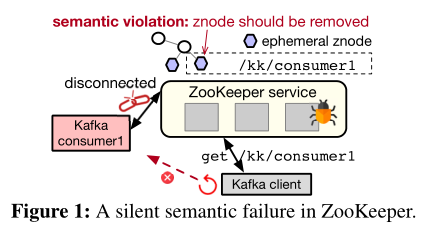
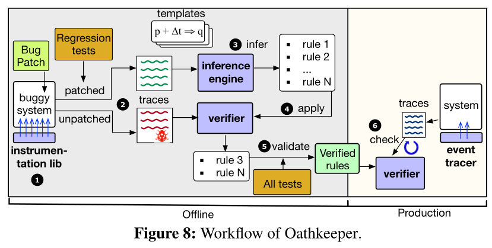

<!--more-->

## Abstract

- Bugs can cause a system to silently violate its semantics without apparent anomalies.
- The majority of the studied failures were violating semantics that existed since the system’s first stable release.
- Oathkeeper, a tool that automatically infers semantic rules from past failures and enforces the rules at runtime to detect new failures.

## 1 Introduction

- A vexing problem occurs when a system is operational
	but **silently** breaks its semantics without **apparent anomalies**.
- How prevalent are semantic violations in practice, what semantics are violated, why are these failures not caught in testing, and how are these silent violations detected.
- Find out
	- silent semantic violations: 39% sampled failures 
	- more than two thirds of the failures violate semantics that have existed since the system’s first stable release
	- 74% violations can be determined locally in some component.
	- The violated semantics are well covered by existing test cases
	- Enabling assertions in release builds can convert semantic violations into crash failures
	- Many system semantics are vulnerable to violations during maintenance operations or node events.
- Oathkeeper
	- A major reason for the gap is that these regression tests are usually patch-driven: they only check if the specific bug is fixed in a particular setup using a bugtriggering workload.
	- Oathkeeper runs the tests on both the buggy version and patched version of the system, and takes a template-driven approach to automatically infer semantic rules from the two traces. Oathkeeper then deploys these semantic rules to production to catch future violations that are caused by different bugs under different conditions.
	- Oathkeeper on average only incurs 1.27% throughput overhead to the target systems.

## 2 Background

### 2.1 Definition 

- Silent semantic violations differ from other failure modes in observability.
- distributed systems have a large number of interfaces (Table 1), many of which have loosely-defined (or hidden) semantics that cannot be easily checked. Consequently, violations of such semantics are difficult to detect and address.

### 2.2 Eg

- A Kafka consumer crashed but the associated znode was not deleted (Figure 1). As a result, when Kafka clients queried ZooKeeper to discover consumer information, they kept trying to connect to the crashed consumer.

## 3 Study Methodology

- We then read their descriptions and check whether the failures violate system semantics. We filter crashes, aborts, out-of-memory errors, and semantic failures with clear error signals.
- Our sampling instead is done iteratively: for a particular system, if after an initial sampling, its number of Candidate cases is too small or 0, we sample more, until the candidate numbers for different systems are relatively balanced. 

## 4 Are Silent Semantic Failures Rare?

- **Prevalence.**
    - > *Finding 1: Silent semantic failures have **significant** presence across all studied systems*
- **Severity.**
	- > *Finding 2: Silent semantic failures are considered **severe** by developers and users. Moreover, the sampled semantic failures are assigned with **higher priorities** compared to all sampled failures.*
	- > *Finding 3: In addition to incorrectness (wrong responses), silent semantic violations often cause **severe consequences** including corrupt state, data or state loss, and security issues.*

## 5 What Kind of Semantics Is Violated?

### 5.1 Sources of Violated Semantics

- > *Finding 4: Most (87%) studied failures violate semantics that are explicitly defined in API specs, system docs, or configs.*
- > *Implications: Developers should move from documenting semantics in informal text to rigorously **declare** **semantics** that are mechanically checkable and enforceable.*

### 5.2 Categorizations of Violated Semantics

- However, our finding suggests that (1) even with new features added to the system, **old semantics** are still ones violated the **most**; (2) even with **testing accumulating** over the years, the reliability of old semantics is **not necessarily** higher in newer versions. 
- We further investigate why old semantics still keep getting
	violated. There are three broad reasons: 
	- (1) new implementation is buggy
	- (2) new feature adds buggy interactions,
	- (3) latent bugs are exposed
- **Local vs. Distributed Semantics**: we analyze whether the semantic violations naturally require **considering multiple distributed components**. This question is important to the **design of runtime verification techniques**.

- > *Finding 6: The violations in semantic failures can be usually (74%) determined in the scope of a **single component**.*
- > *Implications: Employing **local checkers** can potentially expose many semantic violations.*
- > *Finding 7: 86% of the studied cases violate safety semantics.*

## 6 Why Do Silent Semantic Failures Occur?

- We are interested in identifying potential common bug patterns in the root causes, which can inform the designs of bug finding tools to eliminate semantic failures before production.
- The remaining failures are caused by system-specific logic bugs including design flaws, which are difficult to be caught by bug detection tools.
- > *Finding 8: Only 12% of the studied failures are caused by **well-defined bugs** such as race conditions, while most cases are caused by a wide variety of **logic bugs**. Even for failures violating the same semantics, the root causes are diverse.*
- Implications: It can be **challenging** to exploit code patterns to eliminate semantic violations through **static bug detection**.

## 7 How Are Semantic Failures Manifested?

- > *Finding 9: Near two thirds(67%) of the studied cases violate some **long-lived semantics**. In 40% of the cases (27% of totall), the semantics are initially honored but are violated in the middle.**
- **Implications: It is crucial to continuously monitor semantic guarantees, even after the initial semantic check passes.*

- **Failure Triggering Conditions**: We further examine what triggers the semantic failures. Figure 7 shows the result.

- > *Finding 10: More than half of the studied failures are triggered by **specific requests**, while 39% of the failures require particular timing to trigger. Semantic failures often (41%) only manifest themselves under multiple types of conditions.*

## 8 Current Practice for Semantic Failures

### 8.1 Testing

- why the studied failures are not exposed during testing?
	- they lack some operations or arguments key to trigger the production failure
- > *Finding 11: Semantic violations occur not simply due to a lack of testing. The violated semantics are usually (73%) covered by some existing test. In more than half of the studied failures, similar triggering conditions exist in the test suite.*
- *Implications: Coverage of semantics alone is insufficient. Developers should introduce variances in existing test cases. More fundamentally, developers should **write more general tests** for the semantic properties rather than specific examples.*

### 8.2 Assertions

- > *Finding 12: Although in 51% of the failures the buggy functions have some sanity checks, few (9%) cases can be potentially **detected** by adding proper **sanity checks**.*
- *Implications: Enabling assertions helps reduce silent semantic violations. However , developers should **add more semanticlevel invariant checks** besides sanity checks.*

## 9 Oathkeeper: A Semantic Violation Checker

### 9.1 Design Overview and Workflow

- Oathkeeper takes a runtime approach to check semantic violations in production

- ***Insight and Key Idea.** the majority of the studied failures violate **old semantics** (Finding 5) despite the decent coverage of testing(Finding 10). When a semantic failure occurs, developers usually add **regression tests**. *
- Based on this insight, Oathkeeper leverages the existing regression tests developers write for past semantic failures and automatically extracts the essence—the violated semantic rules. Oathkeeper then enforces these rules at runtime to detect future semantic violations, which may be caused by different bugs under different conditions.
- Oathkeeper focuses on rules that describe relations among semantics-related events, particularly operation invocations and state updates. 

### 9.2 Instrumentation and Trace Generation

- the Oathkeeper traces use a uniform event schema that captures operation-related events and state-related events.
- Oathkeeper designs a load-time instrumentation library that performs bytecode manipulation when a target system is loaded. 
- To record state events, Oathkeeper takes a patch plus base approach.
- It analyzes the given semantic failure patch and automatically includes the list of classes involved in the patch file.

### 9.3 Template-Driven Inference

- A key challenge in the semantic rule inference step of Oathkeeper is to integrate domain knowledge without requiring significant manual effort, while also having reasonable accuracy and efficiency. 

### 9.6 Optimizations

- To reduce the validation time, 

	- we introduce a survivor optimization. After a test finishes, we validate the rules, if some rule is already “killed” (invalidated) by this test’s trace, it will not be carried over to the remaining tests.

	- By prioritization, we can potentially invalidate false rules faster.

- optimizations to reduce the runtime overhead
	- the event tracer only preserves the most recent events within a time window
	- to achieve both high concurrency and low memory pressure, we decouple the checking from the event emission with a ring buffer design inspired by highperformance message queues
	- to avoid massive new object creation frequently triggering garbage collection, we reuse expired event objects in the ring buffers

## 10 Evaluation

- We conduct an additional “cross-validation” experiment. Specifically, we collect a larger pool of 22 semantic failures in ZooKeeper.

## 12 Conclusion