<!--more-->


> Course Website: https://sites.google.com/lbl.gov/cs267-spr2021/pre-proposal

# P1: Introduction & Overview

Note:
1. load imbalance = inefficient
2. Simple parallel problem: : dividing big problem to many processors.
3. Classification of HPC:

    1. **SMP**: Shared Memory or Multicore
    2. **HPC**: High performance Computing or distribute memory
    3. **SIMD**: Single Instruction Multiple Data
4. Different between **Concurrency** & **Parallelism** : logical & actual
5. **Goal**: Exa-flop = 10^18 flop/s -GPU 
6. Top 500 Project

    1. Yardstick: Linpack -> Solve $Ax=b$
7. Performance history and Protection
8. **Gordon Bell Prize**: Application Performance 
9. **Five paradigm**: Theory & Experiment & Simulation & Data Analysis & Machine Learning
10. Analytics & Simulation
    - **7 Giants of Data:** Basic statics & Generalized N-Body & Graph-theory & Linear algebra & Optimizations & Integrations & Alignment
    - **7 Dwarfs of Simulation**:  Monte Carlo method & Particle methods & Unstructured meshes & Dense Linear Algebra & Sparse Linear Algebra &  Spectral methods &  Structured Meshes   
11. Limitation of HPC: 
    - Space limitation
	  - Single Chip : $r < c / 10^{12}$
	- **7 Giants of Data:** Basic statics & Generalized N-Body & Graph-theory & Linear algebra & Optimizations & Integrations & Alignment
	- **7 Dwarfs of Simulation**:  Monte Carlo method & Particle methods & Unstructured meshes & Dense Linear Algebra & Sparse Linear Algebra &  Spectral methods &  Structured Meshes.
12. Limitation of HPC: 
    - Space limitation: Single Chip: $r < c / 10^{12}$
    - Heat limitation: $Power \propto  V^2fC$
    - V-f 
13. Reinterpreted Moore's law

---

# P2: Memory Hierarchies and Matrix Multiplication

### Performance programming on uniprocessors requires 

- Understanding of memory system
  - Processor: variable, operation, control
  - Mem hierarchy: On chip cache > SRAM > DRAM > DISK >Cloud
    - Temporal & Spatial **locality**
  - Caches
  - Latency & Bandwidth

- Understanding of fine-grained parallelism in processor  
  - Pipeline 
  - **SIMD** & **FMA**

### Simple performance models can aid in understanding 

-  Two ratios are key to efficiency (relative to peak) 

1. **Computational intensity** of the algorithm:  
   - q = f/m = # floating point operations / # slow memory references 

2. **Machine balance** in the memory system:  
   - tm/tf = time for slow memory reference / time for floating point operation 

### Want $q > t_m/t_f$ to get half machine peak 

- Matrix Multiplication:
  - Naive: $q=f/m=2n^3/(n^3+3n^2) \approx  2$
  - Block: $q=f/m=2n^3/((2N+2)\times n^2)\approx n/N=b$

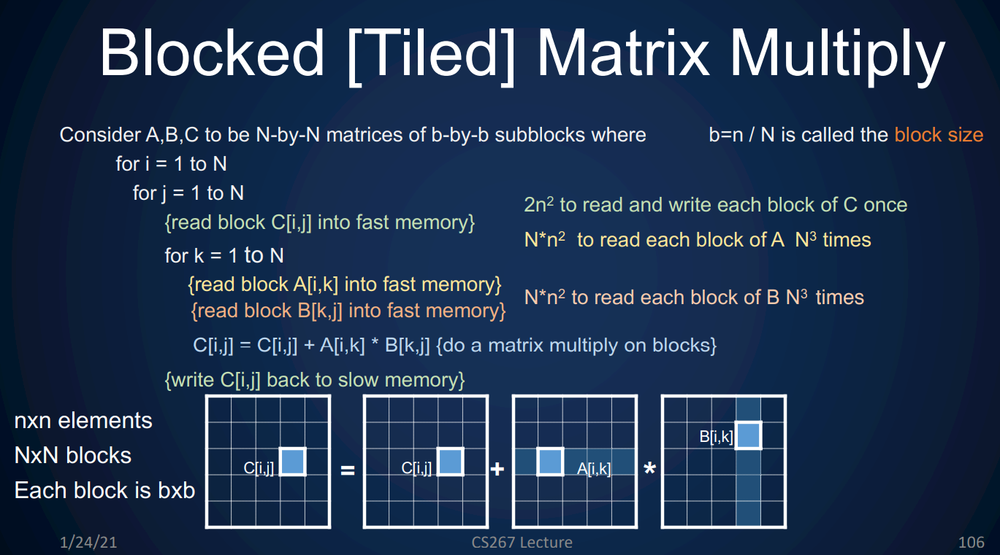

### Blocking (tiling) is a basic approach to increase q 

- Techniques apply generally, but the details (e.g., block size) are architecture dependent 
- Similar techniques are possible on other data structures and algorithms
- Optimize in Practice
  - Matrix Storage
  - Copy Optimization
  - Loop Unrolling
  - Removing False Dependency
  - Exploit Multiple registers
  - Minimize Pointer Updates


> **This is my understanding of the optimization of matrix multiplication later**:
>
> - Face a problem about Matrix multiplication in fast and slow memory.
> - First, defined the number of operations in fast and slow memory and computation intensity(CI) which is to evaluate the performance of algorithm. 
> - Then, simplified Matrix multiplication to Matrix-Vector multiplication, and analysis this problem to get the CI=2. 
> - After that, analysized Naive Matrix multiply and get the CI=2.
> - Due to Multiplication properties of partitioned matrices, she put forward Blocked(Tiled) Matrix multiply and get the CI=b(b*b is the size of partitioned matrices).
> - This small partitioned matrices can take advantage of **cache** in read and write, using SIMD in computation, thus get better performance.

---

# P3: Cache Oblivious MatMul and the Roofline Model

### Cache Oblivious MatMul

- Matrix matrix multiplication

  - Computational intensity O(2n^3) flops on O(3n^2) data 

- Tiling matrix multiplication (cache aware)

  - Can increase to b if b*b blocks fit in fast memory

  - b = sqrt(M/3), the fast memory size M

  - Tiling (aka blocking) “cache-aware”

  - **Cache-oblivious** - recursive

  - ```C
    Define C = RMM (A, B, n)
    if (n==1) { 
        C00 = A00 * B00 ; 
    } else{ 
    	C00 = RMM (A00 , B00 , n/2) + RMM (A01 , B10 , n/2)
    	C01 = RMM (A00 , B01 , n/2) + RMM (A01 , B11 , n/2)
    	C10 = RMM (A10 , B00 , n/2) + RMM (A11 , B10 , n/2)
    	C11 = RMM (A10 , B01 , n/2) + RMM (A11 , B11 , n/2) 
    } 
    return C
    ```

  - $CI=f/m=2n^3/O(n^3/\sqrt{M})=O(\sqrt{M})$

  - **Don’t need to know M for this to work!**

- Optimized libraries (BLAS) exist

  - Flop/s:	MM(BLAS3) > MV(BLAS2)  ->  Compute Bound
  - Time:      MM(BLAS3) < MV(BLAS2)   -> Bandwidth Bound

​     


### Roofline Model

- Roofline captures upper bound **performance**

  - The min of 2 upper bounds for a machine
    - Peak flops (or other arith ops)
    - Memory bandwidth max
  - Algorithm computational intensity
    - Usually defined as best case, infinite cache
  - Machine balance： 
    - Balance = (Peak DP FLOP/s) / Peak Bandwidth
  - Computational / arithmetic intensity:  
    - CI = FLOPs Performed / Data Moved

- Originally for single processors and SPMs

  - | Operation | FLOPs        | Data     | CI          |
    | --------- | ------------ | -------- | ----------- |
    | Dot Prod  | $O(n)$       | $O(n)$   | $O(1)$      |
    | Mat Vec   | $O(n^2)$     | $O(n^2)$ | $O(1)$      |
    | MatMul    | $O(n^3)$     | $O(n^2)$ | $O(n)$      |
    | N-Body    | $O(n^2)$     | $O(n)$   | $O(n)$      |
    | FFT       | $O(n\log n)$ | $O(n)$   | $O(\log n)$ |

    

- Widely used in practice and adapted to any bandwidth/compute limit situation


---

## HW1 MM

### **MM - $3b^3<M$ + Block**

### **Z- morton** 

### **Cache-oblivious**


---

# P4: Shared Memory Parallelism

- Programming shared memory machines
  - May allocate data in large shared region without too many worries about 
    where
  - Memory hierarchy is critical to performance 
    - Even more so than on uniprocessors, due to coherence traffic
  - **For performance tuning, watch sharing (both true and false)**
- Semantics
  - Need to lock access to shared variable for read-modify-write
  - Sequential consistency is the natural semantics
    - Write race-free programs to get this
  - Architects worked hard to make this work
    - Caches are coherent with buses or directories
    - Cache:
      - write back: Update when evicted from cache
      - write through: Update always when wrote
    - No caching of remote data on shared address space machines
  - But compiler and processor may still get in the way
    - Non-blocking writes, read prefetching, code motion…
    - Avoid races or use machine-specific fences carefully


### Original Serial pi program with 100000000 steps

| threads | 1st SPMD | 1st SPMD padded | SPMD critical | PI Loop and reduction |
| ------- | -------- | --------------- | ------------- | --------------------- |
| 1       | 1.86     | 1.86            | 1.87          | 1.91                  |
| 2       | 1.03     | 1.01            | 1.00          | 1.02                  |
| 3       | 1.08     | 0.69            | 0.68          | 0.80                  |
| 4       | 0.97     | 0.53            | 0.53          | 0.68                 |

---

# P5  Sources of Parallelism and Locality I & II

### Outline

- Discrete event systems 
  - Time and space are discrete 
- Particle systems 
  - Important special case of lumped systems 
- Lumped systems (ODEs) 
  - Location/entities are discrete, time is continuous 
- Continuous systems (PDEs) 
  - Time and space are continuous 

### Summary of Discrete Event Simulations

**Approaches**

- Decompose domain, i.e., set of objects
- Run each component ahead using
  - **Synchronous**: communicate at end of each timestep
  - **Asynchronous**: communicate on-demand
    - Conservative scheduling wait for inputs 
      - need deadlock detection
    - Speculative scheduling assume no inputs 
      - roll back if necessary

### Summary of Particle Methods

- Model contains discrete entities, namely, particles
- Time is continuous must be discretized to solve
- Simulation follows particles through timesteps
  - `Force = external _force + nearby_force + far_field_force`
  - All-pairs algorithm is simple, but inefficient, O(n2)
  - Particle-mesh methods approximates by moving particles to a regular mesh, where it is easier to compute forces
  - Tree-based algorithms approximate by treating set of particles as a group, when far away
- May think of this as a special case of a lumped system

### Summary of ODE Methods

- **Explicit** methods for ODEs need <u>sparse-matrix-vector mult</u>.
- **Implicit** methods for ODEs need to <u>solve linear systems</u>
- Direct methods (Gaussian elimination)
  - Called LU Decomposition, because we factor A = L*U.
  - Future lectures will consider **both** **dense** and **sparse** cases.
  - More complicated than sparse-matrix vector multiplication.
- Iterative solvers
  - Will discuss several of these in future.
    - Jacobi, Successive over-relaxation (SOR) , Conjugate Gradient (CG), 
    - Multigrid,...
  - Most have sparse-matrix-vector multiplication in kernel.
- Eigenproblems
  - Future lectures will discuss dense and sparse cases.
  - Also depend on sparse-matrix-vector multiplication, direct methods.

### SpMV in Compressed Sparse Row (CSR) Format

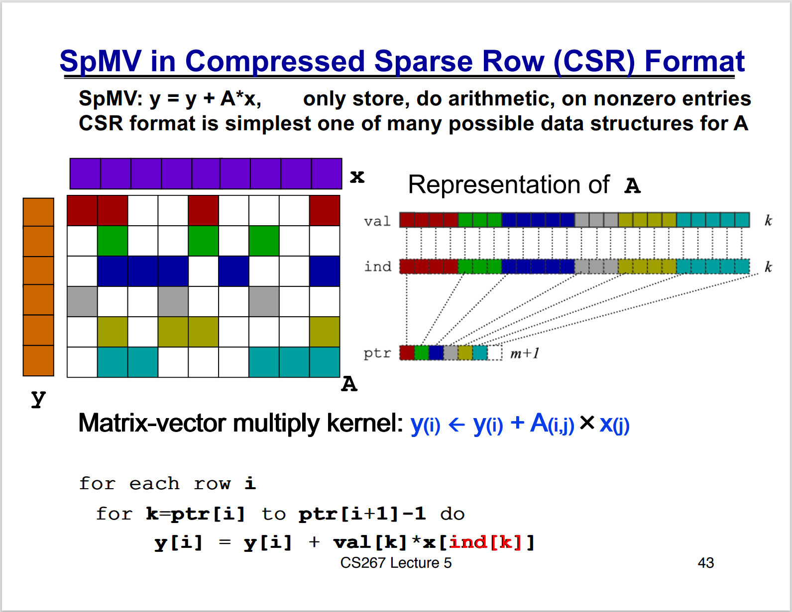


- Pratitioning


### Goals of Reordering

- **Performance goals**
  - **balance load** (how is load measured?).
    - Approx equal number of nonzeros (not necessarily rows)
  - **balance storage** (how much does each processor store?).
    - Approx equal number of nonzeros
  - **minimize communication** (how much is communicated?).
    - Minimize nonzeros outside diagonal blocks
    - Related optimization criterion is to move nonzeros near diagonal
  - **improve register and cache re-use**
    - Group nonzeros in small vertical blocks so source (x) elements loaded into cache or registers may be reused (temporal locality)
    - Group nonzeros in small horizontal blocks so nearby source (x) elements in the cache may be used (spatial locality)
- Other algorithms reorder rows/columns for other reasons
  - Reduce # nonzeros in matrix after Gaussian elimination
  - Improve numerical stability

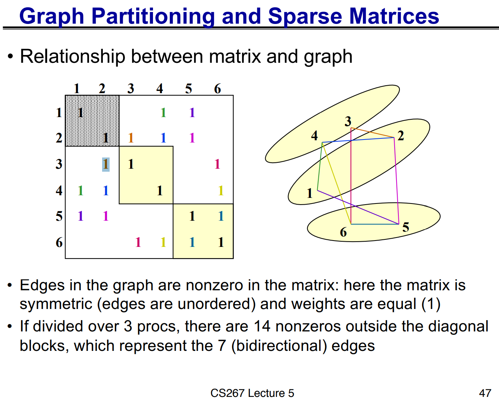


### Recap of Last Lecture

- 4 kinds of simulations
  - Discrete Event Systems
  - Particle Systems
  - Ordinary Differential Equations (ODEs)
  - Partial Differential Equations (PDEs) (today)
- Common problems:
  - **Load balancing**
    - May be due to lack of parallelism or poor work distribution
    - Statically, divide grid (or graph) into blocks
    - Dynamically, if load changes significantly during run
  - **Locality**
    - Partition into large chunks with low surface-to-volume ratio
    - To minimize communication
    - Distributed particles according to location, but use irregular spatial decomposition (e.g., quad tree) for load balance
  - **Constant tension between these two**
    - Particle-Mesh method: can’t balance particles (moving), balance mesh (fixed) and keep particles near mesh points without communication

### Summary of Approaches to Solving PDEs

- As with ODEs, either explicit or implicit approaches are possible
  - **Explicit**, sparse matrix-vector multiplication
  - **Implicit**, sparse matrix solve at each step
    - Direct solvers are hard (more on this later)
    - Iterative solves turn into sparse matrix-vector multiplication
      - Graph partitioning
- **Graph and sparse matrix correspondence:**
  - Sparse matrix-vector multiplication is **nearest** neighbor averaging on the underlying mesh
- Not all nearest neighbor computations have the same efficiency
  - Depends on the mesh structure (nonzero structure) and the number of Flops per point


### Summary sources of parallelism and locality

- Current attempts to categorize main kernels dominating simulation codes
- Seven Dwarfs (P. Colella)
  - **Structured grids** 
    - including locally structured grids, as in AMR
  - **Unstructured grids**
  - **Spectral methods** (Fast Fourier Transform)
  - Dense Linear Algebra
  - Sparse Linear Algebra
    - Both explicit (SpMV) and implicit (solving)
  - Particle Methods
  - Monte Carlo/Embarrassing Parallelism/Map Reduce (easy)


# P6  Communication-avoiding matrix multiplication

### Outline

- **Communication = moving data**
  - Between main memory and cache
  - Between processors over a network
  - Most expensive operation (in time or energy)
- Goal: **Provably minimize communication for algorithms that look like nested loops accessing arrays**
  - Includes matmul, linear algebra (dense and sparse), n-body, convolutional neural nets (CNNs), …
- Simple case: n-body (sequential, with main memory and cache) 
  - Communication lower bound and optimal algorithm
- Extension to Matmul
- Extension to algorithms that look like nested loops accessing arrays, like CNNs (and open questions)


### Data access for n-body

- `A()` = array of structures
  - ` A(i)` contains position, charge on particle `i`
- Usual n-body
  - `for i = 1:n, for j = 1:n except i, F(i) = F(i) + force(A(i),A(j))`
- Simplify to make counting easier
  - Let `B()` = array of disjoint set of particles
  - `for i = 1:n, for j = 1:n, e = e + potential(A(i),B(j))`
- Simplify more
  - `for i = 1:n, for j = 1:n, access A(i) and B(j)`


$$
\text{Transfer data:}\ n^2 \sim 2n\\
\text{Cache data:}\ M^2/4 \sim M
$$


### Generalizing to other algorithms

- Many algorithms look like nested loops accessing arrays
  - Linear Algebra (dense and sparse)
  - Grids (structured and unstructured)
  - Convolutional Neural Nets (CNNs) …
- Matmul: C = A*B
  - `for i=1:n, for j=1:n, for k=1:n`
    - `C(i,j) = C(i,j) + A(i,k) * B(k,j)`

### Proof of Communication Lower Bound on C = A·B (1/4)


- Thm (Loomis & Whitney, 1949) 

  - cubes in 3D set = Volume of 3D set ≤ (area(A shadow) · area(B shadow) · area(C shadow)) 1/2
  - $V\leq \sqrt{S_A \cdot S_B \cdot S_C}$ 

- \# loop iterations doable with `M` words of data = #cubes ≤ (area(A shadow) · area(B shadow) ·area(C shadow)) 1/2 ≤ (M · M · M) 1/2 = **M 3/2** = F 

- Need to read/write at least M n3/ F = Ω(n3/M 1/2) =  Ω(#loop iterations / M 1/2) words to/from cache

- $Cost=M\cdot n^3/ F = M\cdot n^3/ M^{3/2} = n^3/M^{1/2} $

  

### Parallel Case: apply reasoning to one processor out of P

- ”Fast memory” = local processor, “Slow memory” = other procs

- Goal: **lower bound # “reads/writes” = # words moved between** 

- one processor and others

- loop iterations = n3 / P (load balanced)

  - **M = 3n2 / P** (each processor gets equal fraction of data)

  - reads/writes  M · (n3 /P) / (M)3/2 = Ω (n2 / P1/2 )

  - $Cost=M\cdot (n^3/P)/ M^{3/2} = n^3/(P\cdot M^{1/2})  = n^2/ (\sqrt{3P}) \sim \Omega(n^2/p^{1/2})$ 

    


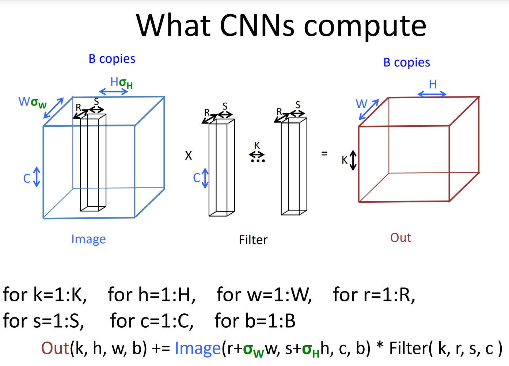


# P7  An Introduction to CUDA and GPUs

What’s in a CPU?

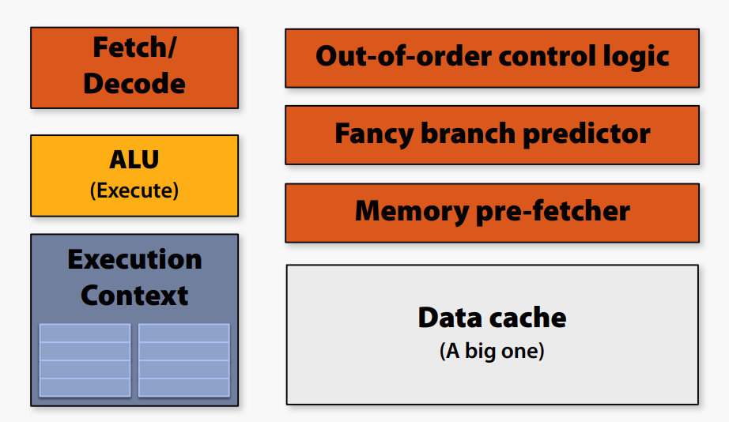

### Hardware Big Idea  

1. Remove components that  help a single instruction stream run fast 
   1. Discover parallelism 
   2. Consume energy
2. A larger number of  (smaller simpler) cores
3. Share the instruction stream
   1. SIMT: single instruction multiple threads
4. Masks
   1. 

### Running GPU Code (Kernel)

1. Allocate memory on GPU 
2. Copy data to GPU
3. Execute GPU program
4. Wait to complete 
5. Copy results back to CPU

```C++
float *x = new float[N];
float *y = new float[N];
//1. Allocate Memory on GPU
int size = N*sizeof(float);
float *d_x, *d_y; // device copies of x y 
cudaMalloc((void **)&d_x, size); 
cudaMalloc((void **)&d_y, size);
//2. Copy data to GPU
cudaMemcpy(d_x, x, size, cudaMemcpyHostToDevice); 
cudaMemcpy(d_y, y, size, cudaMemcpyHostToDevice);
//3. Run kernel on GPU
add<<<1,1>>>(N, d_x, d_y); 
//4. Wait to complete
//5. Copy result back to host 
cudaMemcpy(y, d_y, size, cudaMemcpyDeviceToHost); 

// Free memory 
cudaFree(d_x); cudaFree(d_y); 
delete [] x; delete [] y; 

// GPU function to add two vectors 
__global__
void add(int n, float *x, float *y) { 
    for (int i = 0; i < n; i++) 
    y[i] = x[i] + y[i]; 
} 

```


### Example: Vector Addition

```C++
// Run kernel on GPU
int blockSize = 256; 
int numBlocks = (N + blockSize - 1) / blockSize; 
add<<<numBlocks, blockSize>>>(N, x, y); 

// GPU function to add two vectors 
__global__
void add(int n, float *x, float *y) { 
    int index = blockDim.x * blockIdx.x + threadIdx.x;
    //Works for arbitrary N and # threads / block
    int stride = gridDim.x * blockDim.x;
    for (int i = index; i < n; i+=stride) 
    	y[i] = x[i] + y[i]; 
    }
} 
```

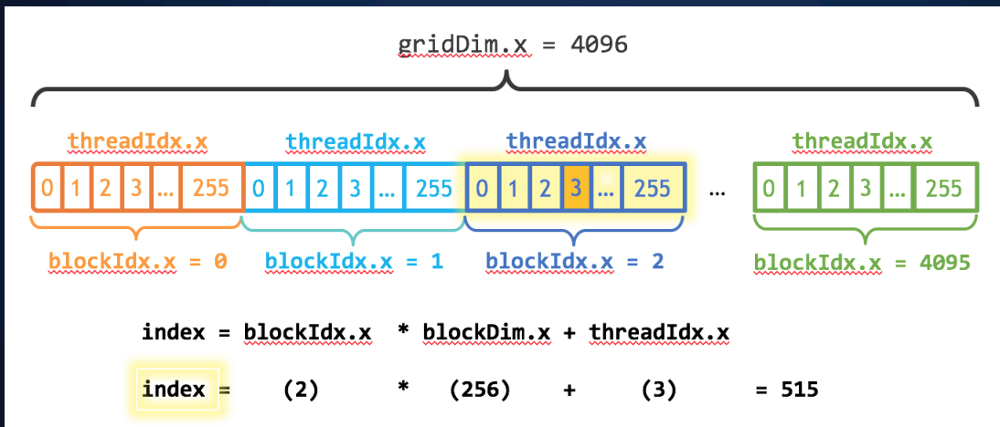


### Memory types on NVIDIA GPUs


- Shared Mem > Local Mem >> Global Mem

Hierarchical Parallelism Strategy

- Use both blocks and threads
- Limit on maximum number of threads/block 
  - Threads alone won’t work for large arrays 
- Fast shared memory only between threads 
  - Blocks alone are slower

Shared (within a block) Memory

- Declare using `__shared__`, allocated per block 
- Fast on-chip memory, user-managed 
- Not visible to threads in other blocks


### 1D Stencil Example

- `y[i] = x[i] + x[i-2] + x[i-1] + x[i+2] + x[i+1]`

- 

- Analyze

  - Input elements are read several times 
  - Reuse of inputs:

- Output

  - Divide output array into blocks, each assigned to a thread block
  - Each element within is assigned to a thread
  - Compute `blockDim.x` output elements
  - Write `blockDim.x` output elements to global memory

- Input

  - 
  - Cache (manually) input data in shared memory
  - Have each block read `(blockDim.x + 2 * radius)` input elements 
    from global memory to shared memory
  - Each block needs a halo of radius elements at each boundary
    - (halos are also called ghost regions)

- Code

  - ```C++
    __global__ void stencil_1d(int *in, int *out) {
        __shared__ int temp[BLOCK_SIZE + 2 * RADIUS];
        int gindex = threadIdx.x + blockIdx.x * blockDim.x;
        int lindex = threadIdx.x + RADIUS;
    
        // Read input elements into shared memory
        temp[lindex] = in[gindex];
        if (threadIdx.x < RADIUS) { // fill in halos
            temp[lindex - RADIUS] = in[gindex - RADIUS];
            temp[lindex + BLOCK_SIZE] = in[gindex + BLOCK_SIZE];
        }
        
        // Synchronize (ensure all the data is available)
    	__syncthreads();//Without this line, what will happened?
        
        // Apply the stencil
        int result = 0;
        for (int offset = -RADIUS ; offset <= RADIUS ; offset++)
        	result += temp[lindex + offset];
        // Store the result
        out[gindex] = result;
    }
    ```

- Problem: Race Condition 

  - Suppose thread 7 (of 8) reads the halo before thread 0 has filled it in
  - Synchronizes all threads within a block `void __syncthreads();`

#### Blocks must be independent

- Any possible interleaving of blocks should be **valid**
  - presumed to run to completion without pre-emption (not fairly scheduled)
  - can run in any order
  - can run concurrently OR sequentially
- Blocks may coordinate but not synchronize
  - shared queue pointer: **OK**
  - shared lock: **BAD** … can easily deadlock
- Independence requirement gives scalability

### Mapping CUDA to Nvidia GPUs

- Threads:
  - Each thread is a SIMD lane (ALU)
- Warps:
  - A warp executed as a logical SIMD instruction (sort of)
  - Warp width is 32 elements: LOGICAL SIMD width
  - (Warp-level programming also possible)
- Thread blocks:
  - Each thread block is scheduled onto an SM
  - Peak efficiency requires multiple thread blocks per processor
- Kernel
  - Executes on a GPU (there is also multi-GPU programming)

### Summary

- GPUs gain efficiency from simpler cores and more parallelism
  - Very wide SIMD (SIMT) for parallel arithmetic and latency-hiding
- Heterogeneous programming with manual offload
  - CPU to run OS, etc. GPU for compute
- Massive (mostly data) parallelism required
  - Not as strict as CPU-SIM (divergent addresses, instructions)
- Threads in block share faster memory and barriers
  - Blocks in kernel share slow device memory and atomics


---

# P8: Data Parallel Algorithms (aka, tricks with trees)

### The Power of Data Parallelism

- Data parallelism: perform the same operation on multiple  values (often array elements)
- Many parallel programming models use some data parallelism
  - SIMD units (and previously SIMD supercomputers) 
  - CUDA / GPUs
  - MapReduce
  - MPI collectives 

### Data Parallel Programming: Scans


- **Scan is always use for non-obvious algorithm**

### Ideal Cost Model for Data Parallelism

- Machine
  - An unbounded number of processors (p)
  - Control overhead is free
  - Communication is free
- Cost (complexity) on this abstract machine is the algorithm’s **span or depth**, T∞
  - Defines a lower bound on time on real machines\

### Broadcast and reduction on processor tree


- **$\log(n)$ is the lower bound!** 

### Multiplying n-by-n matrices in O(log n) time


- for $n^2$ parallel `c[i][j]` 
  - each tree depth = $\log(n)$
  - $O(\log n)$ 

### Can we parallelize a scan?

```c
y(0) = 0;
for i = 1:n
	y(i) = y(i-1) + x(i);
```

- Takes n-1 operations (adds) to do in serial
- The i th iteration of the loop depends completely on the (i-1) st iteration. 

### Sum Scan (aka prefix sum) in parallel


- Time for this algorithm on one processor (work)
  - $T_1(n) = n/2 + n/2 + T1 (n/2) = n + T1 (n/2) = 2n 1$
- Time on unbounded number of processors (span)
  - $T_{\infty}(n) = 2 \log n$

### Non-recursive exclusive scan


- This is both **work-efficient** (n adds) and  **space-efficient** (update in  place)

### Application: Stream Compression


- Remove matching elements
  - `int find (int x, int y) (y % x == 0) ? 1 : 0;`
  - `flags = apply(values, find)`

### Application: Radix Sort (serial algorithm)


- $n = [Bit_2, Bit_1, Bit_0]$


### List Ranking with Pointer Doubling

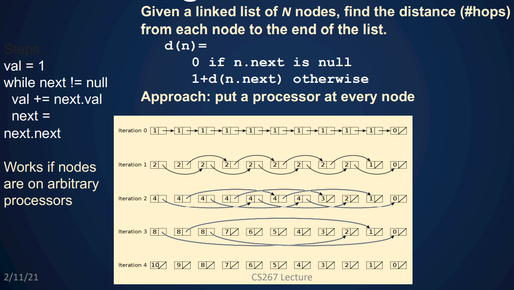

==?? Why  put a processor at every node==

```C
val = 1;
for(int i=0; i<log(n); i++){
	while (next != null){
        val += next.val
        next = next.next
	}
    __syncthreads();
}
```

### Application: Adding n-bit integers in O(log n) time


```C
c[-1] = 0;
for i = 0 to n-1
	c[i] = ( (a[i] xor b[i]) and c[i-1] ) or ( a[i] and b[i] )
```


### Lexical analysis


- Replace every character in the string with the array representation of its state-to-state function (column). 
- Perform a parallel-prefix operation with $\oplus$ as the array composition. Each character becomes an array **representing the state-to-state function for that prefix.** 
- Use initial state (N, row 1) to index into these arrays. 

### Inverting triangular n-by-n matrices


- Recursive !

### Mapping to GPUs

- For n-way parallelism may use n threads, divided into blocks 
- Merge across statements (so A=B; C=A; is a single kernel)
- Mapping threads to ALUs and blocks to SMs is compiler / hardware problem

### Bottom Line

- Branches are still **expensive** on GPUs
- May **pad** with zeros / nulls etc. to get length
- Often write code with a guard (if i < n), which will turn into mask fine if n is large
- Non-contiguous memory is supported, but will still have a higher cost
- Enough parallelism to keep ALUs busy and hide latency, memory/scheduling tradeoff

### Mapping Data Parallelism to SMPs (and MPPs)


$$
T_p(n) = O(n/p+\log p)
$$


### The myth of log n


### Summary of Data Parallelism

- Sequential semantics (or nearly) is very nice
  - Debugging is much easier without non-determinism
  - Correctness easier to reason about
- Cost model is independent of number of processors
  - How much inherent parallelism
- Need to “throttle” parallelism 
  - n >> p can be hard to map, especially with nesting
  - Memory use is a problem
- More reading
  - Classic paper by Hillis and Steele “Data Parallel Algorithms” 
  - https://doi.org/10.1145/7902.7903 and on Youtube
  - Blelloch the NESL languages and “NESL Revisited paper, 2006

---

# P9 Distributed Memory Machines and Programming

### Outline

- Distributed Memory Architectures
  - Properties of communication networks
  - Topologies
  - Performance models
- Programming Distributed Memory Machines using Message Passing
  - Overview of MPI
  - Basic send/receive use
  - Non-blocking communication
  - Collectives

### Design Characteristics of a Network

- Topology (how things are connected)
  - Crossbar; ring; 2-D, 3-D, higher-D mesh or torus; hypercube; tree; butterfly; perfect shuffle, dragon fly, …
- Routing algorithm:
  - Example in 2D torus: all east-west then all north-south (avoids deadlock).
- Switching strategy:
  - Circuit switching: full path reserved for entire message, like the telephone.
  - Packet switching: message broken into separately-routed packets, like the post office, or internet 
- Flow control (what if there is congestion):
  - Stall, store data temporarily in buffers, re-route data to other nodes, tell source node to temporarily halt, discard, etc.

### Observations:

- Latencies differ by 1-2 orders across network designs
- Software/hardware overhead at source/destination dominate 
- cost (1s-10s usecs)
- Hardware latency varies with distance (10s-100s nsec per hop) 
- but is small compared to overheads

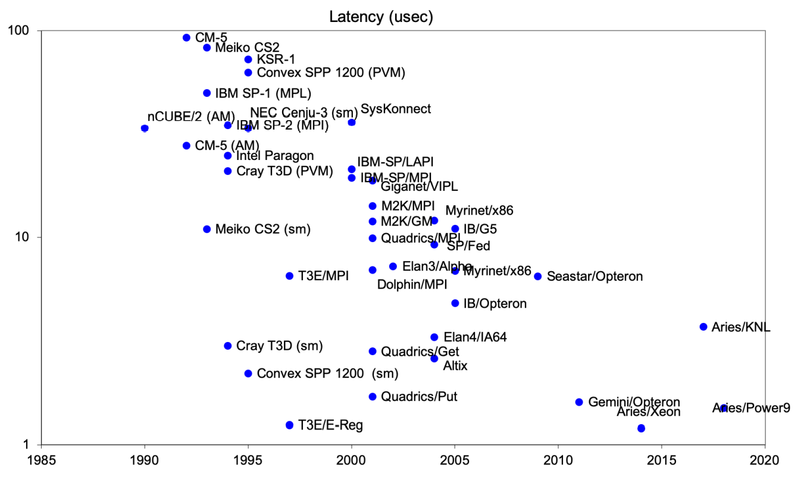

- Latency has not improved significantly, unlike Moore’ s Law

## Performance Properties of a Network: Bisection Bandwidth

- Bisection bandwidth: bandwidth across smallest cut that divides network into two equal halves
- Bandwidth across “narrowest” part of the network

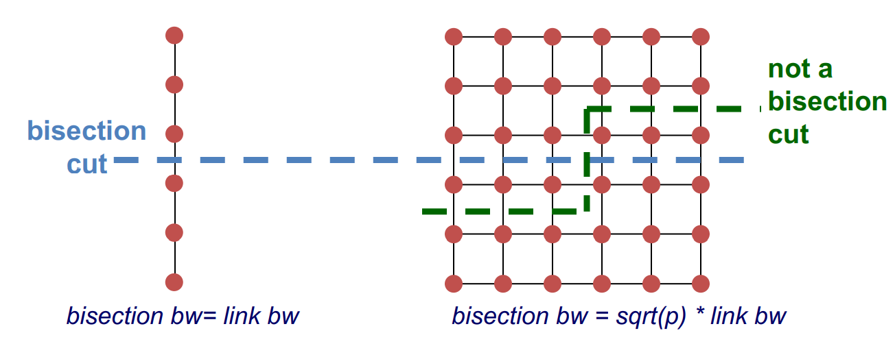

### Linear and Ring Topologies

- Linear array
  - Diameter = n-1; average distance ~n/3. 
  - Bisection bandwidth = 1 (in units of link  bandwidth)
- Torus or Ring
  - Diameter = n/2; average distance ~ n/4.
  - Bisection bandwidth = 2

### Meshes and Tori – used in Hopper


### Hypercubes


### Trees


### Butterflies


### Dragonflies – used in Edison and Cori

- Motivation: Exploit gap in cost and performance between optical interconnects (which go between cabinets in a machine room) and electrical networks (inside cabinet)
  - Optical (fiber) more expensive but higher bandwidth when long
  - Electrical (copper) networks cheaper, faster when short
- Combine in hierarchy:
  - Several groups are connected together using all to all links, i.e. each group has at least one link directly to each other group. 
  - The topology inside each group can be any topology. 
- Uses a randomized routing algorithm
- Outcome: programmer can (usually) ignore topology, get good performance
  - Important in virtualized, dynamic environment
  - Drawback: variable performance

#### Why randomized routing?


### Shared Memory Performance Models

- Often called “$\alpha-\beta$ model” and written
  - $ Time= latency + n/bandwidth=\alpha+n\times\beta$ 

## Programming Distributed Memory Machines with  Message Passing

### MPI Basic Send/Receive


### MPI Basic (Blocking) Send

```C++
MPI_Send( A, 10, MPI_DOUBLE, 1, … ) 
MPI_Recv( B, 20, MPI_DOUBLE, 0, … )
```

- `MPI_SEND(start, count, datatype, dest, tag, comm)`
  - The message buffer is described by (start, count, datatype).
  - The target process is specified by dest, which is the rank of the target process in the communicator specified by comm.
  - When this function returns, the data has been delivered to the system and the buffer can be reused. The message may not have been received by the target process.

- `MPI_RECV(start, count, datatype, source, tag, comm, status)`
  - Waits until a matching (both source and tag) message is received from the system, and the buffer can be used
  - `source` is rank in communicator specified by `comm`, or `MPI_ANY_SOURCE`
  - `tag` is a tag to be matched or `MPI_ANY_TAG`
  - receiving fewer than count occurrences of datatype is OK, but receiving more is an error
  - `status` contains further information (e.g. size of message)

### PI redux: Numerical integration


```C
#include "mpi.h”
#include <math.h>
#include <stdio.h>
int main(int argc, char *argv[])
{
    int done = 0, n, myid, numprocs, i, rc;
    double PI25DT = 3.141592653589793238462643;
    double mypi, pi, h, sum, x, a;
    MPI_Init(&argc,&argv);
    MPI_Comm_size(MPI_COMM_WORLD,&numprocs);
    MPI_Comm_rank(MPI_COMM_WORLD,&myid);
    while (!done) {
        if (myid == 0) {
        printf("Enter the number of intervals: (0 quits) ");
        scanf("%d",&n);
    }
        
    MPI_Bcast(&n, 1, MPI_INT, 0, MPI_COMM_WORLD);
    if (n == 0) break;
        
    h = 1.0 / (double) n;
    sum = 0.0;
    for (i = myid + 1; i <= n; i += numprocs) {
    	x = h * ((double)i - 0.5);
    	sum += 4.0 * sqrt(1.0 - x*x);
    }
        
    mypi = h * sum;
    MPI_Reduce(&mypi, &pi, 1, MPI_DOUBLE, MPI_SUM, 0, MPI_COMM_WORLD);
    if (myid == 0)
        printf("pi is approximately %.16f, Error is %.16f\n", 
               pi, fabs(pi - PI25DT));
    }
    
    MPI_Finalize();
    return 0;
}
```

```shell
#apt install mpich
mpicc -o pi pi.c
mpirun -np 6 ./pi
```

### Buffers


- Avoiding Buffering
  - Avoiding copies uses less memory
  - May use more or less time
- 
- This requires that `MPI_Send` wait on delivery, or  that `MPI_Send` return before transfer is complete, and we wait later

### MPI’s Non-blocking Operations

- Non-blocking operations return (immediately) “request handles” that can be tested and waited on:
  - `MPI_Request request;`
  - `MPI_Status status;`
  - `MPI_Isend(start, count, datatype, dest, tag, comm, &request);`
  - `MPI_Irecv(start, count, datatype, dest, tag, comm, &request);`
  - `MPI_Wait(&request, &status);`
  - (each request must be Waited on)
- One can also test without waiting:
  - `MPI_Test(&request, &flag, &status);`
- Accessing the data buffer without waiting is undefined


# P10: Advanced MPI and Collective Communication Algorithms 

## SUMMA


### `MPI_Comm_split`

```C
int MPI_Comm_split( MPI_Comm comm, 
                    int color, 
                    int key, 
                    MPI_Comm *newcomm)
```

- MPI’s internal Algorithm:

1. Use `MPI_Allgather` to get the color and key from each process
2. Count the number of processes with the same color; create a 
    communicator with that many processes. If this process has 
    `MPI_UNDEFINED` as the color, create a process with a single 
    member.
3. Use key to order the ranks
  - Color: controls assignment to new communicator
  - Key: controls rank assignment within new communicator

### How are collectives implemented in MPI?

- Example: `MPI_AllReduce`
  - All processes must receive the same result vector;
  - Reduction must be performed in canonical order `m0 + m1 ··· + mp−1` (if the operation is not commutative); 
  - The same reduction order and bracketing for all elements of the result vector is not strictly required, but should be strived for.


### AllGather


$$
T_{ring}=\alpha(p-1)+\beta n(p-1)/p\\
\rightarrow T_{rec-dbl}=\alpha\log(p)+\beta n(p-1)/p
$$

### The Bruck Algorithm


$$
T_{brock}=\lceil \alpha\log(p) \rceil+\beta n(p-1)/p
$$

### Nonblocking Collective Communication

Semantic advantages:

- Enable asynchronous progression (and manual) 
  - Software pipelining
- Decouple data transfer and synchronization 
  - Noise resiliency!
- Allow overlapping communicators 
  - See also neighborhood collectives
- Multiple outstanding operations at any time 
  - Enables pipelining window


## Hybrid Programming with Threads

### Programming for Multicore

Common options for programming multicore clusters

- All MPI

  - MPI between processes both within a node and across nodes

  - MPI internally uses shared memory to communicate within a 
    node

- MPI + OpenMP

  - Use OpenMP within a node and MPI across nodes

- MPI + Pthreads

  - Use Pthreads within a node and MPI across nodes 

- The latter two approaches are known as “hybrid programming”


### MPI’s Four Levels of Thread Safety

- MPI defines four levels of thread safety -- these are commitments the application makes to the MPI
- `MPI_THREAD_SINGLE`: only one thread exists in the application
- `MPI_THREAD_FUNNELED`: multithreaded, but only the main thread makes MPI calls (the one that called `MPI_Init_thread`)
- `MPI_THREAD_SERIALIZED`: multithreaded, but only one thread at a time makes MPI calls
- `MPI_THREAD_MULTIPLE`: multithreaded and any thread can make MPI calls at any time (with some restrictions to avoid races – see next slide)
- Thread levels are in increasing order
  - If an application works in FUNNELED mode, it can work in SERIALIZED
- MPI defines an alternative to MPI_Init
  - `MPI_Init_thread(requested, provided)`
    - Application gives level it needs; MPI implementation gives level it supports

### `MPI_THREAD_FUNNELED `

- All MPI calls are made by the master thread 

  - Outside the OpenMP parallel regions 

  - In OpenMP master regions

  - ```C
    int main(int argc, char ** argv)
    {
        int buf[100], provided;
        MPI_Init_thread(&argc, &argv, MPI_THREAD_FUNNELED, 
                        &provided);
        if (provided < MPI_THREAD_FUNNELED)
        	MPI_Abort(MPI_COMM_WORLD, 1);
        
        #pragma omp parallel for
        for (i = 0; i < 100; i++)
        	compute(buf[i]);
        /* Do MPI stuff */
        MPI_Finalize();
        return 0;
    }
    
    ```

### `MPI_THREAD_SERIALIZED`

- Only one thread can make MPI calls at a time

  - Protected by OpenMP critical regions

  - ```C
    int main(int argc, char ** argv)
    {
        int buf[100], provided;
        MPI_Init_thread(&argc, &argv, MPI_THREAD_SERIALIZED, 
                        &provided);
        if (provided < MPI_THREAD_SERIALIZED)
        	MPI_Abort(MPI_COMM_WORLD, 1);
        
        #pragma omp parallel for
        for (i = 0; i < 100; i++) {
        	compute(buf[i]);
        	#pragma omp critical
        	/* Do MPI stuff */
        }
        MPI_Finalize();
        return 0;
    }
    
    ```

### MPI_THREAD_MULTIPLE 

- Any thread can make MPI calls any time (w/ restrictions)

  - ```C
    int main(int argc, char ** argv)
    {
        int buf[100], provided;
        MPI_Init_thread(&argc, &argv, MPI_THREAD_MULTIPLE, 
                        &provided);
        if (provided < MPI_THREAD_MULTIPLE)
        	MPI_Abort(MPI_COMM_WORLD, 1);
        #pragma omp parallel for
        for (i = 0; i < 100; i++) {
            compute(buf[i]);
            /* Do MPI stuff */
        }
        MPI_Finalize();
        return 0;
    }
    
    ```

### Threads and MPI

- An implementation is not required to support levels higher than `MPI_THREAD_SINGLE;` that is, an implementation is not required to be thread safe
- A fully thread-safe implementation will support `MPI_THREAD_MULTIPLE`
- A program that calls `MPI_Init (instead of MPI_Init_thread)` should assume that only `MPI_THREAD_SINGLE` is supported
- A threaded MPI program that does not call `MPI_Init_thread` is an incorrect program (common user error we see)
- **The user has to make sure that one thread is not using an object while another thread is freeing it** 
  - This is an ordering issue; the object might get freed before it is used

### One-sided Communication


### One-sided Communication Example


### Creating Public Memory

- Any memory used by a process is, by default, only locally accessible
  - `X = malloc(100);`
- Once the memory is allocated, the user has to make an explicit MPI call to declare a memory region as remotely accessible
  - MPI terminology for remotely accessible memory is a “window”
  - A group of processes collectively create a “window”
- Once a memory region is declared as remotely accessible, all processes in the window can read/write data to this memory without explicitly synchronizing with the target process

### Window creation models

- Four models exist
- `MPI_WIN_CREATE`
  - You already have an allocated buffer that you would like to make remotely accessible

- `MPI_WIN_ALLOCATE`
  - You want to create a buffer and directly make it remotely accessible
- `MPI_WIN_CREATE_DYNAMIC`
  - You don’t have a buffer yet, but will have one in the future
  - You may want to dynamically add/remove buffers to/from the window
- `MPI_WIN_ALLOCATE_SHARED`
  - You want multiple processes on the same node share a buffer

### `MPI_WIN_ALLOCATE`

```C
int MPI_Win_allocate(MPI_Aint size, int disp_unit,
	MPI_Info info, MPI_Comm comm, void *baseptr,
	MPI_Win *win)
```

- Arguments:
- size - size of local data in bytes (nonnegative integer)
- disp_unit - local unit size for displacements, in bytes (positive integer)
- info - info argument (handle)
- comm - communicator (handle)
- baseptr - pointer to exposed local data
- win - window (handle)


```C
int MPI_Win_create_dynamic(MPI_Info info, MPI_Comm comm,
	MPI_Win *win)
```

- Create an RMA window, to which data can **later** be attached
  - Only data exposed in a window can be accessed with RMA ops
- Initially “empty”
  - Application can dynamically attach/detach memory to this window by calling `MPI_Win_attach/detach`
  - Application can access data on this window only after a memory region has been attached
- Window origin is `MPI_BOTTOM`
  - Displacements are segment addresses relative to `MPI_BOTTOM`
  - Must tell others the displacement after calling attach

```C
int main(int argc, char ** argv)
{
    int *a; MPI_Win win;
    MPI_Init(&argc, &argv);
    MPI_Win_create_dynamic(MPI_INFO_NULL, MPI_COMM_WORLD, &win);
    /* create private memory */
    a = (int *) malloc(1000 * sizeof(int));
    /* use private memory like you normally would */
    a[0] = 1; a[1] = 2;
    /* locally declare memory as remotely accessible */
    MPI_Win_attach(win, a, 1000*sizeof(int));
    /* Array 'a' is now accessible from all processes */
    /* undeclare remotely accessible memory */
    MPI_Win_detach(win, a); free(a);
    MPI_Win_free(&win);
    MPI_Finalize(); return 0;
}
```

### Data movement: Put


### RMA Synchronization Models

- RMA data access model
  - When is a process allowed to read/write remotely accessible memory?
  - When is data written by process X is available for process Y to read?
  - RMA synchronization models define these semantics
- Three synchronization models provided by MPI:
  - Fence (active target)
  - Post-start-complete-wait (generalized active target)
  - Lock/Unlock (passive target)
- Data accesses occur within “epochs”
  - Access epochs: contain a set of operations issued by an origin process
  - Exposure epochs: enable remote processes to update a target’s window
  - Epochs define ordering and completion semantics
  - Synchronization models provide mechanisms for establishing epochs
    - E.g., starting, ending, and synchronizing epochs


---


# 11: UPC++: Partitioned Global Address Space Languages

## Some motivating applications

- Many applications involve asynchronous updates to irregular data structures
  - Adaptive meshes
  - Sparse matrices 
  - Hash tables and histograms
  - Graph analytics
  - Dynamic work queues
- Irregular and unpredictable data movement:
  - Space: Pattern across processors
  - Time: When data moves
  - Volume: Size of data

## Some motivating system trends

### The first exascale systems will appear in 2021

- Cores per node is growing
- Cores are getting simpler (including GPU cores)
- Memory per core is dropping
- Latency is not improving

### Need to reduce communication costs in software

- Overlap communication to hide latency
- Reduce memory using smaller, more frequent messages
- Minimize software overhead 
- Use simple messaging protocols (RDMA)

## Parallel Machines and Programming

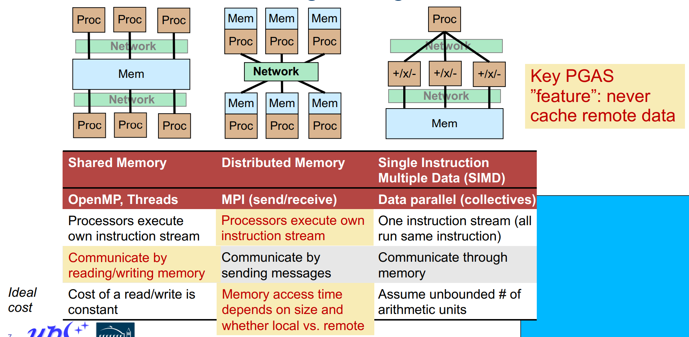

- Memory access time depends on **size** and whether local vs. remote
- Key PGAS  "feature": **never  cache remote data**

### Advantages and disadvantages of each

- Shared memory / OpenMP
  - +**Ease**: Easier to parallelize existing serial code
  - Correctness: Race conditions
  - Scalability: No locality control; cache coherence doesn’t scale
  - Performance: False sharing, lack of parallelism, etc.
- Message Passing / two-sided MPI
  - Ease: More work up front to partition data
  - +**Correctness**: Harder to create races (although deadlocks can still be a problem)
  - +**Scalability**: Effectively unlimited
  - +**Performance**: More transparent, but messages are expensive (need to pack/unpack)

### PGAS = Partitioned Global Address Space

- **Global address space**: thread may directly read/write remote data 
  - Convenience of shared memory
- **Partitioned**: data is designated as local or global
  - Locality and scalability of message passing


- **Shared mem: Physically Partition + Logically Continue**
- Need a way to name remote memory (UPC syntax) 
  - Global pointers: `shared int * p = upc_malloc(4); `
  - Distributed arrays: `shared int a [12];`
- Directly read/write remote memory; partitioned for locality 
  - One-sided communication underneath (UPC syntax): 
  - Put: `a[i] = … ; *p = ...; upc_mem_put(..) `
  - Get: `... = a[i]...; ... = *p; upc_mem_get(...)`

### Global vs raw pointers and affinity

- The affinity **identifies** the process that created the object
- Global pointer carries both an address and the affinity for the data
- Raw C++ pointers can be used on a process to refer to objects in the global address space that have affinity to that process
  - 
  - P0: `g->val` == `l->next->val`

### What does UPC++ offer?

- Asynchronous behavior
  - RMA: Remote Memory Access
    - Get/put to a remote location in another address space
    - Low overhead, zero-copy, one-sided communication. 
  - RPC: Remote Procedure Call: 
    - Moves computation to the data
- Design principles for performance
  -  All communication is **syntactically** **explicit**
  - All communication is **asynchronous**: futures and promises
  - Scalable data structures that avoid **unnecessary** **replication**

## Example: Monte Carlo Pi Calculation

- Estimate Pi by throwing darts at a unit square
- Calculate percentage that fall in the unit circle
  - Area of square = r2 = 1
  - Area of circle quadrant = $1/4\times\pi r^2=\pi/4$
- Randomly throw darts at x,y positions
- `If x2 + y2 < 1`, then point is inside circle
- Compute ratio:
  - points inside / # points total
  - $\pi$ = 4*ratio

### Independent estimates of pi:


### Private vs. Shared Memory in UPC++


- `global_ptr gptr = new_(rank_me());`

- To write an interesting program, we need to have global  pointers refer to remote data 
- One approach is to broadcast the pointer
- 

### Asynchronous remote operations

- Asynchronous execution used to hide remote latency
- Asynchronous get: start reading, but how to tell if you’re done?
  - Put the results into a special “box” called a future
  - 

### UPC++ Synchronization

- UPC++ has two basic forms of barriers:

   1) Synchronous Barrier: block until all other threads arrive (usual)
      `barrier();`
   1) Asynchronous barriers
      ```C++
      future<> f =
        barrier_async(); // this thread is ready for barrier
        // do computation unrelated to barrier
        wait(f); // wait for others to be ready
      ```

- Reminder: slides elide the `upcxx::` that precedes these

  

### Pi in UPC++: Shared Memory Style

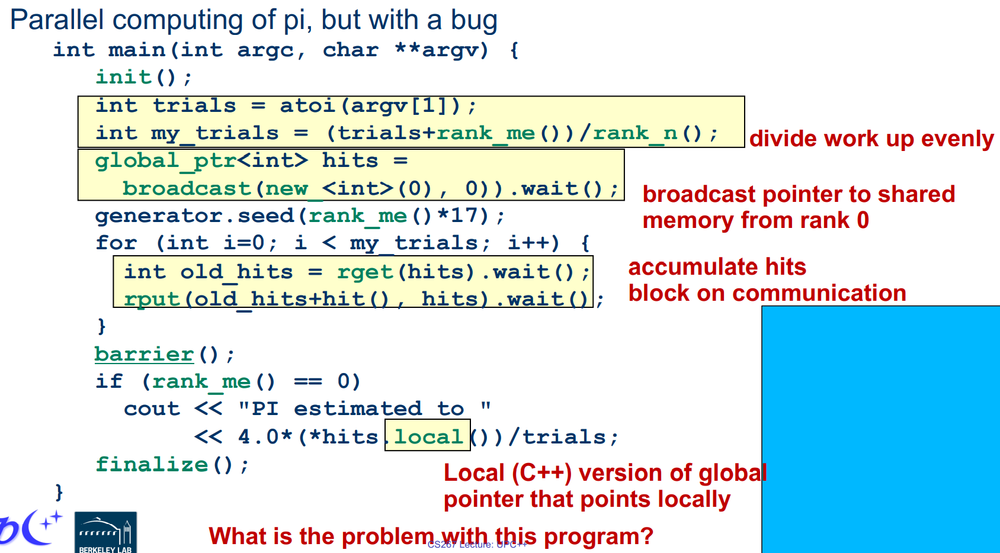

- Race condition:  `int old_hits = rget(hits).wait();`

### Downcasting global pointers

- If a process has direct load/store access to the memory referenced by a global 
  pointer, it can downcast the global pointer into a raw pointer with local()
```C++
global_ptr<double> grid_pptr;
double *grid;

void make_grid(size_t N) {
	grid_gptr = new_array<double>(N);
	grid = grid_gptr.local();//Downcasting 
}
```

- Downcasting can be used to optimize for co-located processes 
  that share physical memory

### Atomics in UPC++ 

- Atomics are indivisible read-modify-write operations 
- As if you put a lock around each operation, but may have  hardware support (e.g., within the network interface)

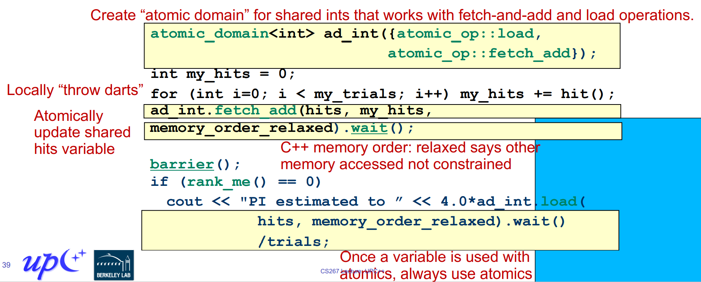

### Pi in UPC++: Data Parallel Style w/ Collectives

- The previous version of Pi works, but is not scalable:
  - Updates are serialized on rank 0, ranks block on updates
- Use a reduction for better scalability:

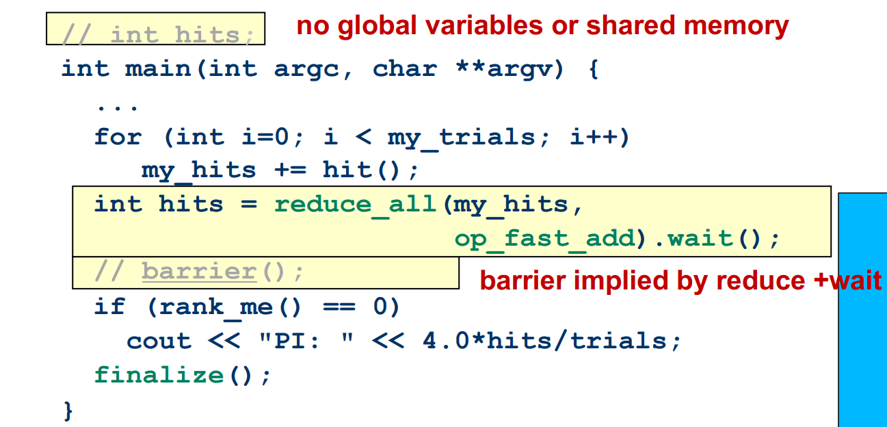

```C++
#include <iostream>
#include <random>
#include <upcxx/upcxx.hpp>
default_random_engine generator;
uniform_real_distribution<> dist(0.0, 1.0);
using namespace upcxx
int hit() {
    double x = dist(generator);
    double y = dist(generator);
    if (x*x + y*y <= 1.0) {
        return 1;
    } else {
        return 0;
    }
}

int main(int argc, char **argv) {
    init();
    int trials = atoi(argv[1]);
    int my_trials = (trials+rank_me())/rank_n();
    global_ptr<int> hits = broadcast(new_<int>(0), 0)).wait();
    generator.seed(rank_me()*17);
    
    int my_hits = 0;
    for (int i=0; i < my_trials; i++) 
    	my_hits += hit();
    
    int hits = reduce_all(my_hits, op_fast_add).wait();
    // barrier();
    if (rank_me() == 0)
    	cout << "PI: " << 4.0*hits/trials;
    finalize();
}


```

## Remote procedure call (RPC)

- Execute a function on another process, sending arguments and returning an optional result 

  - 1.Initiator injects the RPC to the target process 

  - 2.Target process executes fn(arg1, arg2) at some later time determined at the target

  - 3.Result becomes available to the initiator via the future

- Many RPCs can be active simultaneously, hiding latency
- 

### Pi in UPC++: RPC


### Chaining callbacks

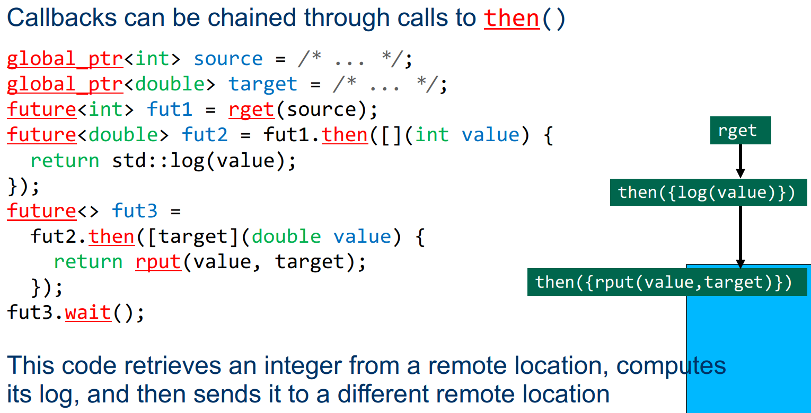

### Conjoining futures


### Distributed objects

- A distributed object is an object that is partitioned over a set of processes
  - `dist_object<T>(T value, team &team = world());`
- The processes share a universal name for the object, but each has its own local value
- Similar in concept to a co-array, but with advantages
  - No communication to set up or **tear down**
  - Scalable metadata representation
  - **Does not require a symmetric heap**
  - Can be constructed over teams

### Pi with a distributed object

- A distributed object can be used to store the results from each process
- 

### Distributed hash table (DHT)

- Distributed analog of std::unordered_map
  - Supports insertion and lookup
  - We will assume the key and value types are string
  - Represented as a collection of individual unordered maps across processes
  - We use RPC to move hash-table operations to the owner


### DHT data representation

- A distributed object represents the directory of unordered maps

- ```C++
  class DistrMap {
  	using dobj_map_t = dist_object<unordered_map<string, string>>;
      // Construct empty map
      dobj_map_t local_map{{}};
      
      //Computes owner for the given key
      int get_target_rank(const string &key) {
      	return std::hash<string>{}(key) % rank_n();
      } 
  };
  ```

### DHT insertion

- Insertion initiates an RPC to the owner and returns a future that represents  completion of the insert

- 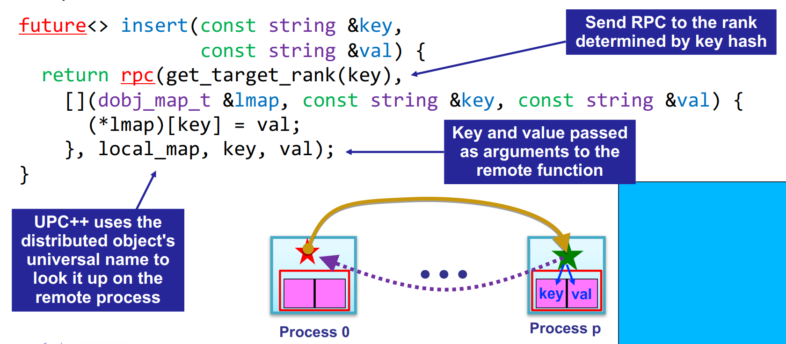

- ```C++
  future<> insert(const string &key, const string &val) {
      return rpc( get_target_rank(key),
  			[](dobj_map_t &lmap, const string &key, const string &val) 
  				{ (*lmap)[key] = val; }, 
  			local_map, key, val);
  }
  ```

### RPC and progress

- Review: high-level overview of an RPC's execution
  - 1.Initiator injects the RPC to the target process 
  - 2.Target process executes fn(arg1, arg2) at some later time determined at target
  - 3.Result becomes available to the initiator via the future
- **Progress** is what ensures that the RPC is eventually executed at the target


### Progress

- UPC++ does not spawn hidden threads to advance its internal state or track asynchronous communication
- This design decision keeps the runtime lightweight and simplifies synchronization
  - RPCs are run in series on the main thread at the target process, avoiding the need for explicit synchronization
- The runtime relies on the application to invoke a progress function to process incoming RPCs and invoke callbacks
- Two levels of progress
  - Internal: advances UPC++ internal state but no notification
  - User: also notifies the application
  - Readying futures, running callbacks, invoking inbound RPCs

### Serialization

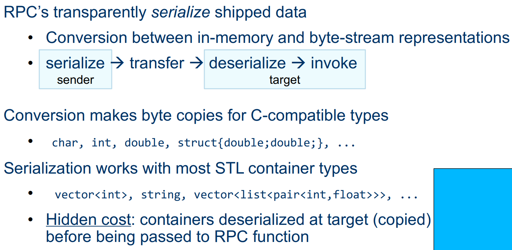

### Views

- UPC++ views permit optimized handling of collections in RPCs, without making unnecessary copies
  - ` view<T>`: non-owning sequence of elements
- When deserialized by an RPC, the view elements can be accessed directly from the internal network buffer, rather than constructing a container at the target


### Shared memory hierarchy and `local_team`

- Memory systems on supercomputers are hierarchical
  - Some process pairs are “closer” than others
  - Ex: cabinet > switch > node > NUMA domain > socket > core
- Traditional PGAS model is a “flat” two-level hierarchy
  - “same process” vs “everything else”
- UPC++ adds an intermediate hierarchy level
  - local_team() – a team corresponding to a physical node
  - These processes share a physical memory domain
    - **Shared** segments are CPU load/store accessible across the same `local_team`
- 

### Downcasting and shared-memory bypass

- Earlier we covered downcasting global pointers
  - Converting `global_ptr<T> `from this process to raw C++ `T*`
  - Also works for `global_ptr<T>` from any process in `local_team()`

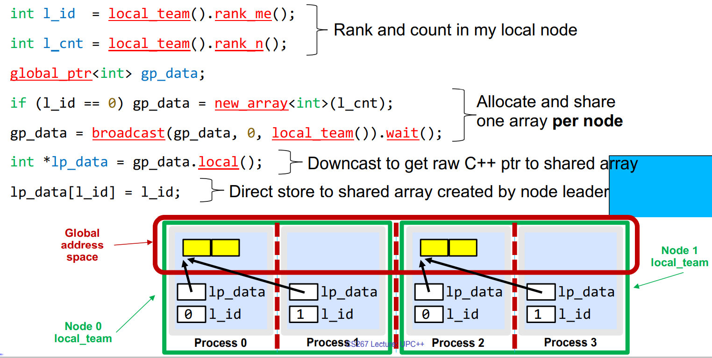

### Optimizing for shared memory in many-core

- `local_team()` allows optimizing co-located processes for physically 
- shared memory in two major ways:
- Memory scalability
  - Need only one copy per node for replicated data
  - E.g. Cori KNL has 272 hardware threads/node
- Load/store bypass – avoid explicit communication overhead for RMA on local shared memory
  - Downcast `global_ptr `to raw C++ pointer
  - Avoid extra data copies and communication overheads

---


# 12: Special Lecture

## 12a: Parallel Algorithms for De Novo Genome Assembly


## 12b: Communication-Avoiding Graph Neural Networks

### What are graphs?


- Stores connections (edges) between entities (vertices/nodes)

### Why not use CNNs?

- 
- Why not use CNNs?

### GNN basics


### GNN training basics

1. Initialize feature vectors in layer 0
2. Sum neighbors’ vectors for each vertex
3. Apply weight to vector sums


### GNN issues

- GNN models are huge: $O(nfl)$
  - $n$ : number of vertices
  - $f$ : length of feature vector
  - $L$ : number of layers
- Need to distribute GNN training + inference

### Why not use mini-batch SGD?

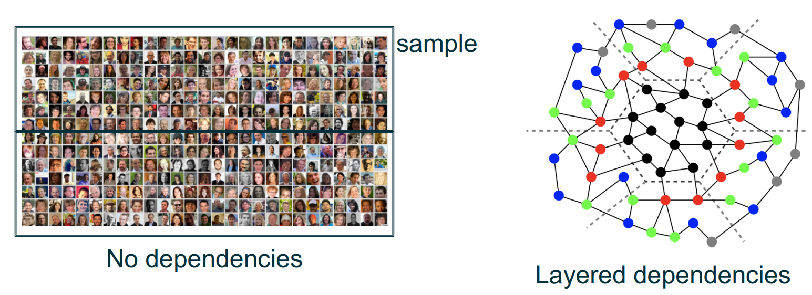

- Layered dependencies -> space issue persists 
- Focus on full-batch gradient descent

### How do we distribute GNN training?

- Formulate GNN training with sparse-dense matrix multiplication operations
  - Both forward and back propagation
- Distribute with distributed sparse-dense matrix multiplication algorithms
  - Focus on node classification, but methods are general

### GNN training as sparse-dense matrix multiplication


#### Forward Propagation:

- $\mathbf{Z}^l \leftarrow \mathbf{A}^T\mathbf{H}^{l-1}\mathbf{W}^l$  <- SpMM, DGEMM
- $\mathbf{H}^l \leftarrow \sigma(\mathbf{Z}^l)$   <- In paper

#### Backward Propagation:

- $\mathbf{G}^{l-1} \leftarrow \mathbf{A G}^l\left(\mathbf{W}^l\right)^{T} \odot \sigma^{\prime}\left(\mathbf{Z}^{l-1}\right) $  <- SpMM, DGEMM
- $\mathbf{Y}^{l-1} \leftarrow\left(\mathbf{H}^{l-1}\right)^{T} \mathbf{A} \mathbf{G}^l$  <- DGEMM

### Bottleneck of GNN training


- SpMM >>> DGEMM

### GNN training communication analysis

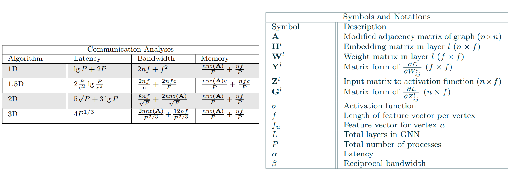

- $nnz(\mathbf{A})$ is the number of edges
- $c$ is the replication factor for 1.5D ($c=1$ is 1D, $c=P^{1/3}$, is 3D)

### GNN Training with 2D/3D Matrix Multiplication

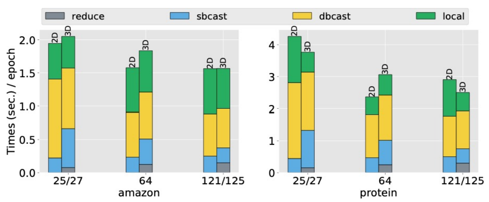

- Other algorithms evaluated in practice (with 6GPUs/node)
- Communication scales with $P$, consistent with analysis
- Computation scales less well à explained in paper


## 12c: Distributed Computing with Ray and NumS

### What is Ray?

- Ray provides a **Task parallel** API and **actor** API built on **dynamic task graphs**
- 

### Ray Architecture


### The Ray API


- Actor Handles


#### NumS: 

#### The Problem

- NumS aims to make **terabyte-scale data modeling easier** for the **Python** scientific computing community.
- We have an abundance of very fast compute devices and libraries to manage parallelism among these devices.
- However, existing libraries expect the Python scientific computing community to learn advanced parallel computing concepts and algorithms to make use of these devices, an uncommon skill among Python users.
- What can be done to make numerical computing at these scales accessible to Python programmers?

#### NumS Design


#### Execution on Ray: RPC Returns

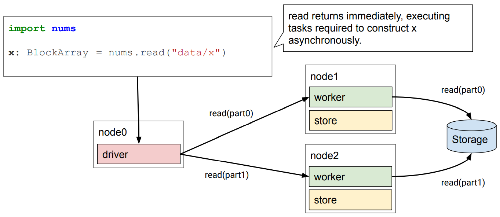

- Objects are held in the store so long as  a reference to the object exists in the  application.

#### Array Access Dependency Resolution

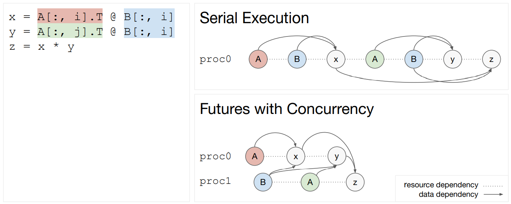


# 18: Sparse-Matrix-Vector-Multiplication and Iterative Solvers


# 19: Fast Fourier Transform


# 20: Graph Algorithms


# 21: Cloud Computing and HPC


# 22a: Graph Partitioning


# 22b: Load Balancing with Work Stealing


# 23: Hierarchical Methods for the N-Body Problem


# 24: Sorting and Searching


# 25: Big Bang, Big Data, Big Iron


# 26: Computational Biology

