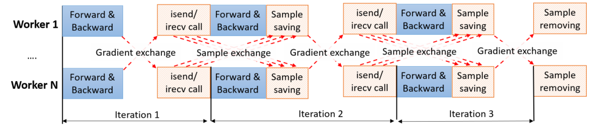
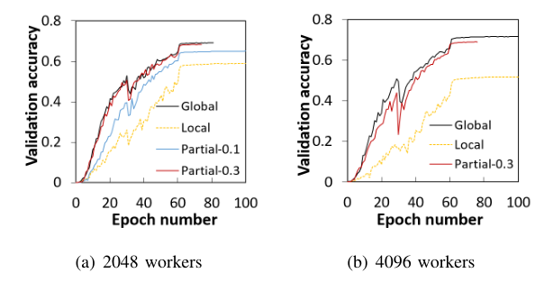
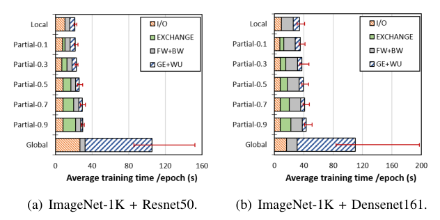

<!--more-->

# Why Globally Re-shuffle? Revisiting Data Shuffling in Large Scale Deep Learning

## Abstract

- Challenge
  - SGD gives enormous pressure on the I/O subsystem.
  - In HPC environments, we often replicate the entire dataset to node local SSDs.
- Contribution
  - Investigate the viability of partitioning the dataset among workers performing only a **partial distributed exchange** of samples in each training epoch.
  - Demonstrate that in practice validation accuracy of global shuffling exchange $\approx$ partial distributed exchange when carefully tuning.

## 1 INTRODUCTION

- Challenge
  - As datasets growing up, it is hard to store the **entire dataset** on compute node local storage, or by each node reading a subset of the samples from the **parallel file system** (PFS)
- Insight
  - **Random access** to the input samples has been in fact identified as one of the major contributors to **poor I/O performance**.
- Contribution
  - Revisit data shuffling strategies when scaling deep learning applications to a large number of workers.
  - Implement a dataset partitioning, shuffling, and redistribution solution for distributed training.
  - **Local shuffling achieves accuracy** $\approx$ **Global shuffling strategy** !!!
    - Average store **#0.03%** dataset
  - **Training time**: local shuffling **#5x** < global shuffling

## 2 BACKGROUND AND MOTIVATION

## 3 DESIGN AND IMPLEMENTATION

- To reduce I/O requirements: 
  - a) we split the dataset across workers, 
  - b) workers train on the local partition, and 
  - c) worker exchange a subset of the locals samples before each epoch
- A. Data Partitioning and Shuffling Scheme
  - Each worker exchanges globally a fraction Q of its local samples before each epoch. Q=1: full global shuffle, Q=0: pure local shuffle
  - In this paper, they use **partial local shuffling (PLS)**, which means 0<Q<1
  - PLS requires each worker **stores** up to $(1 + Q) N/M$ **samples**:
    - $N/M$ (LS) < $(1 + Q) N/M$ (PLS) < $M/2$ (GS)
- B. Exchanging Samples Between Workers
- C. Implementation
  - Two data primitives provided by PyTorch
    - A `Dataset` to store the samples and their corresponding labels
    -  A `DataLoader` to iterate over the (batches of) samples
  - `Scheduler` for managing the global exchange
    - Reduce the overhead: overlap communication with the forward and backward phases
    - 
    - E.g. A epoch with $I=N/(bM)$ iterations, $b$ is a batch size. In each iteration, $(Q\times N/M)/I = Q\times b$ samples are sent/received from one worker

## 4 SHUFFLING IN DISTRIBUTED SGD

- **Understanding**: **partial local shuffling Accuracy** $\approx$  g**lobal shuffling Accuracy**

- A. Partial Local vs. Global Shuffling: Gradients

  -  partial local shuffling produces the **same** gradients as global shuffling.

- B. Convergence Rate and Shuffling Error

  - for insufficient global shuffling in the non-convex case, the convergence rate’s upper bound include three terms

  - $$O\left(\sqrt{\frac{1}{S|N|}}+\frac{\log |N|}{|N|}+\frac{|N| \epsilon(A, N)^2}{b|M|}\right)$$

    -  $S$ is the number of epochs, and $\epsilon(A, N)$ is the shuffling error of algorithm $A$ with the samples $N$
    -  And shuffling error can be simplified: $\epsilon(A, h, N)=1-\frac{\sigma}{|N| !}$
    
  - for practical dataset sizes and number of workers, the shuffling error $\epsilon(A, h, N)\rightarrow1$. 

## 5 EVALUATION

- D. Equivalence of Local and Global Shuffling: **When Local is Enough**
  - while local shuffling starts to **converge slower** than its global counterpart, local partial shuffling provides almost identical accuracy trajectory with global sampling, which in turn with a feasible learning rate schedule could lead to **faster overall convergence** and thus a reduction in runtime.
  - On some larger datasets, **local shuffling accuracy == global shuffling**
    - Indicates that workers **do not** actually need to process a large portion of the whole dataset, and exchanging the gradient weights is **enough** to ensure convergence.
    - 
  - Since global shuffling reads from the PFS, the cost of I/O is much higher than those of local and partial shuffling.
    - 

## 6 RELATED WORK

## 7 CONCLUSION

- Eliminating **unnecessary shuffling** of data samples in distributed SGD can have profound implications on the I/O requirements of the overall training procedure.
- No need to replicate data everywhere, which reduces the cost of data staging in HPC environments. 
- **Smaller local data storage** suffices that could enable training comparable neural network models in **more** modest storage **environments**, such as over local tmpfs, opening up the potential for less powerful HPC systems to be utilized for deep learning workloads.