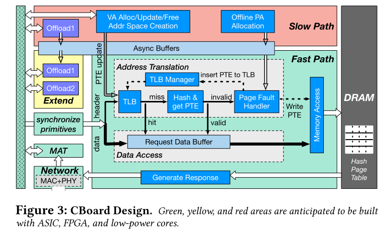

<!--more-->

> [https://cseweb.ucsd.edu/~yiying/clio-asplos22.pdf](https://cseweb.ucsd.edu/~yiying/clio-asplos22.pdf)

# Abstract

## Challenge

building/emulating memory nodes using
regular servers or building them using raw memory devices with
no processing power.
The former incurs higher monetary cost and
faces tail latency and scalability limitations, while the latter intro-
duces performance, security, and management problems.

## Contribution
We seek a sweet spot in
the middle by proposing a hardware-based memory disaggregation
solution that has the right amount of processing power at memory
nodes. 
The Clio hardware includes a new virtual memory system, a customized network system, and a framework for computation offmoading.

## Performance
.1×
to 3.4× energy saving compared to CPU-based and SmartNIC-based
disaggregated memory systems and is 2.7× faster than software-
based SmartNIC solution

# 1 Intro
have pushed the idea of memory disaggregation (MemDisagg for short): organizing computation and memory resources as two separate network-attached pools, one with compute nodes (CNs) and one with memory nodes (MNs).

Clio includes a CN-side user-space library called CLib and a new hardware-based MN device called CBoard. Multiple application processes running on difgerent CNs can allocate memory from the same CBoard, with each process having its own remote virtual memory address space.

A key research question in designing Clio is how to use limited hardware resources to achieve 100 Gbps, microsecond-level average and tail latency for TBs of memory and thousands of concurrent clients?

1) the MN can treat each of its incoming requests in isolation even if requests that the client issues can sometimes be inter-dependent, and 2) the MN hardware does not store metadata or deals with it. Without remembering previous requests or storing metadata, an MN would only need a tiny amount of on-chip memory that does not grow with more clients, thereby saving monetary and energy cost and achieving great scalability. 

Challenge 2
 First, as with any memory systems, users of a disaggregate memory system expect it to deliver certain reliability and consistency guarantees
 Second, quite a few memory operations involve metadata, and they too need to be supported by disaggregated memory. 
 Finally, many memory and network functionalities are traditionally associated with a client process and involve per-process/client metadata

Our fjrst approach is to separate the metadata/control plane and the data plane, with the former running as software on a lowpower ARM-based SoC at MN and the latter in hardware at MN.
Our second approach is to re-design the memory and networking data plane so that most state can be managed only at the CN side.

Our observation here is that the MN only responds to memory requests but never initiates any. This CN-request-MN-respond model allows us to use a custom, connection-less reliable transport protocol that implements almost all transport-layer services and state at CNs, allowing MNs to be free from traditional transport-layer processing.

We propose a new overfmow-free, hash-based page table design where 1) all page table lookups have bounded and low latency (at most one DRAM access time in our implementation), and 2) the total size of all page table entries does not grow with the number of client processes.

# 2 GOALS AND RELATED WORKS

## 2.1 MemDisagg Design Goals

### R1: Hosting large amounts of memory with high utilization.

### R2: Supporting a huge number of concurrent clients.

### R3: Low-latency and high-throughput

### R4: Low tail latency

### R5: Protected memory accesses.

### R6: Low cost.

### R7: Flexible

## 2.2 Server-Based Disaggregated Memory

## 2.3 Physical Disaggregated Memory

# 3 CLIO OVERVIEW

## 3.1 Clio Interface

## 3.2 Clio Architecture

# 4 CLIO DESIGN

## 4.1 Design Challenges and Principles

### Challenge 1: The hardware should avoid maintaining or pro-
cessing complex data structures,

### Challenge 2: Data bufgers and metadata that the hardware
uses should be minimal and have bounded sizes,

### Principle 1: Avoid state whenever possible

### Principle 2: Moving non-critical operations and state to soft-
ware and making the hardware fast path deterministic. 

### Principle 3: Shifting functionalities and state to CNs

### Principle 4: Making ofg-chip data structures effjcient and scalable.

### Principle 5: Making the hardware fast path smooth by treating each data unit independently at MN  

## 4.2 Scalable, Fast Address Translation

### Flat, single page table design (Principle 4).

### V A allocation (Principle 2). 

### TLB

### Limitation

## 4.3 Low-Tail-Latency Page Fault Handling

## 4.4 Asymmetric Network Tailored for MemDisagg

### Removing connections with request-response semantics.

### Lifting reliability to the memory request level.

### CN-managed congestion and incast control

## 4.5 Request Ordering and Data Consistency

### Allowing intra-request packet re-ordering (T1)

### Enforcing intra-thread inter-request ordering at CN (T2).

### Inter-thread/process consistency (T3)

### Handling retries (T4)

## 4.6 Extension and Offloading Support

## 4.7 Distributed MNs

# 5 CLIO IMPLEMENTATION

**CBoard Prototyping.**

**CLib Implementation**

# 6 BUILDING APPLICATIONS ON CLIO

**Image compression.**

**Radix tree**

**Key-value store.** 

**Multi-version object store.**

**Simple data analytics.**

# 7 EV ALUATION

## 7.1 Basic Microbenchmark Performance

## 7.2 Application Performance

## 7.3 CapEx, Energy, and FPGA Utilization

# 8 DISCUSSION AND CONCLUSION

