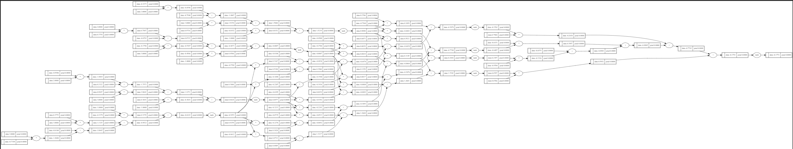

Backpropagation and training of neural networks. Assumes basic knowledge of Python and a vague recollection of calculus from high school.
<!--more-->

[Note link](https://concrete-piano-cd0.notion.site/Lecture-1-The-spelled-out-intro-to-neural-networks-and-backpropagation-building-micrograd-df00386387ac4114b6c73ab14e657d13)

