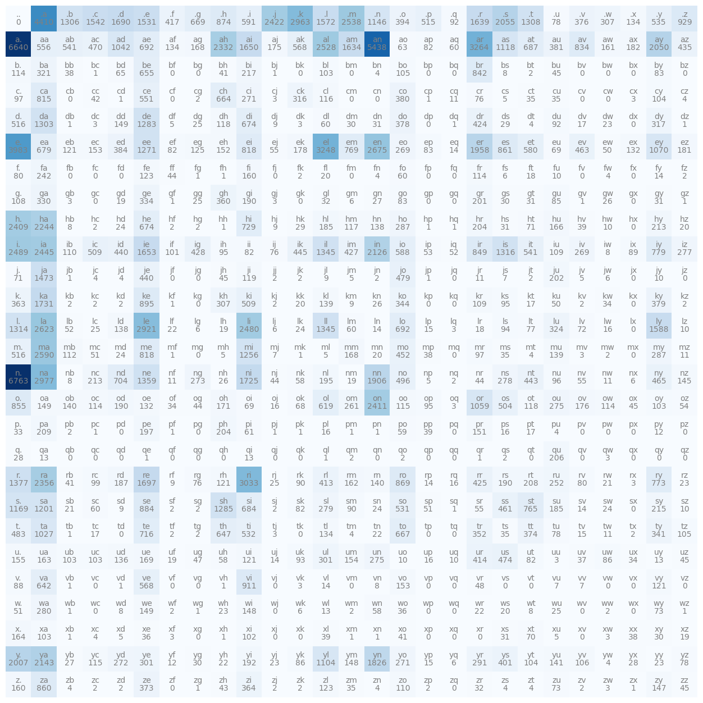

We implement a bigram character-level language model, which we will further complexify in followup videos into a modern Transformer language model, like GPT. In this video, the focus is on (1) introducing torch.Tensor and its subtleties and use in efficiently evaluating neural networks and (2) the overall framework of language modeling that includes model training, sampling, and the evaluation of a loss (e.g. the negative log likelihood for classification).
<!--more-->

[Note link](https://concrete-piano-cd0.notion.site/Lecture-2-The-spelled-out-intro-to-language-modeling-building-makemore-322d450f05564ba9afe89f964f326ee5)

