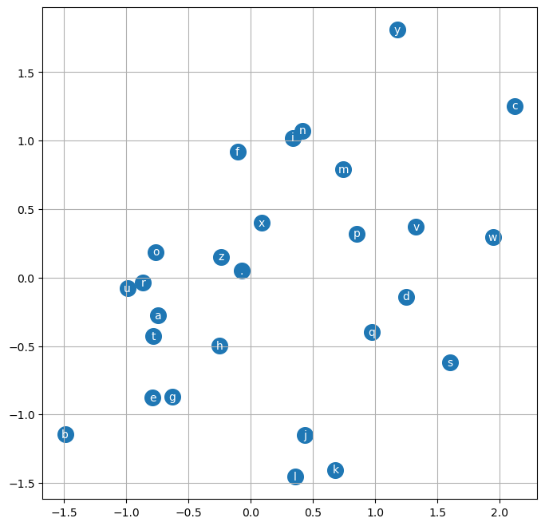

We implement a multilayer perceptron (MLP) character-level language model. In this video we also introduce many basics of machine learning (e.g. model training, learning rate tuning, hyperparameters, evaluation, train/dev/test splits, under/overfitting, etc.).
<!--more-->

[Note link](https://concrete-piano-cd0.notion.site/Lecture-3-Building-makemore-Part-2-MLP-ae0fd10a0eaa4faeb8c6bb74a458dbb1)