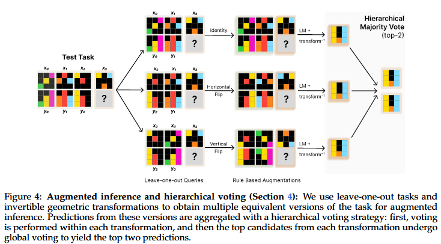
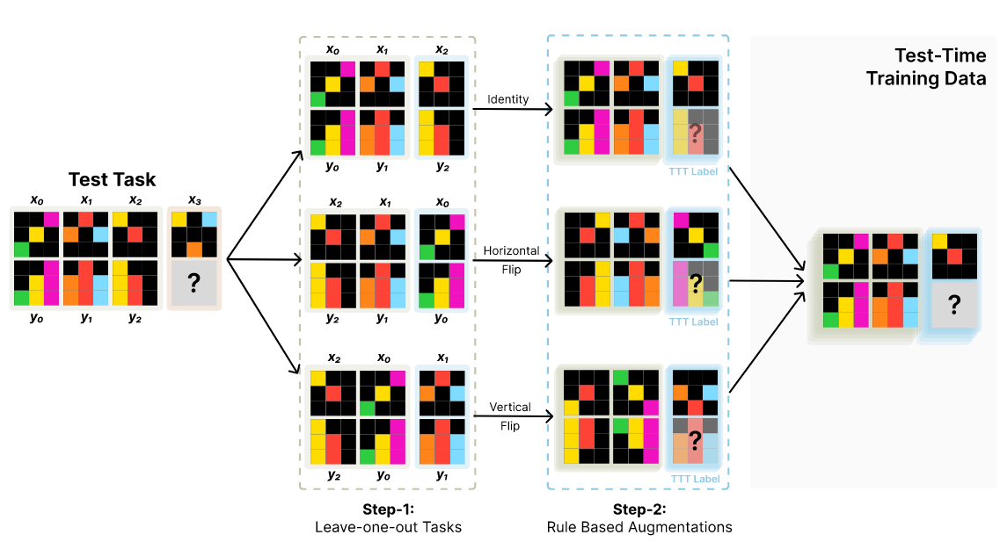

0 Main idea:

<!--more-->

# 0 Background

Abstraction and Reasoning Corpus(ARC) Challenge is a challenging few-shot visual reasoning problems. ARC is an ideal benchmark for testing the limits of LM generalization as it presents novel tasks, in a novel format, requiring nontrivial search and inference capabilities.

**Test-time training** (TTT) enables parametric models to adapt during inference through dynamic parameter updates, an approach that remains relatively unexplored in the era of large language models.

- Thus, TTT trains a specialized prediction model for each test input, obtained by fine-tuning a base model on a test-time dataset generated from that test input.

# 1 Challenges:

- Current Model perform poor on ARC-Challenge.

# 2 Motivation:

### Key point

(1) initial finetuning on similar tasks 

(2) auxiliary task format and augmentations 

(3) per-instance training
Train
$$
\begin{aligned}
\mathrm{Samples}\overset{\mathrm{Data}\,\,\mathrm{Augment}}{\longrightarrow}&\mathrm{Data}_{\mathrm{TTT}}\,\,\left[ \mathrm{Num}_{\mathrm{Samples}} \right]\\
	&\downarrow _{\mathrm{LoRA}}\\
	\mathrm{Model}\overset{\mathrm{FT}}{\longrightarrow}&\mathrm{Model}_{\mathrm{FT}}\\
	&\downarrow\\
	&\mathrm{Weight}_{\mathrm{LoRA}}\left[ \mathrm{Num}_{\mathrm{Samples}} \right]\\
\end{aligned}
$$

Test
$$
\begin{aligned}
	\mathrm{Model}_{\mathrm{FT}}\overset{\mathrm{Weight}_{\mathrm{LoRA}}\left[ \mathrm{Num}_{\mathrm{Samples}} \right]}{\longrightarrow}&\mathrm{Samples}_{\mathrm{Eval}}\left[ \mathrm{Num}_{\mathrm{Samples}} \right]\\
	&\downarrow _{\mathrm{Voting}}\\
	&\mathrm{Results}\\
\end{aligned}
$$

# 3 Proposed Methods:

Environments:

- 8b Llama3, 1b, 3b Llama3.2

- Each LoRA, $\text{rank}=128$ for each TTT tasks

- Data:

	- 80 ARC for eval, easy->expert average
	- 250 samples per tasks

1. How to construct the augmented TTT dataset DTTT from the test input (Section 3).  

  a. Data: 
       i. Step1: Leave-one-out Tasks
       ii. Step2: Rule Based Augmentation
       iii. Baseline: End to End
  

  b. result

  ​    i. TTT 6x > Base

  ​    ii. ICL +38% > Not

  ​    iii. Augment Data +55% > Not

2. An augmented inference strategy based on self-consistency over transformations (Section 4).  

	a. **directly sampling** is detrimental, as there is no way to directly enforce **diversity** across **samples** while ensuring **coherence** within samples.

3. A base model with parameters $\theta_0$ that is fine-tuned on a dataset DFT of similar tasks (Section 5).
