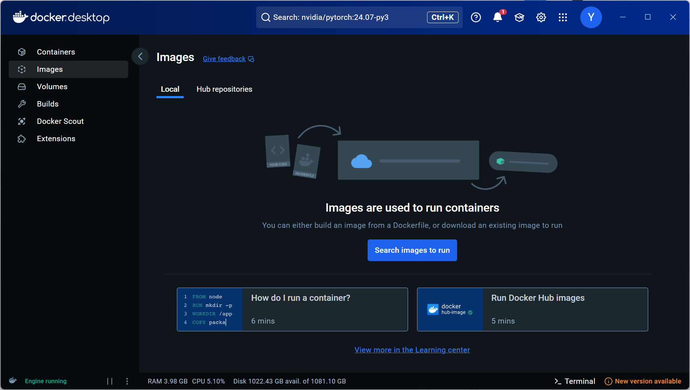

<!--more-->
# docker


Windows11下 Docker、WSL2安装及GPU配置 - 感冒零的文章 - 知乎
https://zhuanlan.zhihu.com/p/695680333

```shell
docker pull nvcr.io/nvidia/pytorch:24.07-py3

docker save -o "C:\Users\x\image\pytorch_24.07-py3.tar" nvcr.io/nvidia/pytorch:24.07-py3

# reload
docker load -i "C:\Users\x\image\pytorch_24.07-py3.tar"

```
---
# sftp
[sftp command](https://www.w3cschool.cn/linuxc/linuxc-p3yq3m69.html)
```shell
sfpt username@1.1.1.1 
> ls
> put /a /b # mv local to remote
> get /b /a # mv remote to local
```
---
# miniconda

在你的集群环境中安装 Miniconda 并将 `conda` 的环境存储配置为当前目录，可以按照以下步骤操作：

### 1. 安装 Miniconda
运行以下命令安装 Miniconda：

```bash
bash /storage/yanglinyi/dyr/Miniconda3-latest-Linux-x86_64.sh
```

安装过程中：
- **安装路径**：选择 `/storage/yanglinyi/dyr/miniconda3`，因为这是一个持久化存储路径。
- **是否初始化**：选择 `yes`，以便将 `conda` 添加到你的环境变量中。

### 2. 配置 `conda` 环境存储位置
在安装完成后，修改 `conda` 的配置以将环境存储在当前目录下。

1. **创建目录**（如果需要）：
   ```bash
   mkdir -p /storage/yanglinyi/dyr/envs
   ```

2. **设置环境存储路径**：
   运行以下命令，将 `conda` 的环境存储路径改为 `/storage/yanglinyi/dyr/envs`：
   ```bash
   conda config --add envs_dirs /storage/yanglinyi/dyr/envs
   ```

3. **确认配置**：
   查看当前 `conda` 配置，确保环境路径已更新：
   ```bash
   conda config --show
   ```

### 3. 创建和激活 `reft` 环境
按照以下步骤创建和激活名为 `reft` 的 `conda` 环境：

```bash
conda create -n reft python=3.9 -y
conda activate reft
```

### 4. 设置激活环境后的工作目录
如果希望激活 `reft` 环境后自动切换到当前目录，可以编辑环境的 `activate.d` 文件：

1. **创建 `activate.d` 目录**：
   ```bash
   mkdir -p /storage/yanglinyi/dyr/envs/reft/etc/conda/activate.d
   ```

2. **创建自动切换脚本**：
   编辑并保存脚本 `/storage/yanglinyi/dyr/envs/reft/etc/conda/activate.d/activate.sh`：
   ```bash
   echo "cd /storage/yanglinyi/dyr" > /storage/yanglinyi/dyr/envs/reft/etc/conda/activate.d/activate.sh
   chmod +x /storage/yanglinyi/dyr/envs/reft/etc/conda/activate.d/activate.sh
   ```

### 5. 验证安装
重启终端或手动刷新环境变量后，测试以下命令是否正常工作：
```bash
conda activate reft
python --version
```

如果一切正常，你的 Miniconda 安装和 `reft` 环境已经配置完成！

## 新机器再次进入

```shell
export PATH=/storage/yanglinyi/dyr/conda/bin:$PATH
conda --version
conda activate reft
```


---

[VSCode远程调试Python - 李理的博客](https://fancyerii.github.io/2023/09/25/py-remote-debug/#安装debugpy)

[Poetry插件导出教程](https://blog.csdn.net/gitblog_00765/article/details/141838844)

