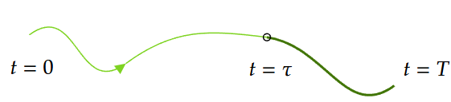

<!--more-->

# Spinning Up: Part 3 Intro to Policy Optimization

> [Welcome to Spinning Up in Deep RL! — Spinning Up documentation](https://spinningup.openai.com/en/latest/)

## Deriving the Simplest Policy Gradient

Optimize the policy by gradient ascent:
$$
\theta_{k+1}=\theta_k+\left.\alpha \nabla_\theta J\left(\pi_\theta\right)\right|_{\theta_k}
$$

- Expression for policy gradient
  - deriving the analytical gradient of policy performance
  - forming a sample estimate of that expected value

1. **Probability of a Trajectory.**

    $$
       P(\tau \mid \theta)=\rho_0\left(s_0\right) \prod_{t=0}^T P\left(s_{t+1} \mid s_t, a_t\right) \pi_\theta\left(a_t \mid s_t\right)
    $$
    
2. **The Log-Derivative Trick**, we get:
   $$
   \nabla_\theta P(\tau \mid \theta)=P(\tau \mid \theta) \nabla_\theta \log P(\tau \mid \theta)
   $$
	- $g(x)=\log f(x)$
	- $\nabla g(x) = \nabla f(x)/f(x)$
	- $\nabla f(x) = \nabla g(x) f(x)= \nabla \log (f(x)) f(x)$
3. **Log-Probability of a Trajectory**. The log-prob of a trajectory is just
   $$
   \log P(\tau \mid \theta)=\log \rho_0\left(s_0\right)+\sum_{t=0}^T\left(\log P\left(s_{t+1} \mid s_t, a_t\right)+\log \pi_\theta\left(a_t \mid s_t\right)\right) .
   $$

4. **Gradients of Environment Functions**. The environment has no dependence on $\theta$, so gradients of $\rho_0\left(s_0\right)$, $P\left(s_{t+1} \mid s_t, a_t\right)$, and $R(\tau)$ are zero.

5. **Grad-Log-Prob of a Trajectory.** The gradient of the log-prob of a trajectory is thus
$$
   \begin{aligned}
   \nabla_\theta \log P(\tau \mid \theta) & 
   =
   \cancel{\nabla_\theta \log \rho_0\left(s_0\right)}
   +\sum_{t=0}^T\left( \cancel{\nabla_\theta \log P\left(s_{t+1} \mid s_t, a_t\right)}
   +\nabla_\theta \log \pi_\theta\left(a_t \mid s_t\right)\right) \\
   & =\sum_{t=0}^T \nabla_\theta \log \pi_\theta\left(a_t \mid s_t\right) .
   \end{aligned}
$$

> **Derivation for Basic Policy Gradient**
> $$
> \begin{align}
> \nabla_\theta J(\pi_\theta) 
> &= \nabla_\theta \mathbb{E}_{\tau \sim \pi_\theta} \left[ R(\tau) \right] 
> && \text{} \\
> &= \nabla_\theta \int_\tau P(\tau \mid \theta) R(\tau) \, d\tau 
> && \text{Expand expectation} \\
> &= \int_\tau \nabla_\theta P(\tau \mid \theta) R(\tau) \, d\tau 
> && \text{Bring gradient under integral} \\
> &= \int_\tau P(\tau \mid \theta) \nabla_\theta \log P(\tau \mid \theta) R(\tau) \, d\tau 
> && \text{Log-derivative trick} \\
> &= \mathbb{E}_{\tau \sim \pi_\theta} \left[ \nabla_\theta \log P(\tau \mid \theta) R(\tau) \right] 
> && \text{Return to expectation form} \\
> \therefore \nabla_\theta J(\pi_\theta) &= \mathbb{E}_{\tau \sim \pi_\theta} \left[ \sum_{t=0}^T \nabla_\theta \log \pi_\theta(a_t \mid s_t) R(\tau) \right] 
> && \text{Expression for grad-log-prob}
> \end{align}
> $$
> 

If we collect a set of trajectories $\mathcal{D}=\left\{\tau_i\right\}_{i=1, \ldots, N}$, the policy gradient can be estimated with
$$
\hat{g}=\frac{1}{|\mathcal{D}|} \sum_{\tau \in \mathcal{D}} \sum_{t=0}^T \nabla_\theta \log \pi_\theta\left(a_t \mid s_t\right) R(\tau)
$$
where $|\mathcal{D}|$ is the number of trajectories in $\mathcal{D}$ (here, $N$ ).

## Implementing the Simplest Policy Gradient

## Expected Grad-Log-Prob Lemma

EGLP Lemma. Suppose that $P_{\theta}$ is a parameterized probability distribution over a random variable, $x$. Then:
$$
\underset{x \sim P_\theta}{\mathrm{E}}\left[\nabla_\theta \log P_\theta(x)\right]=0.
$$

## Don’t Let the Past Distract You

Policy gradient:
$$
\nabla_\theta J(\pi_\theta) = \underset{\tau \sim \tau_\theta}{\mathrm{E}} \left[ \sum_{t=0}^T \nabla_\theta \log \pi_\theta (a_t \mid s_t)R(\tau) \right].
$$

- Agent should **only** reinforce actions on *consequence*: only rewards coming after.

So we only reinforced based on rewards obtained after:
$$
\nabla_\theta J\left(\pi_\theta\right)=\underset{\tau \sim \pi_\theta}{\mathrm{E}}\left[\sum_{t=0}^T \nabla_\theta \log \pi_\theta\left(a_t \mid s_t\right) {\color{green}\sum_{t^{\prime}=t}^T} R\left(s_{t^{\prime}}, a_{t^{\prime}}, s_{t^{\prime}+1}\right)\right] .
$$

We'll call this form the "**reward-to-go policy gradient**," 
$$
\hat{R}_t \doteq \sum_{t^{\prime}=t}^T R\left(s_{t^{\prime}}, a_{t^{\prime}}, s_{t^{\prime}+1}\right)
$$

## Implementing Reward-to-Go Policy Gradient

## Baselines in Policy Gradients

Consequence of the EGLP lemma is: for any function $b$  which depends on state,

$$
\underset{a_t \sim \pi_\theta}{\mathrm{E}}\left[\nabla_\theta \log \pi_\theta\left(a_t \mid s_t\right) b\left(s_t\right)\right]=0 
$$
This allows us to add or subtract, without changing it in expectation: 

$$
\nabla_\theta J\left(\pi_\theta\right)=\underset{\tau \sim \pi_\theta}{\mathrm{E}}\left[\sum_{t=0}^T \nabla_\theta \log \pi_\theta\left(a_t \mid s_t\right)\left(\sum_{t^{\prime}=t}^T R\left(s_{t^{\prime}}, a_{t^{\prime}}, s_{t^{\prime}+1}\right)- {\color{green}b\left(s_t\right)}\right)\right] .
$$
Function $b$ called *baseline*.

The normal baseline is $V^\pi(s_t)$, as average return under policy $\pi$ for rest of time.

Empirically, $b(s_t)=V^\pi(s_t)$ has the desirable effect on reducing variance, making the learning more stable: *If the agent gets its expectation, it feel neutral about it.*

> In practice, we use the **value network** $V_\phi (s_t)$ to approximate $V^\pi(s_t)$.
>
> The simplest way of learning $V_\phi (s_t)$ is,
> $$
> \phi_k=\arg \min _\phi \underset{s_t, \hat{R}_t \sim \pi_k}{\mathrm{E}}\left[\left(V_\phi\left(s_t\right)-\hat{R}_t\right)^2\right]
> $$
> where $\pi_k$ is the policy at epoch $k$, from $\phi_{k-1}$  by one or more gradient descent.
> 

Thus, we get general formation:
$$
\nabla_\theta J\left(\pi_\theta\right)=
\underset{\tau \sim \pi_\theta}{\mathrm{E}}
\left[
\sum_{t=0}^T \nabla_\theta \log \pi_\theta\left(a_t \mid s_t\right) 
{\color{green}\Phi_t}
\right] .
$$
where $\Phi_t$ could be:
$$

\Phi_t =
\begin{cases}
R(\tau) \\
\sum\limits_{t' = t}^{T} \displaystyle R(s_t^{\prime}, a_t^{\prime}, s_{t+1}^{\prime}) \\
\sum\limits_{t' = t}^{T} \displaystyle R\left(s_t^{\prime}, a_t^{\prime}, s_{t+1}^{\prime}\right) - b\left(s_t\right)
\end{cases}
$$

1. On-Policy Action-Value Function
   $$
   \Phi_t=Q^{\pi_\theta}(s_t, a_t)
   $$

2. The Advantage Function ($A^{\pi_\theta}(s_t,a_t) = Q^{\pi_\theta}(s_t,a_t) - V^{\pi_\theta}(s_t)$)
   $$
   \Phi_t = A^{\pi_\theta}(s_t,a_t)
   $$

   - this equivalent to $\Phi_t=Q^{\pi_\theta}(s_t, a_t)$ and using $b(s_t)=V^\pi(s_t)$.

# Understanding

| Method                      | Expectation | Variance |
| --------------------------- | ----------- | -------- |
| Model (Neuron Network)      | Bad         | Good     |
| MC (Monte Carlo Estimation) | Good        | Bad      |

GAE: find proper method to estimate average value function $V^\pi$:

| Distance  | Expectation | Variance |
| --------- | ----------- | -------- |
| Too short | Bad         | Good     |
| Too long  | Good        | Bad      |

- Adding $\lambda$ to balance  Expectation and Variance.

- $$
  A_t^{\lambda} = \sum_{l=0}^{\infty} (\gamma\lambda)^l \delta_{t+l}
  $$