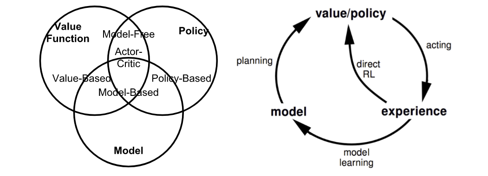
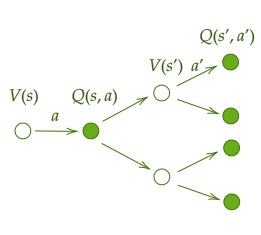

# A (Long) Peek into Reinforcement Learning: Part1

<!--more-->

> [A (Long) Peek into Reinforcement Learning | Lil'Log](https://lilianweng.github.io/posts/2018-02-19-rl-overview/)

## Key Concepts

The agent can stay in one of many **states** ($s\in \mathcal{S}$) of the environment, and choose to take one of many **actions** ($a\in \mathcal{A}$) to switch from one state to another. Which state the agent will arrive in is decided by transition probabilities between states ($P$). Once an action is taken, the environment delivers a **reward** ($r\in \mathcal{R}$) as feedback.

- Model-based: model is known
- Model-free: No dependency on model
- On-policy: train on deterministic outcomes or samples
- Off-policy: train on transitions or episodes of different behavior policy 

State-transition Function:

$$
\begin{align}
P_{ss'}^a & = P(s', s, a) \\
& = \mathbb{P}[S_{t+1} = s', S_t = s, A_t = a] \\ 
& = \sum_{r \in \mathcal{R}} P(s', r|s, a)
\end{align}
$$

Reward function $R$

$$
\begin{align}
R(s, a) &= \mathbb{E}[R_{t+1}|S_t = s, A_t = a] \\
&= \sum_{r \in \mathcal{R}} r \sum_{s' \in S} P(s', r|s, a)
\end{align}
$$

Policy:

- Deterministic: $\pi(s)=a$
- Stochastic: $\pi(a\mid s)= \mathbb{P}_\pi[A=a\mid S=s]$

Return:

$$
G_t = R_{t+1} + \gamma R_{t+2} + \cdots = \sum_{k=0}^\infty \gamma^k R_{t+k+1}
$$

The **state-value** of a state $s$ is the expected **return**:

$$
V_\pi(s)=\mathbb{E}_\pi[G_t\mid S_t=s]
$$

**Action-value**:

$$
Q_\pi(s,a) = \mathbb{E}_\pi[G_t\mid S_t=s, A_t = a]
$$

We can use probability distribution + Q-values -> State Value:

$$
V_\pi(s) = \sum_{a\in \mathbb{A}} Q_\pi(s,a) \pi(a\mid s)
$$

Action Advantage Function:

$$
A_\pi(s,a) = Q_\pi(s,a)-V_\pi(s)
$$

Thus, we get the optimal policy:

$$
\begin{cases}
V_*(s)=\underset{\pi}{\max} V_\pi(s) \\
\pi_* = \arg \underset{\pi}{\max} V_\pi(s) \\
V_{\pi_*} = V_*
\end{cases}
$$

Same as $Q$

## Markov Decision Processes

In **Markov Decision Processes**, future only depends on the current state.

*Eg for MDP*

## Bellman Equations

Current $V$ is future $R$ + future $V$

$$
\begin{aligned}
V(s) & =\mathbb{E}\left[G_t \mid S_t=s\right] \\
& =\mathbb{E}\left[R_{t+1}+\gamma R_{t+2}+\gamma^2 R_{t+3}+\ldots \mid S_t=s\right] \\
& =\mathbb{E}\left[R_{t+1}+\gamma\left(R_{t+2}+\gamma R_{t+3}+\ldots\right) \mid S_t=s\right] \\
& =\mathbb{E}\left[R_{t+1}+\gamma G_{t+1} \mid S_t=s\right] \\
& =\mathbb{E}\left[R_{t+1}+\gamma V\left(S_{t+1}\right) \mid S_t=s\right]
\end{aligned}
$$

Similarly for $Q$ value

$$
\begin{aligned}
Q(s, a) & =\mathbb{E}\left[R_{t+1}+\gamma V\left(S_{t+1}\right) \mid S_t=s, A_t=a\right] \\
& =\mathbb{E}\left[R_{t+1}+\gamma \mathbb{E}_{a \sim \pi} Q\left(S_{t+1}, a\right) \mid S_t=s, A_t=a\right]
\end{aligned}
$$

## Bellman Expectation Equations

Recursive update process

$$
\begin{aligned} 
{\color[rgb]{0.29,0.56,0.89}V_\pi(s)} & = \sum_{a \in \mathcal{A}} \pi(a \mid s) {\color{green}Q_\pi(s, a)} 
&(1)\\ 
{\color{green}Q_\pi(s, a)} & =R(s, a)+\gamma \sum_{s^{\prime} \in \mathcal{S}} P_{s s^{\prime}}^a {\color[rgb]{0.29,0.56,0.89}V_\pi\left(s^{\prime}\right)} 
&(2)\\ 
V_\pi(s) & =\sum_{a \in \mathcal{A}} \pi(a \mid s)\left(R(s, a)+\gamma \sum_{s^{\prime} \in \mathcal{S}} P_{s s^{\prime}}^a V_\pi\left(s^{\prime}\right)\right) 
&{\color{green}(2)Q_\pi \rightarrow (1)}\\ 
Q_\pi(s, a) & =R(s, a)+\gamma \sum_{s^{\prime} \in \mathcal{S}} P_{s s^{\prime}}^a \sum_{a^{\prime} \in \mathcal{A}} \pi\left(a^{\prime} \mid s^{\prime}\right) Q_\pi\left(s^{\prime}, a^{\prime}\right) 
&{\color[rgb]{0.29,0.56,0.89}(1)V_\pi \rightarrow(2)}
\end{aligned}
$$

Bellman Optimality Equations: The **Optimal Value** $V_*, Q_*$ are **best return**.

$$
\begin{aligned}
{\color[rgb]{0.29,0.56,0.89}V_*(s)} & =\max _{a \in \mathcal{A}} {\color{green}Q_*(s, a) }
\\ 
{\color{green}Q_*(s, a)} & =R(s, a)+\gamma \sum_{s^{\prime} \in \mathcal{S}} P_{s s^{\prime}}^a {\color[rgb]{0.29,0.56,0.89}V_*\left(s^{\prime}\right)} 
\\ 
V_*(s) & =\max _{a \in \mathcal{A}}\left(R(s, a)+\gamma \sum_{s^{\prime} \in \mathcal{S}} P_{s s^{\prime}}^a V_*\left(s^{\prime}\right)\right) 
&{\color{green}(2)Q_\pi \rightarrow (1)}\\ 
Q_*(s, a) & =R(s, a)+\gamma \sum_{s^{\prime} \in \mathcal{S}} P_{s s^{\prime}}^a \max _{a^{\prime} \in \mathcal{A}} Q_*\left(s^{\prime}, a^{\prime}\right)
&{\color[rgb]{0.29,0.56,0.89}(1)V_\pi \rightarrow(2)}
\end{aligned}
$$

However, in most scenarios, we do not know $P^a_{ss^\prime}$, or $R(s,a)$, so we can not directly use Bellmen equations to solve this problem.

