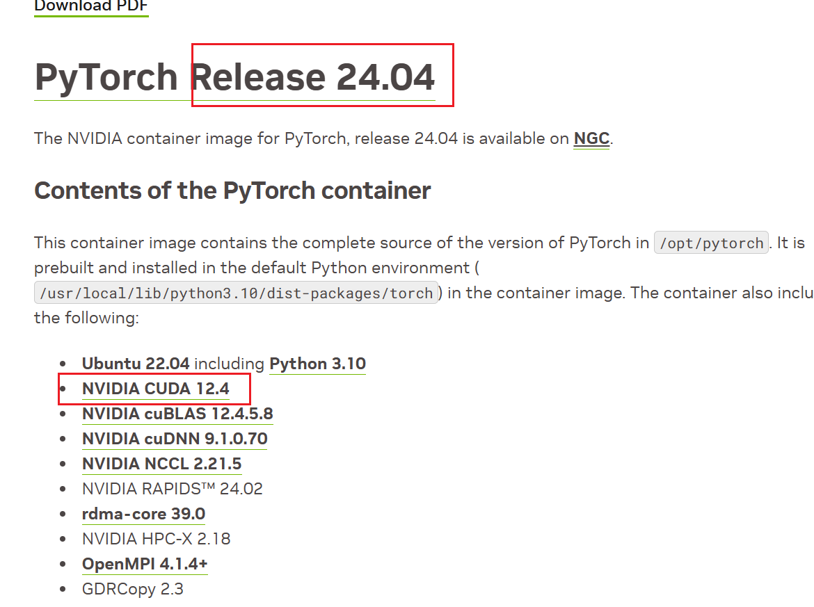

# A (Long) Peek into Reinforcement Learning: Part2

<!--more-->

> [conda配置清华源](https://zhuanlan.zhihu.com/p/628870519)

# conda配置清华源
```
conda config --add channels https://mirrors.tuna.tsinghua.edu.cn/anaconda/pkgs/free/
conda config --add channels https://mirrors.tuna.tsinghua.edu.cn/anaconda/pkgs/main/
conda config --add channels https://mirrors.tuna.tsinghua.edu.cn/anaconda/cloud/pytorch/
conda config --add channels https://mirrors.tuna.tsinghua.edu.cn/anaconda/cloud/pytorch/linux-64/
conda config --set show_channel_urls yes
```

# pip 清华源
升级 pip 到最新的版本后进行配置：
```
python -m pip install --upgrade pip
pip config set global.index-url https://mirrors.tuna.tsinghua.edu.cn/pypi/web/simple
```
# docker 镜像源
在`/etc/docker/daemon.json `下
```
"registry-mirrors": [
        "https://pull.loridocker.com",
        "https://ccr.ccs.tencentyun.com",
        "https://docker.1panel.live"
    ]
```

# 占卡工具
```
wget https://github.com/godweiyang/GrabGPU/releases/download/v1.0.1/gg_cu121
```
# nv docker pytorch+cuda
[ `pytorch` 对应 `cuda` 版本](https://docs.nvidia.com/deeplearning/frameworks/pytorch-release-notes/)



国内镜像

https://docker.aityp.com/r/docker.io/nvcr.io/nvidia/pytorch

