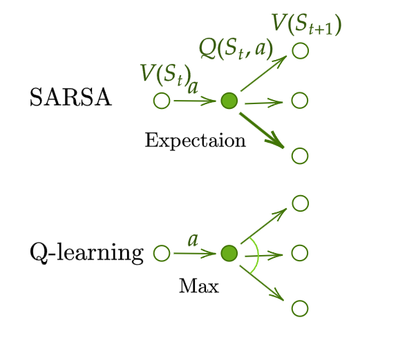
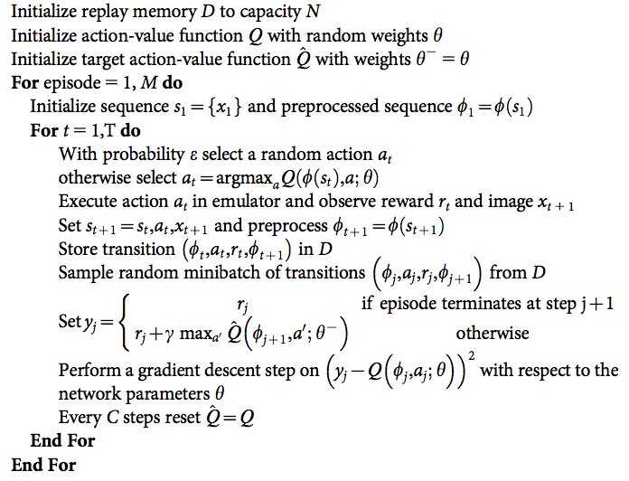
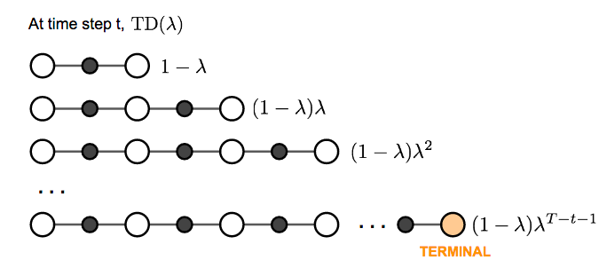
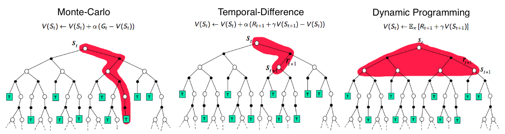

# A (Long) Peek into Reinforcement Learning: Part3

<!--more-->

> [A (Long) Peek into Reinforcement Learning | Lil'Log](https://lilianweng.github.io/posts/2018-02-19-rl-overview/)

## Common Approaches

### Temporal-Difference Learning (TD)

- model-free
-  learns from episodes of experience (**incomplete** episodes)

#### Bootstrapping

- **bootstrapping**: existing estimate $\rightarrow$ update targets
- x need actual rewards and complete returns like MC

#### Value Estimation

- TD method: update $V(S_T)$ to estimated return (TD target ) $G_T = R_{t+1}+\gamma V(S_{t+1})$
  $$
  V(S_t)\leftarrow (1-\alpha)V(S_t)+\alpha G_t \\
  V(S_t)\leftarrow V(S_t)+\alpha(R_{t+1}+\gamma V(S_{t+1})-V(S_t))
  $$
  
- action-value estimation

$$
Q ( S_{t}, A_{t} ) \gets Q ( S_{t}, A_{t} )+\alpha( R_{t+1}+\gamma Q ( S_{t+1}, A_{t+1} )-Q ( S_{t}, A_{t} ) )
$$

 TD learning (TD control)

#### SARSA: On-Policy TD control

- Update $Q$ following GPI

1. $t=0$

2. $S_0$ choose $A_0=\arg\max_{a\in\mathcal{A}}Q(S_0, a)$, common use $\epsilon$-greedy

3. At $t$, applying $A_t$, get $R_{t+1}$ and come to next state $S_{t+1}$

4. Similar to 2. $A_{t+1} = \arg\max_{a\in \mathcal{A}}Q({\color[rgb]{0.29,0.56,0.89}S_{t+1}}, a)$ 

5. Update $Q$-value: 

   $Q ( S_{t}, A_{t} ) \gets Q ( S_{t}, A_{t} )+\alpha( R_{t+1}+\gamma {\color{green}Q ( S_{t+1}, A_{t+1} )} -Q ( S_{t}, A_{t} ) )$

6. $t=t+1$, to 3.

#### Q-Learning: Off-policy TD control

1. $t=0, S_0$

2. At $t$, choose $A_t=\arg\max_{a\in\mathcal{A}}Q({\color[rgb]{0.29,0.56,0.89}S_t}, a)$, common use $\epsilon$-greedy

3. At $t$, applying $A_t$, get $R_{t+1}$ and come to next state $S_{t+1}$

4. Update $Q$-value: 

   $Q ( S_{t}, A_{t} ) \gets Q ( S_{t}, A_{t} )+\alpha( R_{t+1}+\gamma {\color{green}\max_{a\in\mathcal{A}}Q ( S_{t+1}, a )} -Q ( S_{t}, A_{t} ) )$

5. $t=t+1$, to 3.

Compared to SARSA, Q-learning do not follow current policy $A_t$ to pick the second action $A_{t+1}$. It estimate $Q^\star \cancel{\leftarrow} Q(\cdot, a^\star)$. $a^\star$ not matter, and in the nest step Q-learning may not follow $a^\star$.

#### Deep Q-Network

Theoretically, we can memories $Q^*$ for all state-action pairs in Q-learning. However, as state-action pairs become larger and larger, it quickly become computational infeasible. As a result, people use functions (ML models) to approximate $Q$, which is called **function approximation**, like $Q(s, a,;\theta)$, with parameter $\theta$.

- But as Q-value function approximation combined with bootstrapping, it becomes instability and divergence.

Deep Q-Network(DQN) aims to improve stability of Q-learning, by **two**  innovative mechanisms:

- **Experience Replay**: All episode steps $e_t=(S_t, A_t, R_t, S_{t+1})$ are stored in one **replay memory** $D_t=\{e_1, ...,e_t\}$. During Q-learning update, drawn random samples from $D_t$, so one sample may be used multiple times. In this way,
  - improves data efficiency,
  - removes correlations in the observation sequences, and
  - smooths changes in the data distribution.
- **Periodically Update Target**: Q network periodically update the target value in each $C$ steps (C is a hyperparameter). This modification makes the training more stable, as it reduce the short -term fluctuation.

The loss function:
$$
{\mathcal{L}} ( \theta)=\mathbb{E}_{( s, a, r, s^{\prime} ) \sim U ( D )} {\Big[} {\big(} r+\gamma\operatorname* {m a x}_{a^{\prime}} Q ( s^{\prime}, a^{\prime} ; \theta^{-} )-Q ( s, a ; \theta) {\big)}^{2} {\Big]} 
$$
where $U(D)$ is a uniform distribution over the replay memory $D_t$; $\theta^-$ is the frozen target Q-network.

In addition, clip the error term between $[-1, 1]$ is helpful.

There are many extensions of DQ, like dueling architecture, which estimate state-value function $V(s)$ and advantage function $A(s, a)$ with shared network parameters.

#### Combining TD and MC Learning

In previous TD learning, we only trace **one step** on action chain, 
$$
V(S_t)\leftarrow V(S_t)+\alpha({\color{green}G_t}-V(S_t))
$$
so we can easily extend it to take multiple steps:

Label the estimated return after $n$ steps: $G_t^{(n)}$ 
$$
\begin{align*}
n = 1 \quad & G_t^{(1)} = R_{t+1} + \gamma V(S_{t+1}) \quad & \text{(TD learning)} \\
n = 2 \quad & G_t^{(2)} = R_{t+1} + \gamma R_{t+2} + \gamma^2 V(S_{t+2}) \\
\dots \\
n = n \quad & G_t^{(n)} = R_{t+1} + \gamma R_{t+2} + \cdots + \gamma^{n-1} R_{t+n} + \gamma^n V(S_{t+n}) \\
\dots \\
n = \infty \quad & G_t^{(\infty)} = R_{t+1} + \gamma R_{t+2} + \cdots + \gamma^{T-t-1} R_T + \gamma^{T-t} V(S_T) \quad & \text{(MC estimation)}
\end{align*}
$$
The generalized $n$-step TD learning has the same form for update:
$$
V(S_t)\leftarrow V(S_t)+\alpha({\color{green}G_t^{(n)}}-V(S_t))
$$

We are free to learn any $n$ in TD, so which is the best $n$? Or in another words, which $G_t^{(n)}$ can give the best return approximation. A smart solution is using **weight sum** of all steps TD target, with the weight decay $\lambda^{n-1}$. This is similar to why we want to discount future rewards: 

> The longer future we see, the less possibility it takes.

To make all weights sum to $1$, we multiply by $(1-\lambda)$, because:
$$
\begin{aligned} 
\text{let }  S & =1+\lambda+\lambda^2+\ldots \\ 
S & =1+\lambda\left(1+\lambda+\lambda^2+\ldots\right) \\ 
S & =1+\lambda S \\ 
\text{thus }S & =1 /(1-\lambda)
\end{aligned}
$$
This weighted sum of $n$-step is called $\lambda$-return:
$$
G_t^{\lambda} = (1-\lambda)\sum_{n=1}^{\infty} \lambda^{n-1} G_t^{(n)}
$$
TD learning with $\lambda$ is called **TD($\lambda$)**, as the original version is TD($0$).

Comparison of the diagrams of Monte-Carlo, Temporal-Difference learning, and Dynamic Programming for state value functions.
$$
\begin{align}
\text{MC: } & V(S_t)\gets V(S_t)+\alpha (G_t - V(S_t))\\
\text{TD: } & V(S_t)\gets V(S_t)+\alpha (R_{t+1} +\gamma V(S_{t+1})- V(S_t))\\
\text{DP: } & V (S_{t}) \gets \mathbb{E}_{\pi} \left[ R_{t+1}+\gamma V (S_{t+1}) \right] \\
\end{align}
$$
