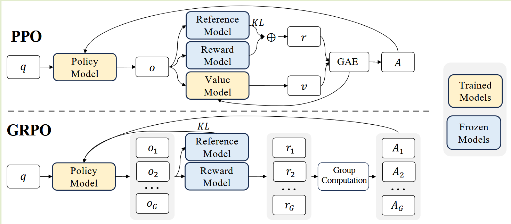

# RL algorithm: from PPO to GRPO and DAPO

> https://zhuanlan.zhihu.com/p/1898817630208517687

$\text{Latex Example}\quad {\color{green}green}\quad {\color[rgb]{0.286,0.529,0.808} light-blue}\quad {\color[rgb]{0.553,0.133,0.537}purple} {\color[rgb]{0.820,0.208,0.208}\quad light- red}\quad {\color{brown}brown}$

<!--more-->

## 1. Main concepts

- On-Policy: training data produced from policy which interacting with environment, which means it needs real-time interaction.
-  Off-Policy: training data produced from some prepared policy environment.

PPO, GRPO, DAPO are On-policy strategies, which contain four key compounds:

- Actor:  produce action policy
- Critic: evaluate the value network of action and situation
- Reward Model: model or function that give the real-time reward for situation transfer
- Reference Model: reference strategies, in order to prevent the bias between updated policy network and original policy network.

some algorithms:

On-Policy
- Monte Carlo Policy Gradient
- Actor-Critic
- REINFORCE
- Trust Region Policy Optimization (TRPO)
- Proximal Policy Optimization (PPO)

Off-Policy
- Q-Learning
- SARSA
- Deep Q-Network (DQN)

## 2. PPO

### Policy Gradient Optimization

The goal is to maximize the expected reward, the target can be written as:

$$
\pi^\star = \arg\max_\pi J(\pi)
$$

And reward form each real-time reward in trajectory, so the target can also be written as:

$$
J(\pi_\theta) = \int_\tau {\color{green}P(\tau\mid \pi)}R(\tau)d_\tau = \mathbb{E}_{\tau \sim \pi}[R(\tau)]
$$

in which $\tau$ presents a set of action-state trajectories, $\tau=(s_0,a_0,s_1,a_1 \cdots)$, and $R_t=\sum_{t=0}^\infty \gamma^t r_t$. in this situation, status transfer are decided by current situation and chosen decision: $s_{t+1}\sim P(\cdot \mid s_t,a_t) $.

A trajectory's total statistic distribution can be written as:

$$
{\color{green}P(\tau\mid \pi)} = \rho(s_0) \prod_{t=0}^{T-1} P(s_{t+1} \mid  s_t, a_t) \pi(a_t, s_t)
$$

For the policy gradient method, we hope get the maximize trajectory reward by gradient ascent. the update gradient ascent formulation is:

$$
\theta_{k+1}=\theta_k + \alpha 
{\color[rgb]{0.286,0.529,0.808} \nabla_\theta J(\pi_\theta)}
\mid_{\theta_k}
$$

Thus, how to calculate the gradient of target function $\nabla_\theta J(\pi_\theta)$ ? It seems hard because it relevant to a set of points in the trajectory of last iteration. However, it can simply transfer to a format that only relevant to the policy.

$$
\begin{align}
{\color[rgb]{0.286,0.529,0.808}\nabla_\theta J(\pi_\theta)} &= \nabla_\theta \mathbb{E}_{\tau\sim\pi_\theta}[R(\tau)] \\
&=\nabla_\theta \int_\tau P(\tau\mid \theta) R(\tau)d_\tau \\
&= {\color[rgb]{0.553,0.133,0.537}\int_\tau \nabla_\theta P(\tau\mid \theta) R(\tau)d_\tau}\quad (1)

\end{align}
$$

the gradient transfer to integration of reward and trajectory transfer.

We use *log trick* for derivative:

$$
\begin{align}
\because \ \ \ z&=\log(y), z\prime=\frac{1}{y}y^\prime \\
\therefore (1)&= \int_\tau {\color[rgb]{0.553,0.133,0.537}\nabla_\theta P(\tau\mid \theta)} R(\tau)d_\tau \\
&=\int_\tau {\color[rgb]{0.553,0.133,0.537}P(\tau\mid \theta) \nabla_\theta \log (P(\tau\mid \theta))} R(\tau)d_\tau
\end{align}
$$

Because $P(\tau\mid\pi)$ represents the trajectory, this integration can be written as an expectation:

$$
\begin{align}
\because J(\pi_\theta) &= \int_\tau P(\tau\mid \pi) {\color[rgb]{0.820,0.208,0.208}R(\tau)}d_\tau = \mathbb{E}_{\tau \sim \pi}[{\color[rgb]{0.820,0.208,0.208}R(\tau)}] \\

\therefore (1)&=\int_\tau P(\tau\mid \theta){\color[rgb]{0.820,0.208,0.208} \nabla_\theta \log (P(\tau\mid \theta))R(\tau)} d_\tau \\

& = \mathbb{E}_{\tau\sim \pi}[{\color[rgb]{0.820,0.208,0.208}\nabla_\theta \log (P(\tau\mid \theta))R(\tau)}]

\end{align}
$$

And as we know, ${P(\tau\mid \pi)} = \rho(s_0) \prod_{t=0}^{T-1} P(s_{t+1} \mid  s_t, a_t) \pi(a_t, s_t)$, then we get log of this equation and derivative of it:

$$
\begin{align}
{\color[rgb]{0.820,0.208,0.208}\log (P(\tau\mid \theta))}
&=\log\left(\rho(s_0) \prod_{t=0}^{T-1} P(s_{t+1} \mid  s_t, a_t) \pi(a_t, s_t)\right) \\
&= \log(\rho(s_0)) + \sum_{t=0}^{T-1} \left[\log(P(s_{t+1} \mid  s_t, a_t)) + \log(\pi(a_t, s_t)) \right] \\

\therefore {\color[rgb]{0.820,0.208,0.208} \nabla_\theta \log (P(\tau\mid \theta))}
&= \sum_{t=0}^{T-1} {\color{green}\nabla_\theta\log(\pi_\theta(a_t, s_t))} \\
\end{align}
$$

In this smart way, it transfer from muti-multiple operation to muti-addition operation, which especially help for derivative.

Therefore: 

$$
\begin{align}
\therefore 
{\color[rgb]{0.286,0.529,0.808}\nabla_\theta J(\pi_\theta)} &= (1)  
= \mathbb{E}_{\tau\sim \pi}[{\color[rgb]{0.820,0.208,0.208}\nabla_\theta \log (P(\tau\mid \theta))R(\tau)}] \\
&= \mathbb{E}_{\tau\sim \pi}
\left[
\sum_{t=0}^{T-1} {\color{green}\nabla_\theta\log(\pi_\theta(a_t, s_t))} 
{\color[rgb]{0.820,0.208,0.208}R(\tau)}
\right]

\end{align}
$$

we get the equation only about the policy $\theta$ and reward $R(\tau)$.

However, we could not sample all the trajectory to calculate gradient. Sometimes we only can approximate, like Monte-Carlo.

So we can sample part of local to approximate the total.

$$
\hat{g} = \frac{1}{\mathcal{D}}
\sum_{\color[rgb]{0.820,0.208,0.208}\tau\in \mathcal{D}} 
\sum_{t=0}^{T} {\color{green}\nabla_\theta\log(\pi_\theta(a_t, s_t))} 
{\color[rgb]{0.820,0.208,0.208}R(\tau)}
$$

$$
\begin{align}
\therefore 
{\color[rgb]{0.286,0.529,0.808}\hat{g}} \sim &
{\color[rgb]{0.286,0.529,0.808}\nabla_\theta J(\pi_\theta)} \\
&= \mathbb{E}_{\tau\sim \pi}
\left[
\sum_{t=0}^{T-1} {\color{green}\nabla_\theta\log(\pi_\theta(a_t, s_t))} 
{\color[rgb]{0.820,0.208,0.208}R(\tau)}
\right] \\

\end{align}
$$

## 3. Reinforce Algorithm

As we get $\hat{g}$ to approximate the gradient, we update the policy:

$$
\theta_{k+1} = \theta_k + 
{\color[rgb]{0.286,0.529,0.808} \nabla_\theta J(\pi_\theta) }
\mid_{\theta_k} 
= \theta_k + \alpha {\color[rgb]{0.286,0.529,0.808}\hat{g}}
$$

This is a Model-free algorithm, because it only sample from policy network, and not relevant to situation transfer, decided by environment.

However, since it needs sample approximate, like MC, it will have large variance if the data sample are less, which reduces the stability of training. This is also the weakness of Policy Gradient: If the behavior complex enough, or the policy model too large, the sample data and the calculation cost many, otherwise, the variance become too big to tolerate.

> *Are their any way to reduce variance? yes!*

### Focus only on the future

To review formal policy gradient algorithms, each step approximate calculate from start to now, is it necessary ?

$$
\hat{g} = \frac{1}{\mathcal{D}}
\sum_{\color[rgb]{0.820,0.208,0.208}\tau\in \mathcal{D}} 
\sum_{t=0}^{T} {\color{green}\nabla_\theta\log(\pi_\theta(a_t, s_t))} 
{\color[rgb]{0.820,0.208,0.208}R(\tau)}
$$

No, we can only forces on the future reward.

$$
{\color[rgb]{0.286,0.529,0.808} \nabla_\theta J(\pi_\theta) }\sim {\color[rgb]{0.286,0.529,0.808}\hat{g}^\prime} 
= \frac{1}{N}
\sum_{\color[rgb]{0.820,0.208,0.208}i \in {N}} 
\sum_{t=0}^{T} 
\nabla_\theta\log(\pi_\theta(a_{\, {\color[rgb]{0.820,0.208,0.208}i},t}, s_{\, {\color[rgb]{0.820,0.208,0.208}i},t})) \\
\cdot \left[
\sum_{\color{green}t^\prime = t}^{T}
r(s_{\, {\color[rgb]{0.820,0.208,0.208}i},{\color{green}t^\prime}}, 
a_{\, {\color[rgb]{0.820,0.208,0.208}i},{\color{green}t^\prime}})
-b
\right]
$$

this $b$ is represent the *baseline*, which always evaluated by the value model to estimate the value of current state $b=V_\pi(s)$.

### Advantage Function

As we introduce the reward-to-go and reward base-line, we call $\left[
\sum_{\color{green}t^\prime = t}^{T}
r(s_{\, {\color[rgb]{0.820,0.208,0.208}i},{\color{green}t^\prime}}, 
a_{\, {\color[rgb]{0.820,0.208,0.208}i},{\color{green}t^\prime}}))
-b
\right]$ as Advantage Function, which means in current situation, the value of choosing this action is better or worse the average value:

$$
A^\pi(s,a) =
\underbrace{
\sum_{\color{green}t^\prime = t}^{T}
r(s_{\, {\color[rgb]{0.820,0.208,0.208}i},{\color{green}t^\prime}}, 
a_{\, {\color[rgb]{0.820,0.208,0.208}i},{\color{green}t^\prime}})
}_{Q^\pi(s,a)}
-
\underbrace{b}_{V^\pi(s,a)} \\

{\color{brown}A^\pi(s,a)} = Q^\pi(s,a) - V^\pi(s,a)
$$

In this way, the policy gradient approximation can be written as:

$$
{\color[rgb]{0.286,0.529,0.808} \nabla_\theta J(\pi_\theta) }\sim {\color[rgb]{0.286,0.529,0.808}\hat{g}^\prime} 
= \frac{1}{N}
\sum_{\color[rgb]{0.820,0.208,0.208}i \in {N}}
\sum_{t=0}^{T} 
\nabla_\theta\log(\pi_\theta(a_{\, {\color[rgb]{0.820,0.208,0.208}i},t}, s_{\, {\color[rgb]{0.820,0.208,0.208}i},t})) {\color{brown}A^\pi(s,a)}
$$

> How can we estimate $A^\pi$ ?

### Generalized Advantage estimation(GAE)

For the value function, we have

$$
Q^\pi(s_t,a_t) = \gamma V^\pi(s_{t+1}) + r(s_t, a_t)
$$

Thus, the advantage function can be written as 

$$
\begin{align}
{\color{brown}A^\pi(s_t,a_t)} &= Q^\pi(s_t,a_t) - {\color{green}V^\pi(s_t)}\\
&= \gamma V^\pi(s_{t+1}) + r(s_t, a_t) - {\color{green}V^\pi(s_t)}
\end{align}
$$

Besides, in TD estimation, update $V_{TD}(s_{t}) = r(s_t,a_t) + \gamma V^\pi(s_{t+1})$ to estimated return 

Similarly, iterate again, we can get

$$
\begin{align}
{\color{brown}A^\pi(s_t,a_t)^{(1)}}
&= r(s_t, a_t) - {\color{green}V^\pi(s_t)} \\
&\quad \ + {\color[rgb]{0.820,0.208,0.208}\gamma V^\pi(s_{t+1})} 
\\
{\color{brown}A^\pi(s_t,a_t)^{(2)}}
&= r(s_t, a_t) - {\color{green}V^\pi(s_t)}\\
&\quad \ +{\color[rgb]{0.820,0.208,0.208}\gamma (r(s_{t+1},a_{t+1}) + \gamma V^\pi(s_{t+2}))}  
\\
{\color{brown}A^\pi(s_t,a_t)^{(3)}}
&= r(s_t, a_t) - {\color{green}V^\pi(s_t)} \\
&\quad \ +{\color[rgb]{0.820,0.208,0.208}\gamma (r(s_{t+1},a_{t+1}) + \gamma (r(s_{t+2},a_{t+2}) + \gamma V^\pi(s_{t+3}))}  
\end{align}
$$

Thus we define TD error:

$$
\delta_t = r_t + \gamma V^\pi(s_{t+1}) - V^\pi(s_t) \\
\delta_{t+1} = r_{t+1} + \gamma V^\pi(s_{t+2}) - V^\pi(s_{t+1})
$$
Represent it for $A^\pi$
$$
\begin{align}
{\color{brown}A^\pi(s_t,a_t)^{(1)}}
&= r(s_t, a_t) - {\color{green}V^\pi(s_t)} \\
&\quad \ + {\color[rgb]{0.820,0.208,0.208}\gamma V^\pi(s_{t+1})} \\
&= \delta_t
\\
{\color{brown}A^\pi(s_t,a_t)^{(2)}}
&= r(s_t, a_t) - {\color{green}V^\pi(s_t)}\\
&\quad \ +{\color[rgb]{0.820,0.208,0.208}\gamma (r(s_{t+1},a_{t+1}) + \gamma V^\pi(s_{t+2}))}\\  
&= \delta_t - {\color[rgb]{0.820,0.208,0.208}\gamma V^\pi(s_{t+1})}+{\color[rgb]{0.820,0.208,0.208}\gamma (r(s_{t+1},a_{t+1}) + \gamma V^\pi(s_{t+2}))} \\
&= \delta_t + {\color[rgb]{0.820,0.208,0.208}\gamma (r(s_{t+1},a_{t+1}) + \gamma V^\pi(s_{t+2}))-V^\pi(s_{t+1})}\\
&= \delta_t + \gamma \delta_{t+1}
\\
{\color{brown}A^\pi(s_t,a_t)^{(3)}}
&= r(s_t, a_t) - {\color{green}V^\pi(s_t)} \\
&\quad \ +{\color[rgb]{0.820,0.208,0.208}\gamma (r(s_{t+1},a_{t+1}) + \gamma (r(s_{t+2},a_{t+2}) + \gamma V^\pi(s_{t+3}))} \\
&= \delta_t + \gamma \delta_{t+1} + \gamma^2 \delta_{t+2}
\\
\cdots\quad & \quad \quad \cdots
\\
{\color{brown}A^\pi(s_t,a_t)^{(n)}}
&= \sum_{i=t}^{t+n-1} \gamma^{i-t}\delta_i
\end{align}
$$

For GAE, it add decay scale $\lambda\in(0,1)$ for each part:

$$
\begin{align}
A^{GAE}(t) &= A^{(1)}(t) + \lambda A^{(2)}(t) + \lambda^2 A^{(3)}(t) +\cdots +\lambda^{n-1} A^{(n)}(t)
\\
&= \delta_t + \lambda(\delta_t+ {\color{green}\gamma \delta_{t+1}}) + \lambda^2(\delta_t+ {\color{green}\gamma \delta_{t+1}}+ {\color[rgb]{0.553,0.133,0.537}\gamma^2 \delta_{t+2}}) +\cdots
\\
&= \delta_t(\underline{1}+\lambda+\lambda^2 + \cdots)
+ {\color{green}\gamma\delta_{t+1}}(\underline{\lambda}+\lambda^2 +\lambda^3 + \cdots) \\
&\quad \ + {\color[rgb]{0.553,0.133,0.537}\gamma^2\delta_{t+1}}(\underline{\lambda^2} + \lambda^3 +\lambda^4 + \cdots) \\
\end{align}
$$

to sum the geometric sequence:

$$
\begin{align} 
\text{for}\quad & S_n = a, ar,ar^2, ... ar^{n-1}
\\
\text{we have}\quad & S_n = a \cdot \frac{1-r^n}{1-r}
\\
\text{and}\quad &\lim_{n\rightarrow \infty} S_n = a \cdot \frac{1}{1-r}\ \text{if}\ r \in (0,1)
\end{align}
$$

Therefore, we have

$$
\begin{align}
A^{GAE}(t) 
&= \delta_t(\underline{1}+\lambda+\lambda^2 + \cdots)
+ {\color{green}\gamma\delta_{t+1}}(\underline{\lambda}+\lambda^2 +\lambda^3 + \cdots) \\
&\quad \ + {\color[rgb]{0.553,0.133,0.537}\gamma^2\delta_{t+1}}(\underline{\lambda^2} + \lambda^3 +\lambda^4 + \cdots) \\
&= \delta_t \frac{1-\lambda^n}{1-\lambda} 
+ {\color{green}\gamma\delta_{t+1}} \frac{\lambda(1-\lambda^{n-1})}{1-\lambda} \\
&\quad \ +{\color[rgb]{0.553,0.133,0.537}\gamma^2\delta_{t+1}}\frac{\lambda^2(1-\lambda^{n-2})}{1-\lambda} + \cdots
\\
\lim_{n\rightarrow\infty} A^{GAE}(t) 
&= \delta_t \frac{1}{1-\lambda} 
+ {\color{green}\gamma\delta_{t+1}} \frac{\lambda}{1-\lambda}
+{\color[rgb]{0.553,0.133,0.537}\gamma^2\delta_{t+1}}\frac{\lambda^2}{1-\lambda} + \cdots
\\
\lim_{n\rightarrow\infty} A^{GAE}(t) 
&= \frac{1}{1-\lambda} \sum_{i=t}^{t+n-1} (\lambda\gamma)^{i-t}\delta_i
\end{align}
$$

In recursive way: $A(t) = \delta_t + \lambda\gamma A(t+1)$

In short, we can analyze this by setting $\lambda$:

- $\lambda=0, \ A^{GAE}(t)=\delta_t = A^{(1)}(t)$, only next step estimation have contribution on GAE.
- $\lambda=0, \ A^{GAE}(t) = A^{(n)}(t)$ , for all trajectory estimation have contribution on GAE.
- So it can balance *variance* - *bias*:
  - If $\lambda$ is bigger, GAE utilize more on trajectory history information, in order to reduce *bias*.
  - If $\lambda$ is smaller, GAE utilize less on trajectory history information, in order to reduce *variance*.

## Proximal Policy Optimization

PPO needs two models, **policy network** and **value network**.

For target function in **policy network**:

$$
\mathcal{L}_{\text{Policy}}= \min 
\left(
\frac{\pi_\theta(a_t \mid s_t)}{\pi_{\text{old}}(a_t \mid s_t)}\hat{A}_t,
\text{clip}\left(\frac{\pi_\theta(a_t \mid s_t)}{\pi_{\text{old}}(a_t \mid s_t)}, 1-\epsilon, 1+\epsilon \right)\hat{A}_t
\right)
$$

this clip function is prevent policy update too big.

For target function in **value network**:

$$
\mathcal{L}_{\text{Value}}=\frac{1}{2}\left \| V_\theta(s)-\left(\sum_{t=0}^T \gamma^tr_t \mid s_0=s \right)  \right \|_2^2
$$

And with entropy loss, to encourage exploration:

$$
\mathcal{L}_{\text{Entropy}}=-\sum_x p(x)\log p(x)
$$

Finally, we get total loss:

$$
\mathcal{L}_{\text{PPO}}
= \mathcal{L}_{\text{Policy}}
+c_1\mathcal{L}_{\text{Value}}
+c_2\mathcal{L}_{\text{Entropy}}
$$

To avoid bias too much for reference model, we add KL divergence

$$
-\beta D_{KL}(\pi_\theta(\cdot\mid s_t)|| \pi_{\text{ref}}(\cdot\mid s_t))
$$

---

## GRPO

The target function of GRPO:

$$
\begin{align}
\mathcal{J}_{\text{GRPO}}(\theta) 
&= \mathbb{E}\left[ q \sim P(Q), \{o_i\}_{i=1}^G \sim \pi_{\theta_{\text{old}}}(O|q) \right] 
\\
&=
\frac{1}{G} \sum_{i=1}^{G} \frac{1}{|o_i|} \sum_{t=1}^{|o_i|} \left\{ 
\min\left[
\frac{\pi_\theta(o_{i,t}|q, o_{i,<t})}{\pi_{\theta_{\text{old}}}(o_{i,t}|q, o_{i,<t})} {\color{green}\hat{A}_{i,t}}, \\
\quad \ \text{clip}\left( 
\frac{\pi_\theta(o_{i,t}|q, o_{i,<t})}{\pi_{\theta_{\text{old}}}(o_{i,t}|q, o_{i,<t})}, 1 - \varepsilon, 1 + \varepsilon 
\right) {\color{green}\hat{A}_{i,t}}
\right] \\
- \beta \mathbb{D}_{\text{KL}}\left[ \pi_\theta \| \pi_{\text{ref}} \right]
\right\}
\end{align}
$$

The main difference is to change GAE advantage to **relative advantage estimation**:

$$
{\color{green}\hat{A_i}} 
= \frac{r_i - \text{mean}(\{r_1,r_2, \dots, r_G \})}
{\text{std}(\{r_1, r_2,\dots r_G \})} 
$$
