# Linear Attention [2/n]

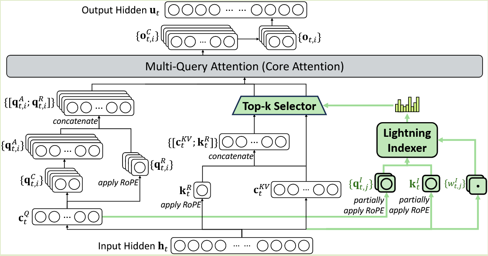

<!--more-->

---
2025-12-15

> PKM: 1907.05242
> MLS: 2412.09764
> UltraMem v1: 2411.12364
> UltraMem v2: 2508.18756

各个Mem架构横向比较
- PKM、UltraMem 和 MLS 在形式上都可写成 top-k 稀疏加权的 memory read，差别不在于是否用 top-k，而在于 routing 的数学地位。
- PKM 的 routing 来自 product key 的结构先验，是固定、非学习的；UltraMem v1/v2 把 routing 视为 检索或可学习的 gate；
- MLS 则进一步把 routing 明确写成 memory layer 的定义性原语（带约束的 mask），而不是实现技巧。

从统一视角看，前几者都可以视为 MLS 在不同 routing 约束下的特例。

\---

2025-12-21

> Native Sparse Attention: Hardware-Aligned and Natively Trainable Sparse Attention
>
> 2502.11089

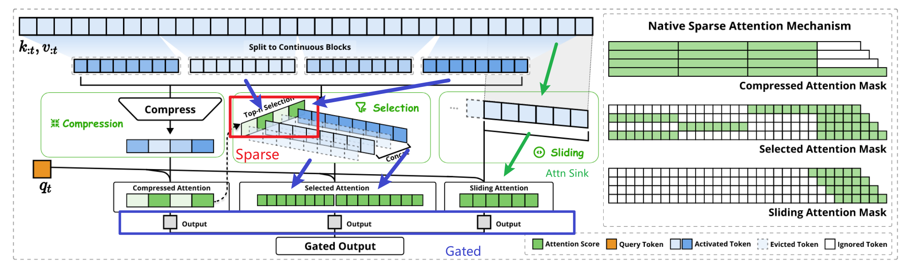

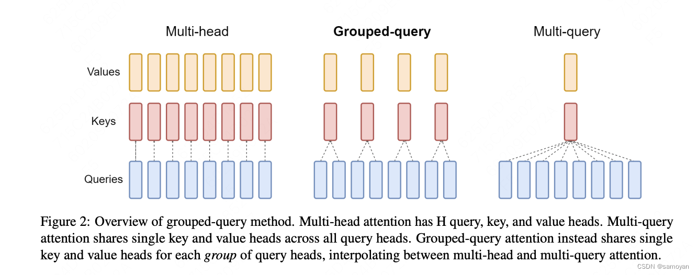

- Flash-Attn 为了凑矩阵乘法 把QK的Block 捆绑
  - 矩阵乘法可以调用高效的半精度矩阵乘法(tensor core)
  - 矩阵乘法太快了，memory load 反而成为瓶颈

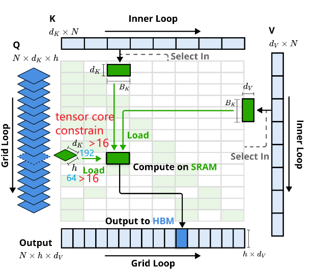

> 总结 
>
> - decoding 用了 GQA 高效
> - Compress 得到了Selection 的梯度回传 选择块更精准

## KIMI moba

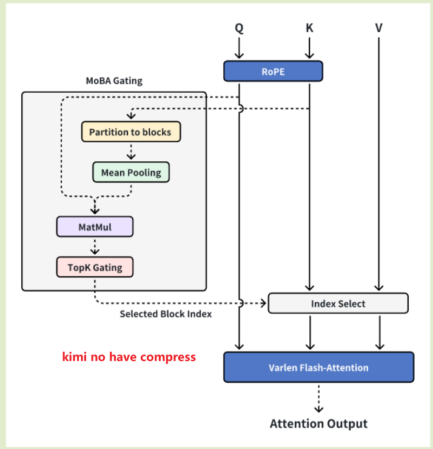

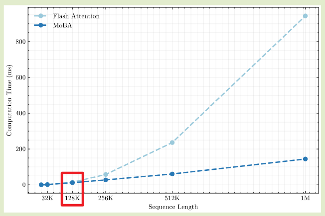

- kimi 128k 优势弱于 NSA

  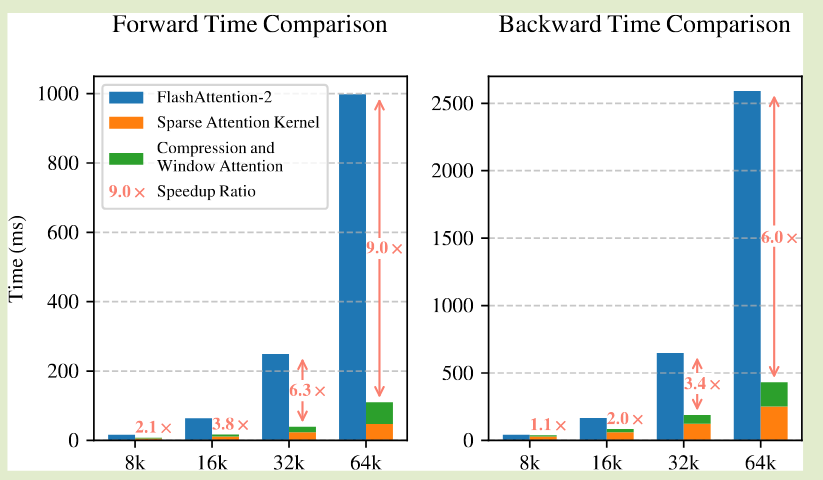

> 无论什么硬件，通用的原则;
>
> - 矩阵乘法快于 Mem 写入读出
> - 连续读取 局部性

## MinMax

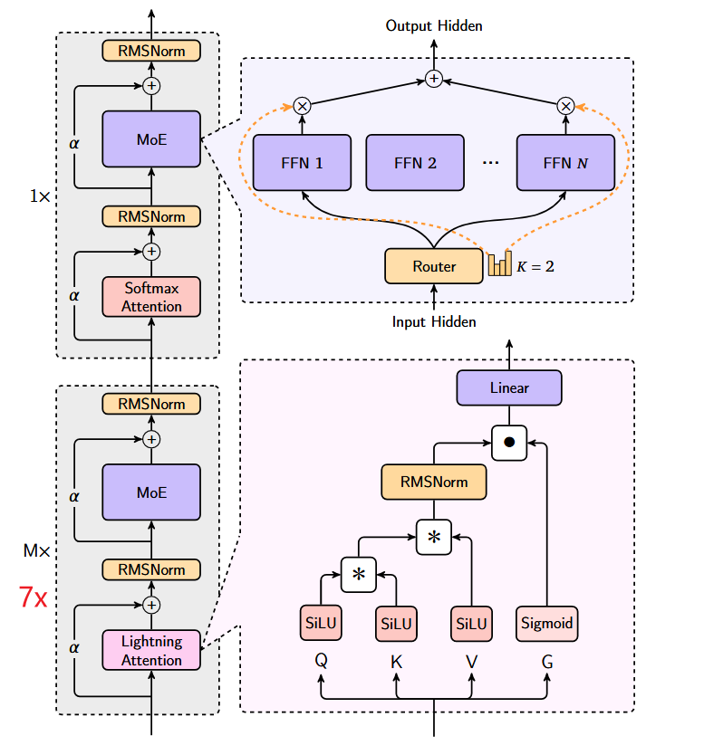

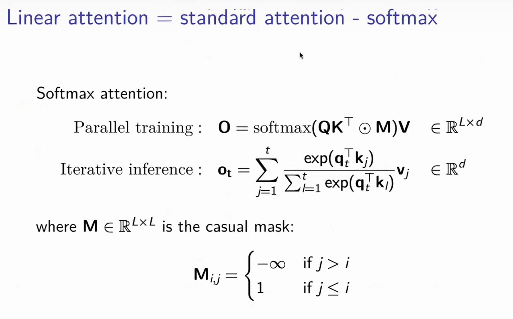

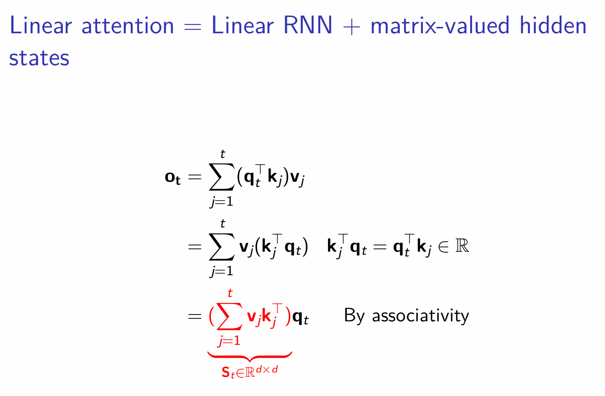

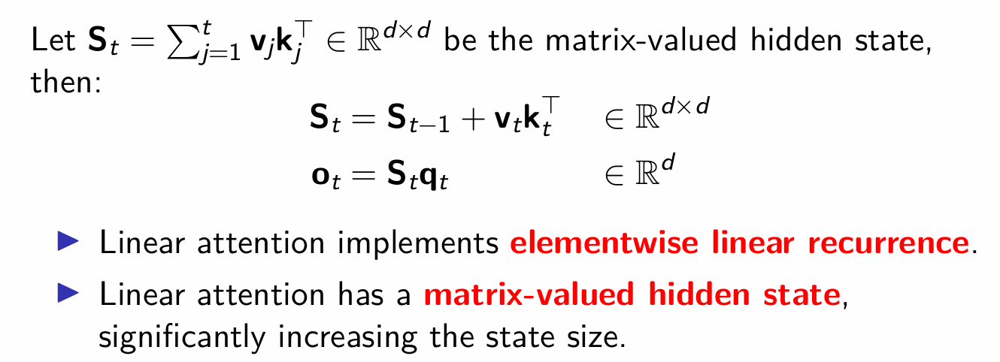

- LSTM: vector-valued hidden state
- Linear Attention: hardware efficiency (Matrix Mutiplication)
- Mamba2 

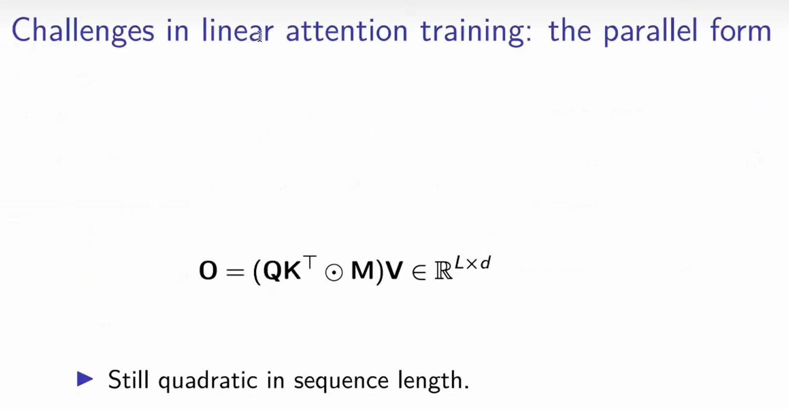

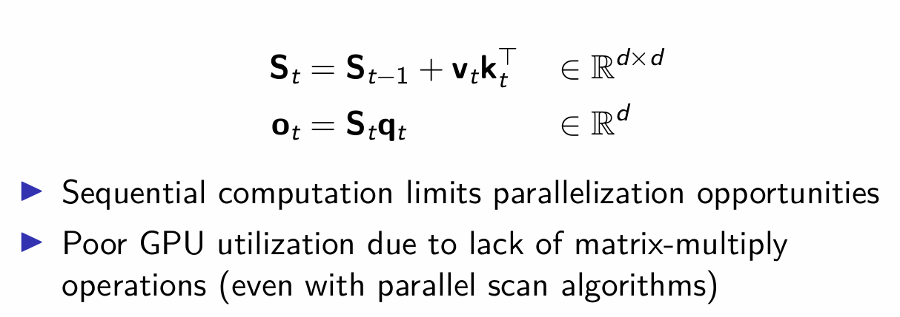

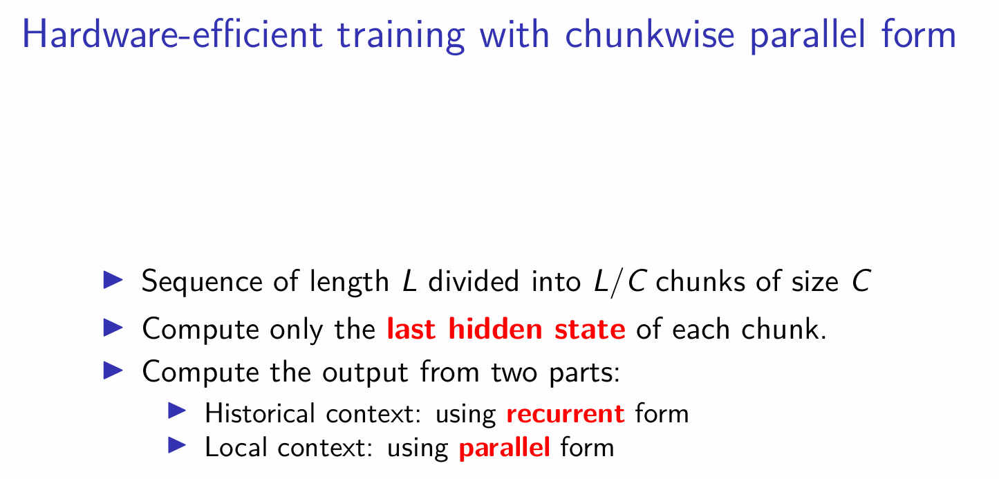

- Similar to NSA, divide large sequence to chunks
  - [[2311.05908\] FlashFFTConv: Efficient Convolutions for Long Sequences with Tensor Cores](https://arxiv.org/abs/2311.05908)
  - “FlashFFT Conv uses a matrix decomposition that computes the FFT using matrix multiply units and enables kernel fusion for long sequences, reducing I/O. ”

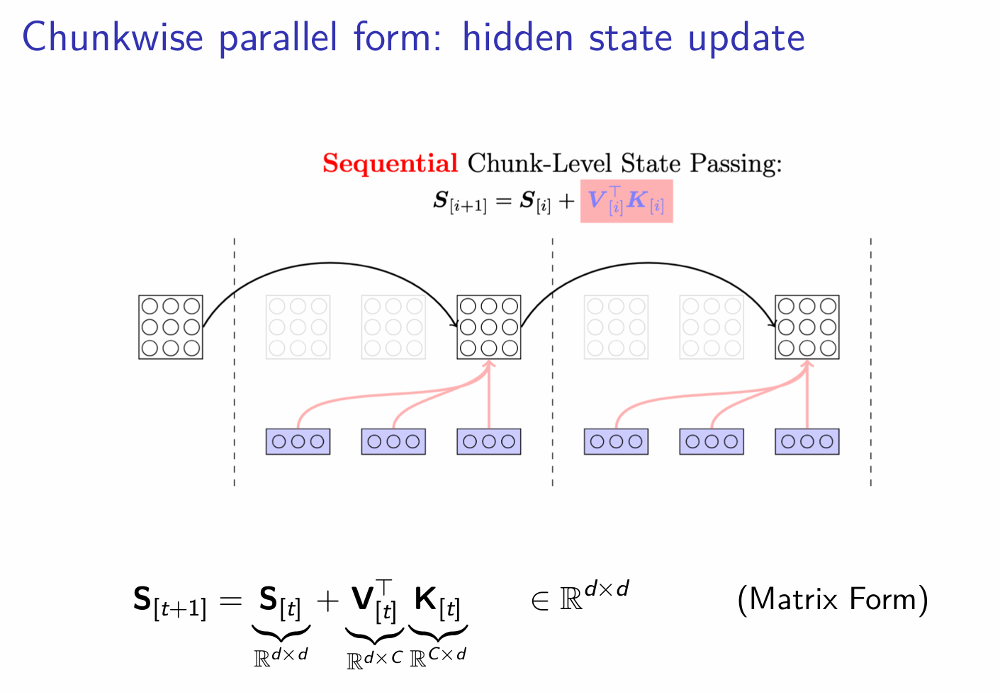
$$
\boldsymbol{S}_{[i+1]} = \boldsymbol{S}_{[i]} + 
\boldsymbol{V}^\top_{[i]}  \boldsymbol{K}_{[i]} \\
\boldsymbol{O}_{[i+1]} = \boldsymbol{S}_{[i+1]} \boldsymbol{q}_{[i+1]} \\
\boldsymbol{O} = (\boldsymbol{Q} \boldsymbol{K}^\top \odot \boldsymbol{M}) \boldsymbol{V} \in \mathbb{R}^{L \times d}
$$

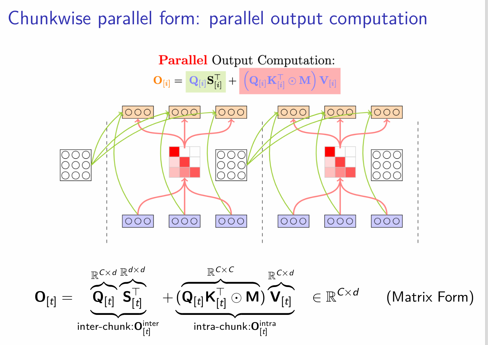
$$
\mathbf{O} = (\mathbf{Q} \mathbf{K}^\top \odot \mathbf{M}) \mathbf{V} \in \mathbb{R}^{L \times d}
$$

$$
\boldsymbol{O}_{[i]} = \boldsymbol{Q}_{[i]}\boldsymbol{S}^\top_{[i]} 
+ (\boldsymbol{Q}_{[i]}\boldsymbol{K}^\top_{[i]} \odot \boldsymbol{M})
\boldsymbol{V}_{[i]} 
\\
\boldsymbol{O} = (\boldsymbol{Q} \boldsymbol{K}^\top \odot \boldsymbol{M}) \boldsymbol{V} \in \mathbb{R}^{L \times d}
$$

 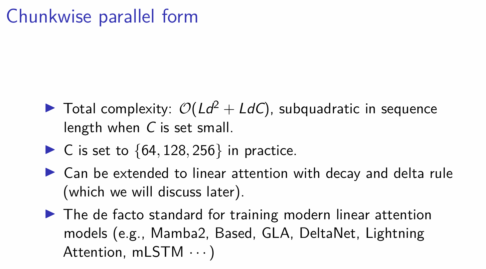

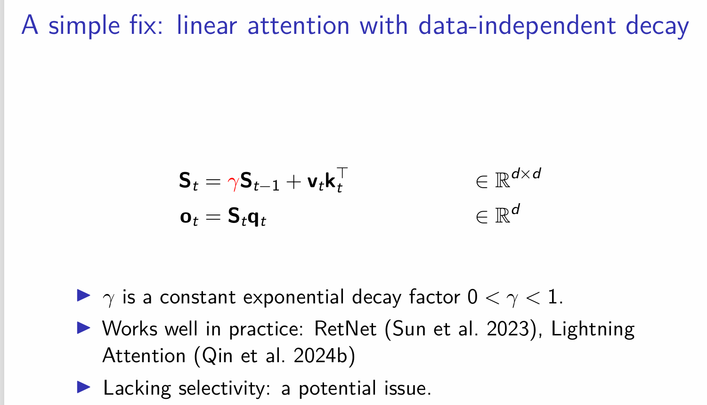

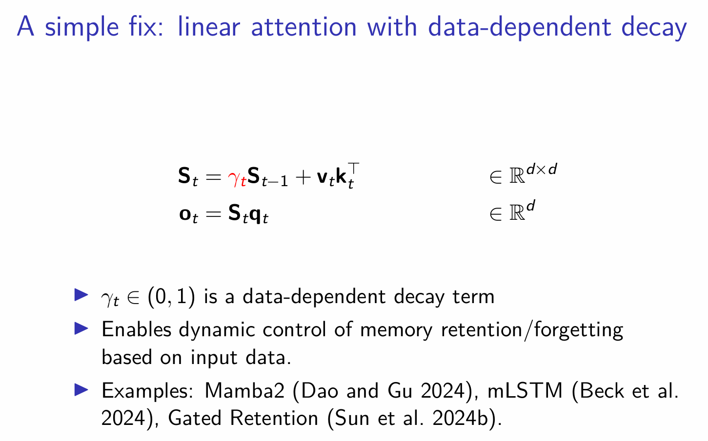

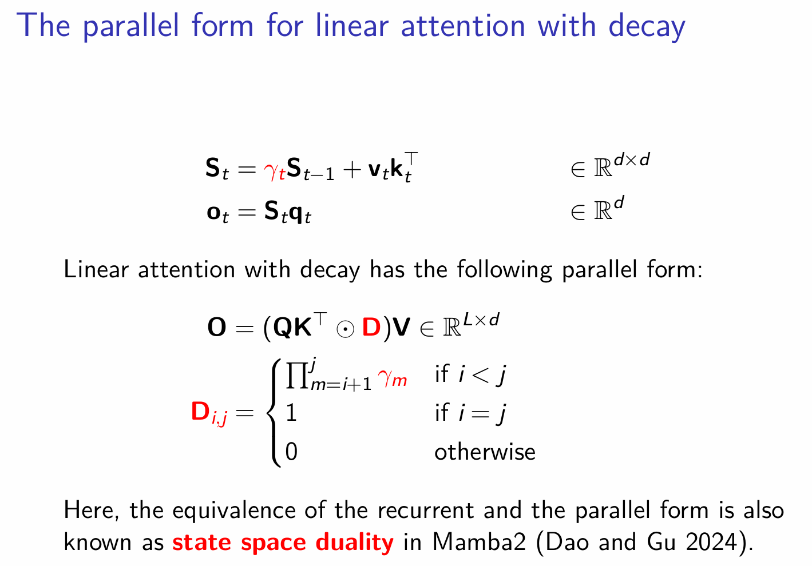

[[2411.13676\] Hymba: A Hybrid-head Architecture for Small Language Models](https://arxiv.org/abs/2411.13676)

- Some methods need scaling up to a very big level, can be more influencial.

Spare Attn 技术比较稳定

Linear Attn 风险更高

- 已经验证了一年
  - [[2408.12570\] Jamba-1.5: Hybrid Transformer-Mamba Models at Scale](https://arxiv.org/abs/2408.12570)
  - [[2412.05892v1\] BAMBA: A Bimodal Adversarial Multi-Round Black-Box Jailbreak Attacker for LVLMs](https://arxiv.org/abs/2412.05892v1)

开源：更大技术影响力

- 投资者有信心
- 追赶者

